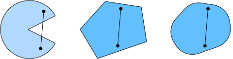
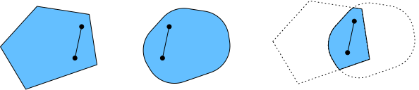

# Tính Lồi
<a id="sec_convexity"></a>

Tính lồi đóng vai trò quan trọng trong thiết kế các thuật toán tối ưu hóa.
Điều này chủ yếu do thực tế rằng việc phân tích và kiểm tra các thuật toán trong bối cảnh như vậy dễ dàng hơn nhiều.
Nói cách khác,
nếu thuật toán hoạt động kém ngay cả trong bối cảnh lồi,
thông thường chúng ta không nên kỳ vọng sẽ thấy kết quả tốt trong các trường hợp khác.
Hơn nữa, mặc dù các bài toán tối ưu hóa trong deep learning thường không lồi, chúng thường thể hiện một số tính chất của các bài toán lồi gần các cực tiểu cục bộ. Điều này có thể dẫn đến các biến thể tối ưu hóa mới thú vị như [Izmailov.Podoprikhin.Garipov.ea.2018].

```python
#@tab mxnet
%matplotlib inline
from d2l import mxnet as d2l
from mpl_toolkits import mplot3d
from mxnet import np, npx
npx.set_np()
```

```python
#@tab pytorch
%matplotlib inline
from d2l import torch as d2l
import numpy as np
from mpl_toolkits import mplot3d
import torch
```

```python
#@tab tensorflow
%matplotlib inline
from d2l import tensorflow as d2l
import numpy as np
from mpl_toolkits import mplot3d
import tensorflow as tf
```

## Định nghĩa

Trước khi phân tích lồi,
chúng ta cần định nghĩa *tập lồi* và *hàm lồi*.
Chúng dẫn đến các công cụ toán học thường được áp dụng trong học máy.


### Tập Lồi

Tập hợp là cơ sở của tính lồi. Nói đơn giản, một tập $\mathcal{X}$ trong không gian vector là *lồi* nếu với bất kỳ $a, b \in \mathcal{X}$ nào, đoạn thẳng nối $a$ và $b$ cũng nằm trong $\mathcal{X}$. Về mặt toán học, điều này có nghĩa là với mọi $\lambda \in [0, 1]$ chúng ta có

$$\lambda  a + (1-\lambda)  b \in \mathcal{X} \textrm{ khi } a, b \in \mathcal{X}.$$

Điều này nghe có vẻ hơi trừu tượng. Hãy xem xét [fig_pacman](#fig_pacman). Tập đầu tiên không lồi vì tồn tại các đoạn thẳng không nằm trong nó.
Hai tập còn lại không gặp vấn đề này.


<a id="fig_pacman"></a>

Các định nghĩa bản thân không đặc biệt hữu ích trừ khi bạn có thể làm gì đó với chúng.
Trong trường hợp này chúng ta có thể xem xét các giao của tập như được hiển thị trong [fig_convex_intersect](#fig_convex_intersect).
Giả sử $\mathcal{X}$ và $\mathcal{Y}$ là các tập lồi. Thì $\mathcal{X} \cap \mathcal{Y}$ cũng lồi. Để thấy điều này, xét bất kỳ $a, b \in \mathcal{X} \cap \mathcal{Y}$. Vì $\mathcal{X}$ và $\mathcal{Y}$ lồi, các đoạn thẳng nối $a$ và $b$ nằm trong cả $\mathcal{X}$ và $\mathcal{Y}$. Do đó, chúng cũng phải nằm trong $\mathcal{X} \cap \mathcal{Y}$, từ đó chứng minh định lý.


<a id="fig_convex_intersect"></a>

Chúng ta có thể tăng cường kết quả này một cách dễ dàng: cho các tập lồi $\mathcal{X}_i$, giao của chúng $\cap_{i} \mathcal{X}_i$ là lồi.
Để thấy rằng chiều ngược lại không đúng, hãy xét hai tập rời nhau $\mathcal{X} \cap \mathcal{Y} = \emptyset$. Bây giờ chọn $a \in \mathcal{X}$ và $b \in \mathcal{Y}$. Đoạn thẳng trong [fig_nonconvex](#fig_nonconvex) nối $a$ và $b$ phải chứa một phần không thuộc $\mathcal{X}$ cũng không thuộc $\mathcal{Y}$, vì chúng ta giả định $\mathcal{X} \cap \mathcal{Y} = \emptyset$. Do đó đoạn thẳng cũng không nằm trong $\mathcal{X} \cup \mathcal{Y}$, từ đó chứng minh rằng nói chung hợp của các tập lồi không nhất thiết phải lồi.


<a id="fig_nonconvex"></a>

Thông thường các bài toán trong deep learning được định nghĩa trên các tập lồi. Ví dụ, $\mathbb{R}^d$,
tập các vector thực $d$ chiều,
là một tập lồi (xét cho cùng, đoạn thẳng giữa hai điểm bất kỳ trong $\mathbb{R}^d$ vẫn nằm trong $\mathbb{R}^d$). Trong một số trường hợp chúng ta làm việc với các biến có độ dài bị chặn, chẳng hạn như các quả cầu bán kính $r$ được định nghĩa bởi $\{\mathbf{x} | \mathbf{x} \in \mathbb{R}^d \textrm{ và } \|\mathbf{x}\| \leq r\}$.

### Hàm Lồi

Bây giờ chúng ta đã có tập lồi, chúng ta có thể giới thiệu *hàm lồi* $f$.
Cho một tập lồi $\mathcal{X}$, một hàm $f: \mathcal{X} \to \mathbb{R}$ là *lồi* nếu với mọi $x, x' \in \mathcal{X}$ và với mọi $\lambda \in [0, 1]$ chúng ta có

$$\lambda f(x) + (1-\lambda) f(x') \geq f(\lambda x + (1-\lambda) x').$$

Để minh họa điều này, hãy vẽ một số hàm và kiểm tra xem những hàm nào thỏa mãn yêu cầu.
Dưới đây chúng ta định nghĩa một số hàm, cả lồi và không lồi.

```python
#@tab all
f = lambda x: 0.5 * x**2  # Convex
g = lambda x: d2l.cos(np.pi * x)  # Nonconvex
h = lambda x: d2l.exp(0.5 * x)  # Convex

x, segment = d2l.arange(-2, 2, 0.01), d2l.tensor([-1.5, 1])
d2l.use_svg_display()
_, axes = d2l.plt.subplots(1, 3, figsize=(9, 3))
for ax, func in zip(axes, [f, g, h]):
    d2l.plot([x, segment], [func(x), func(segment)], axes=ax)
```

Đúng như kỳ vọng, hàm cosine là *không lồi*, trong khi hàm parabol và hàm mũ thì lồi. Lưu ý rằng yêu cầu $\mathcal{X}$ là tập lồi là cần thiết để điều kiện có ý nghĩa. Nếu không, kết quả của $f(\lambda x + (1-\lambda) x')$ có thể không được xác định rõ.


### Bất Đẳng Thức Jensen

Cho một hàm lồi $f$,
một trong những công cụ toán học hữu ích nhất
là *bất đẳng thức Jensen*.
Nó tổng quát hóa định nghĩa của tính lồi:

$$\sum_i \alpha_i f(x_i)  \geq f\left(\sum_i \alpha_i x_i\right)    \textrm{ và }    E_X[f(X)]  \geq f\left(E_X[X]\right),$$

trong đó $\alpha_i$ là các số thực không âm sao cho $\sum_i \alpha_i = 1$ và $X$ là một biến ngẫu nhiên.
Nói cách khác, kỳ vọng của một hàm lồi không nhỏ hơn hàm lồi của kỳ vọng, trong đó kỳ vọng sau thường là biểu thức đơn giản hơn.
Để chứng minh bất đẳng thức đầu tiên, chúng ta liên tục áp dụng định nghĩa tính lồi cho từng số hạng trong tổng.


Một trong những ứng dụng phổ biến của bất đẳng thức Jensen là
giới hạn một biểu thức phức tạp hơn bằng một biểu thức đơn giản hơn.
Ví dụ,
ứng dụng của nó có thể liên quan đến
log-likelihood của các biến ngẫu nhiên quan sát một phần. Tức là, chúng ta sử dụng

$$E_{Y \sim P(Y)}[-\log P(X \mid Y)] \geq -\log P(X),$$

vì $\int P(Y) P(X \mid Y) dY = P(X)$.
Điều này có thể được sử dụng trong các phương pháp biến phân. Ở đây $Y$ thường là biến ngẫu nhiên không quan sát được, $P(Y)$ là ước đoán tốt nhất về phân phối của nó, và $P(X)$ là phân phối với $Y$ được tích phân ra ngoài. Ví dụ, trong phân cụm $Y$ có thể là nhãn cụm và $P(X \mid Y)$ là mô hình sinh khi áp dụng nhãn cụm.


## Tính Chất

Hàm lồi có nhiều tính chất hữu ích. Chúng ta mô tả một số tính chất thường dùng dưới đây.


### Cực Tiểu Cục Bộ Là Cực Tiểu Toàn Cục

Trước hết, cực tiểu cục bộ của hàm lồi cũng là cực tiểu toàn cục.
Chúng ta có thể chứng minh điều này bằng phản chứng như sau.

Xét một hàm lồi $f$ được định nghĩa trên tập lồi $\mathcal{X}$.
Giả sử $x^{\ast} \in \mathcal{X}$ là một cực tiểu cục bộ:
tồn tại một giá trị dương nhỏ $p$ sao cho với $x \in \mathcal{X}$ thỏa $0 < |x - x^{\ast}| \leq p$ chúng ta có $f(x^{\ast}) < f(x)$.

Giả sử cực tiểu cục bộ $x^{\ast}$
không phải là cực tiểu toàn cục của $f$:
tồn tại $x' \in \mathcal{X}$ sao cho $f(x') < f(x^{\ast})$.
Tồn tại
$\lambda \in [0, 1)$ như $\lambda = 1 - \frac{p}{|x^{\ast} - x'|}$
sao cho
$0 < |\lambda x^{\ast} + (1-\lambda) x' - x^{\ast}| \leq p$.

Tuy nhiên,
theo định nghĩa hàm lồi, chúng ta có

$$\begin{aligned}
    f(\lambda x^{\ast} + (1-\lambda) x') &\leq \lambda f(x^{\ast}) + (1-\lambda) f(x') \\
    &< \lambda f(x^{\ast}) + (1-\lambda) f(x^{\ast}) \\
    &= f(x^{\ast}),
\end{aligned}$$

điều này mâu thuẫn với phát biểu rằng $x^{\ast}$ là cực tiểu cục bộ.
Do đó, không tồn tại $x' \in \mathcal{X}$ sao cho $f(x') < f(x^{\ast})$. Cực tiểu cục bộ $x^{\ast}$ cũng là cực tiểu toàn cục.

Ví dụ, hàm lồi $f(x) = (x-1)^2$ có cực tiểu cục bộ tại $x=1$, cũng là cực tiểu toàn cục.

```python
#@tab all
f = lambda x: (x - 1) ** 2
d2l.set_figsize()
d2l.plot([x, segment], [f(x), f(segment)], 'x', 'f(x)')
```

Thực tế là cực tiểu cục bộ của hàm lồi cũng là cực tiểu toàn cục rất thuận tiện.
Điều này có nghĩa là nếu chúng ta tối thiểu hóa hàm thì không thể "bị mắc kẹt".
Tuy nhiên, lưu ý rằng điều này không có nghĩa là không thể có nhiều hơn một cực tiểu toàn cục hoặc rằng thậm chí có thể không tồn tại cực tiểu toàn cục. Ví dụ, hàm $f(x) = \mathrm{max}(|x|-1, 0)$ đạt giá trị nhỏ nhất trên khoảng $[-1, 1]$. Ngược lại, hàm $f(x) = \exp(x)$ không đạt giá trị nhỏ nhất trên $\mathbb{R}$: khi $x \to -\infty$ nó tiệm cận đến $0$, nhưng không có $x$ nào để $f(x) = 0$.

### Tập Dưới của Hàm Lồi Là Lồi

Chúng ta có thể
định nghĩa các tập lồi một cách thuận tiện
thông qua *tập dưới* của hàm lồi.
Cụ thể,
cho một hàm lồi $f$ được định nghĩa trên tập lồi $\mathcal{X}$,
bất kỳ tập dưới nào

$$\mathcal{S}_b \stackrel{\textrm{def}}{=} \{x | x \in \mathcal{X} \textrm{ và } f(x) \leq b\}$$

đều là lồi.

Hãy chứng minh điều này nhanh chóng. Nhớ lại rằng với bất kỳ $x, x' \in \mathcal{S}_b$ chúng ta cần chỉ ra rằng $\lambda x + (1-\lambda) x' \in \mathcal{S}_b$ miễn là $\lambda \in [0, 1]$.
Vì $f(x) \leq b$ và $f(x') \leq b$,
theo định nghĩa tính lồi chúng ta có

$$f(\lambda x + (1-\lambda) x') \leq \lambda f(x) + (1-\lambda) f(x') \leq b.$$


### Tính Lồi và Đạo Hàm Bậc Hai

Khi đạo hàm bậc hai của hàm $f: \mathbb{R}^n \rightarrow \mathbb{R}$ tồn tại, việc kiểm tra $f$ có lồi hay không rất dễ dàng.
Tất cả những gì chúng ta cần làm là kiểm tra xem Hessian của $f$ có nửa xác định dương không: $\nabla^2f \succeq 0$, tức là,
ký hiệu ma trận Hessian $\nabla^2f$ là $\mathbf{H}$,
$\mathbf{x}^\top \mathbf{H} \mathbf{x} \geq 0$
với mọi $\mathbf{x} \in \mathbb{R}^n$.
Ví dụ, hàm $f(\mathbf{x}) = \frac{1}{2} \|\mathbf{x}\|^2$ là lồi vì $\nabla^2 f = \mathbf{1}$, tức là Hessian của nó là ma trận đơn vị.


Hình thức hơn, một hàm một chiều khả vi hai lần $f: \mathbb{R} \rightarrow \mathbb{R}$ là lồi
khi và chỉ khi đạo hàm bậc hai $f'' \geq 0$. Với bất kỳ hàm đa chiều khả vi hai lần $f: \mathbb{R}^{n} \rightarrow \mathbb{R}$,
nó lồi khi và chỉ khi Hessian của nó $\nabla^2f \succeq 0$.

Đầu tiên, chúng ta cần chứng minh trường hợp một chiều.
Để thấy rằng
tính lồi của $f$ kéo theo
$f'' \geq 0$, chúng ta sử dụng thực tế rằng

$$\frac{1}{2} f(x + \epsilon) + \frac{1}{2} f(x - \epsilon) \geq f\left(\frac{x + \epsilon}{2} + \frac{x - \epsilon}{2}\right) = f(x).$$

Vì đạo hàm bậc hai được cho bởi giới hạn trên sai phân hữu hạn, suy ra

$$f''(x) = \lim_{\epsilon \to 0} \frac{f(x+\epsilon) + f(x - \epsilon) - 2f(x)}{\epsilon^2} \geq 0.$$

Để thấy rằng
$f'' \geq 0$ kéo theo $f$ là lồi,
chúng ta sử dụng thực tế rằng $f'' \geq 0$ kéo theo $f'$ là hàm đơn điệu không giảm. Cho $a < x < b$ là ba điểm trong $\mathbb{R}$,
trong đó $x = (1-\lambda)a + \lambda b$ và $\lambda \in (0, 1)$.
Theo định lý giá trị trung bình,
tồn tại $\alpha \in [a, x]$ và $\beta \in [x, b]$
sao cho

$$f'(\alpha) = \frac{f(x) - f(a)}{x-a} \textrm{ và } f'(\beta) = \frac{f(b) - f(x)}{b-x}.$$


Bởi tính đơn điệu $f'(\beta) \geq f'(\alpha)$, do đó

$$\frac{x-a}{b-a}f(b) + \frac{b-x}{b-a}f(a) \geq f(x).$$

Vì $x = (1-\lambda)a + \lambda b$,
chúng ta có

$$\lambda f(b) + (1-\lambda)f(a) \geq f((1-\lambda)a + \lambda b),$$

từ đó chứng minh tính lồi.

Thứ hai, chúng ta cần một bổ đề trước khi
chứng minh trường hợp đa chiều:
$f: \mathbb{R}^n \rightarrow \mathbb{R}$
là lồi khi và chỉ khi với mọi $\mathbf{x}, \mathbf{y} \in \mathbb{R}^n$

$$g(z) \stackrel{\textrm{def}}{=} f(z \mathbf{x} + (1-z)  \mathbf{y}) \textrm{ trong đó } z \in [0,1]$$

là lồi.

Để chứng minh rằng tính lồi của $f$ kéo theo $g$ là lồi,
chúng ta có thể chỉ ra rằng với mọi $a, b, \lambda \in [0, 1]$ (do đó
$0 \leq \lambda a + (1-\lambda) b \leq 1$)

$$\begin{aligned} &g(\lambda a + (1-\lambda) b)\\
=&f\left(\left(\lambda a + (1-\lambda) b\right)\mathbf{x} + \left(1-\lambda a - (1-\lambda) b\right)\mathbf{y} \right)\\
=&f\left(\lambda \left(a \mathbf{x} + (1-a)  \mathbf{y}\right)  + (1-\lambda) \left(b \mathbf{x} + (1-b)  \mathbf{y}\right) \right)\\
\leq& \lambda f\left(a \mathbf{x} + (1-a)  \mathbf{y}\right)  + (1-\lambda) f\left(b \mathbf{x} + (1-b)  \mathbf{y}\right) \\
=& \lambda g(a) + (1-\lambda) g(b).
\end{aligned}$$

Để chứng minh chiều ngược lại,
chúng ta có thể chỉ ra rằng với
mọi $\lambda \in [0, 1]$

$$\begin{aligned} &f(\lambda \mathbf{x} + (1-\lambda) \mathbf{y})\\
=&g(\lambda \cdot 1 + (1-\lambda) \cdot 0)\\
\leq& \lambda g(1)  + (1-\lambda) g(0) \\
=& \lambda f(\mathbf{x}) + (1-\lambda) f(\mathbf{y}).
\end{aligned}$$


Cuối cùng,
sử dụng bổ đề trên và kết quả của trường hợp một chiều,
trường hợp đa chiều
có thể được chứng minh như sau.
Một hàm đa chiều $f: \mathbb{R}^n \rightarrow \mathbb{R}$ là lồi
khi và chỉ khi với mọi $\mathbf{x}, \mathbf{y} \in \mathbb{R}^n$, $g(z) \stackrel{\textrm{def}}{=} f(z \mathbf{x} + (1-z)  \mathbf{y})$, trong đó $z \in [0,1]$,
là lồi.
Theo trường hợp một chiều,
điều này đúng khi và chỉ khi
$g'' = (\mathbf{x} - \mathbf{y})^\top \mathbf{H}(\mathbf{x} - \mathbf{y}) \geq 0$ ($\mathbf{H} \stackrel{\textrm{def}}{=} \nabla^2f$)
với mọi $\mathbf{x}, \mathbf{y} \in \mathbb{R}^n$,
tương đương với $\mathbf{H} \succeq 0$
theo định nghĩa của ma trận nửa xác định dương.


## Ràng Buộc

Một trong những tính chất tuyệt đẹp của tối ưu hóa lồi là nó cho phép chúng ta xử lý các ràng buộc một cách hiệu quả. Tức là, nó cho phép chúng ta giải các bài toán *tối ưu hóa có ràng buộc* có dạng:

$$\begin{aligned} \mathop{\textrm{minimize~}}_{\mathbf{x}} & f(\mathbf{x}) \\
    \textrm{ subject to } & c_i(\mathbf{x}) \leq 0 \textrm{ for all } i \in \{1, \ldots, n\},
\end{aligned}$$

trong đó $f$ là hàm mục tiêu và các hàm $c_i$ là các hàm ràng buộc. Để thấy tác dụng của điều này, hãy xét trường hợp $c_1(\mathbf{x}) = \|\mathbf{x}\|_2 - 1$. Trong trường hợp này các tham số $\mathbf{x}$ bị ràng buộc trong quả cầu đơn vị. Nếu ràng buộc thứ hai là $c_2(\mathbf{x}) = \mathbf{v}^\top \mathbf{x} + b$, thì tương ứng với tất cả $\mathbf{x}$ nằm trong một nửa không gian. Thỏa mãn cả hai ràng buộc đồng thời tương đương với việc chọn một lát cắt của quả cầu.

### Lagrangian

Nói chung, việc giải một bài toán tối ưu hóa có ràng buộc là khó. Một cách giải quyết có nguồn gốc từ vật lý với trực giác khá đơn giản. Hãy tưởng tượng một quả bóng trong một hộp. Quả bóng sẽ lăn đến nơi thấp nhất và lực hấp dẫn sẽ được cân bằng bởi các lực mà các cạnh của hộp có thể tác dụng lên quả bóng. Tóm lại, gradient của hàm mục tiêu (tức là trọng lực) sẽ được bù lại bởi gradient của hàm ràng buộc (quả bóng cần ở trong hộp bởi vì các bức tường "đẩy ngược lại").
Lưu ý rằng một số ràng buộc có thể không hoạt động:
các bức tường không bị chạm bởi quả bóng
sẽ không thể tác dụng lực lên quả bóng.


Bỏ qua phần dẫn xuất của *Lagrangian* $L$,
lý luận trên
có thể được biểu diễn thông qua bài toán tối ưu hóa điểm yên ngựa sau:

$$L(\mathbf{x}, \alpha_1, \ldots, \alpha_n) = f(\mathbf{x}) + \sum_{i=1}^n \alpha_i c_i(\mathbf{x}) \textrm{ trong đó } \alpha_i \geq 0.$$

Ở đây các biến $\alpha_i$ ($i=1,\ldots,n$) được gọi là *nhân tử Lagrange* đảm bảo các ràng buộc được thực thi đúng cách. Chúng được chọn vừa đủ lớn để đảm bảo $c_i(\mathbf{x}) \leq 0$ với mọi $i$. Ví dụ, với bất kỳ $\mathbf{x}$ nào mà $c_i(\mathbf{x}) < 0$ tự nhiên, chúng ta sẽ chọn $\alpha_i = 0$. Hơn nữa, đây là bài toán tối ưu hóa điểm yên ngựa trong đó người ta muốn *tối đa hóa* $L$ theo tất cả $\alpha_i$ và đồng thời *tối thiểu hóa* nó theo $\mathbf{x}$. Có nhiều tài liệu phong phú giải thích cách đi đến hàm $L(\mathbf{x}, \alpha_1, \ldots, \alpha_n)$. Với mục đích của chúng ta, chỉ cần biết rằng điểm yên ngựa của $L$ là nơi bài toán tối ưu hóa có ràng buộc gốc được giải một cách tối ưu.

### Hình Phạt

Một cách thỏa mãn các bài toán tối ưu hóa có ràng buộc ít nhất là *xấp xỉ* là thích nghi Lagrangian $L$.
Thay vì thỏa mãn $c_i(\mathbf{x}) \leq 0$ chúng ta chỉ đơn giản thêm $\alpha_i c_i(\mathbf{x})$ vào hàm mục tiêu $f(x)$. Điều này đảm bảo rằng các ràng buộc sẽ không bị vi phạm quá nhiều.

Thực ra, chúng ta đã sử dụng thủ thuật này suốt từ đầu. Hãy xem xét weight decay trong [sec_weight_decay](#sec_weight_decay). Trong đó chúng ta thêm $\frac{\lambda}{2} \|\mathbf{w}\|^2$ vào hàm mục tiêu để đảm bảo $\mathbf{w}$ không tăng quá lớn. Từ góc độ tối ưu hóa có ràng buộc chúng ta có thể thấy rằng điều này sẽ đảm bảo $\|\mathbf{w}\|^2 - r^2 \leq 0$ với một bán kính $r$ nào đó. Điều chỉnh giá trị của $\lambda$ cho phép chúng ta thay đổi kích thước của $\mathbf{w}$.

Nói chung, việc thêm hình phạt là một cách tốt để đảm bảo thỏa mãn ràng buộc xấp xỉ. Trong thực tế điều này hóa ra mạnh mẽ hơn nhiều so với thỏa mãn chính xác. Hơn nữa, đối với các bài toán không lồi, nhiều tính chất làm cho cách tiếp cận chính xác hấp dẫn trong trường hợp lồi (ví dụ: tính tối ưu) không còn đúng nữa.

### Chiếu

Một chiến lược thay thế để thỏa mãn các ràng buộc là phép chiếu. Chúng ta cũng đã gặp chúng trước đây, ví dụ khi xử lý cắt gradient trong [sec_rnn-scratch](#sec_rnn-scratch). Ở đó chúng ta đảm bảo gradient có độ dài bị chặn bởi $\theta$ thông qua

$$\mathbf{g} \leftarrow \mathbf{g} \cdot \mathrm{min}(1, \theta/\|\mathbf{g}\|).$$

Điều này hóa ra là *phép chiếu* của $\mathbf{g}$ lên quả cầu bán kính $\theta$. Tổng quát hơn, phép chiếu lên tập lồi $\mathcal{X}$ được định nghĩa là

$$\textrm{Proj}_\mathcal{X}(\mathbf{x}) = \mathop{\mathrm{argmin}}_{\mathbf{x}' \in \mathcal{X}} \|\mathbf{x} - \mathbf{x}'\|,$$

là điểm gần nhất trong $\mathcal{X}$ với $\mathbf{x}$.


<a id="fig_projections"></a>

Định nghĩa toán học của phép chiếu nghe có vẻ hơi trừu tượng. [fig_projections](#fig_projections) giải thích nó rõ ràng hơn. Trong đó chúng ta có hai tập lồi, một đường tròn và một hình thoi.
Các điểm bên trong cả hai tập (màu vàng) không thay đổi khi chiếu.
Các điểm bên ngoài cả hai tập (màu đen) được chiếu lên
các điểm bên trong các tập (màu đỏ) gần nhất với các điểm gốc (màu đen).
Trong khi với quả cầu $\ell_2$ điều này giữ nguyên hướng, điều này không nhất thiết đúng trong trường hợp tổng quát, như có thể thấy trong trường hợp hình thoi.


Một trong những ứng dụng của phép chiếu lồi là tính toán các vector trọng số thưa. Trong trường hợp này chúng ta chiếu các vector trọng số lên quả cầu $\ell_1$,
là phiên bản tổng quát của trường hợp hình thoi trong [fig_projections](#fig_projections).


## Tóm Tắt

Trong bối cảnh deep learning, mục đích chính của hàm lồi là thúc đẩy các thuật toán tối ưu hóa và giúp chúng ta hiểu chúng một cách chi tiết. Trong phần tiếp theo, chúng ta sẽ thấy cách gradient descent và stochastic gradient descent có thể được dẫn xuất tương ứng.


* Giao của các tập lồi là lồi. Hợp thì không.
* Kỳ vọng của một hàm lồi không nhỏ hơn hàm lồi của kỳ vọng (bất đẳng thức Jensen).
* Một hàm khả vi hai lần là lồi khi và chỉ khi Hessian của nó (ma trận đạo hàm bậc hai) là nửa xác định dương.
* Ràng buộc lồi có thể được thêm vào thông qua Lagrangian. Trong thực tế chúng ta có thể đơn giản thêm chúng với hình phạt vào hàm mục tiêu.
* Phép chiếu ánh xạ đến các điểm trong tập lồi gần nhất với các điểm gốc.

## Bài Tập

1. Giả sử chúng ta muốn xác minh tính lồi của một tập bằng cách vẽ tất cả các đường thẳng giữa các điểm trong tập và kiểm tra xem các đường có nằm trong tập không.
    1. Chứng minh rằng chỉ cần kiểm tra các điểm trên biên là đủ.
    1. Chứng minh rằng chỉ cần kiểm tra các đỉnh của tập là đủ.
1. Ký hiệu $\mathcal{B}_p[r] \stackrel{\textrm{def}}{=} \{\mathbf{x} | \mathbf{x} \in \mathbb{R}^d \textrm{ và } \|\mathbf{x}\|_p \leq r\}$ là quả cầu bán kính $r$ sử dụng chuẩn $p$. Chứng minh rằng $\mathcal{B}_p[r]$ là lồi với mọi $p \geq 1$.
1. Cho các hàm lồi $f$ và $g$, chỉ ra rằng $\mathrm{max}(f, g)$ cũng là lồi. Chứng minh rằng $\mathrm{min}(f, g)$ không lồi.
1. Chứng minh rằng chuẩn hóa của hàm softmax là lồi. Cụ thể hơn hãy chứng minh tính lồi của
    $f(x) = \log \sum_i \exp(x_i)$.
1. Chứng minh rằng các không gian con tuyến tính, tức là $\mathcal{X} = \{\mathbf{x} | \mathbf{W} \mathbf{x} = \mathbf{b}\}$, là các tập lồi.
1. Chứng minh rằng trong trường hợp các không gian con tuyến tính với $\mathbf{b} = \mathbf{0}$, phép chiếu $\textrm{Proj}_\mathcal{X}$ có thể được viết là $\mathbf{M} \mathbf{x}$ với một ma trận $\mathbf{M}$ nào đó.
1. Chỉ ra rằng với các hàm lồi khả vi hai lần $f$ chúng ta có thể viết $f(x + \epsilon) = f(x) + \epsilon f'(x) + \frac{1}{2} \epsilon^2 f''(x + \xi)$ với một $\xi \in [0, \epsilon]$ nào đó.
1. Cho một tập lồi $\mathcal{X}$ và hai vector $\mathbf{x}$ và $\mathbf{y}$, chứng minh rằng phép chiếu không bao giờ làm tăng khoảng cách, tức là $\|\mathbf{x} - \mathbf{y}\| \geq \|\textrm{Proj}_\mathcal{X}(\mathbf{x}) - \textrm{Proj}_\mathcal{X}(\mathbf{y})\|$.


[Discussions](https://discuss.d2l.ai/t/350)
