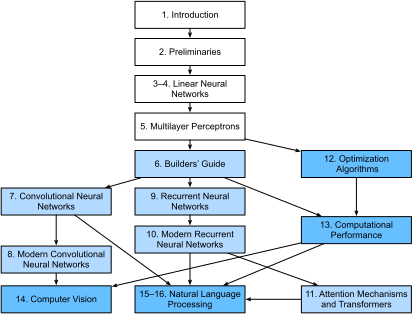

# Lời nói đầu

Chỉ vài năm trước, không có nhiều nhà khoa học deep learning
phát triển các sản phẩm và dịch vụ thông minh tại các công ty lớn và startup.
Khi chúng tôi bước vào lĩnh vực này, machine learning
chưa xuất hiện trên trang nhất báo hàng ngày.
Bố mẹ chúng tôi không biết machine learning là gì,
chứ chưa nói đến việc tại sao chúng tôi lại chọn nó
thay vì nghề y hay luật.
Machine learning lúc bấy giờ là một ngành học thuật hàn lâm
với ứng dụng công nghiệp giới hạn
trong một tập hẹp các bài toán thực tế,
bao gồm nhận dạng giọng nói và thị giác máy tính.
Hơn nữa, nhiều ứng dụng trong số đó
đòi hỏi nhiều kiến thức chuyên ngành đến mức
chúng thường được coi là các lĩnh vực hoàn toàn riêng biệt
mà machine learning chỉ là một thành phần nhỏ.
Vào thời điểm đó, mạng nơ-ron---những
người tiền thân của các phương pháp deep learning
mà chúng tôi tập trung trong cuốn sách này---thường
bị coi là đã lỗi thời.


Thế nhưng chỉ trong vài năm, deep learning đã làm cả thế giới ngạc nhiên,
thúc đẩy tiến bộ nhanh chóng trong nhiều lĩnh vực đa dạng
như thị giác máy tính, xử lý ngôn ngữ tự nhiên,
nhận dạng giọng nói tự động, học tăng cường,
và tin sinh y học.
Hơn nữa, sự thành công của deep learning
trong rất nhiều bài toán thực tiễn
thậm chí còn thúc đẩy những phát triển mới
trong lý thuyết machine learning và thống kê.
Với những tiến bộ này,
chúng ta có thể xây dựng những chiếc xe tự lái
với mức độ tự động hóa cao hơn bao giờ hết
(dù vẫn ít tự động hơn những gì một số công ty muốn bạn tin),
các hệ thống đối thoại có thể debug code bằng cách đặt câu hỏi làm rõ,
và các tác nhân phần mềm đánh bại những kỳ thủ cờ vây giỏi nhất thế giới---một kỳ tích từng được cho là còn hàng thập kỷ nữa mới đạt được.
Những công cụ này đang tác động ngày càng rộng rãi lên công nghiệp và xã hội,
thay đổi cách làm phim, cách chẩn đoán bệnh,
và đóng vai trò ngày càng lớn trong khoa học cơ bản---từ vật lý thiên văn, đến mô hình khí hậu, đến dự báo thời tiết, đến y sinh học.


## Về cuốn sách này

Cuốn sách này là nỗ lực của chúng tôi nhằm làm cho deep learning trở nên dễ tiếp cận,
dạy bạn *các khái niệm*, *bối cảnh*, và *code*.

### Một phương tiện kết hợp Code, Toán học và HTML

Để bất kỳ công nghệ tính toán nào đạt được tác động tối đa,
nó phải được hiểu rõ, được tài liệu hóa tốt, và được hỗ trợ bởi
các công cụ trưởng thành, được bảo trì tốt.
Các ý tưởng cốt lõi cần được chắt lọc rõ ràng,
giảm thiểu thời gian làm quen cần thiết
để đưa những người mới thực hành lên tốc độ.
Các thư viện trưởng thành nên tự động hóa các tác vụ thông thường,
và code mẫu nên giúp người thực hành
dễ dàng sửa đổi, áp dụng và mở rộng các ứng dụng phổ biến cho nhu cầu của họ.


Lấy ví dụ về các ứng dụng web động.
Mặc dù nhiều công ty, chẳng hạn như Amazon,
đã phát triển các ứng dụng web dựa trên cơ sở dữ liệu thành công từ những năm 1990,
tiềm năng của công nghệ này để hỗ trợ các doanh nhân sáng tạo
chỉ được khai thác ở mức độ cao hơn nhiều trong mười năm qua,
một phần nhờ vào sự phát triển của các framework mạnh mẽ, được tài liệu hóa tốt.


Thử nghiệm tiềm năng của deep learning đặt ra những thách thức độc đáo
vì bất kỳ ứng dụng đơn lẻ nào cũng kết hợp nhiều ngành khác nhau.
Áp dụng deep learning đòi hỏi đồng thời hiểu
(i) động lực để đặt bài toán theo một cách cụ thể;
(ii) dạng toán học của một mô hình cho trước;
(iii) các thuật toán tối ưu hóa để khớp mô hình với dữ liệu;
(iv) các nguyên tắc thống kê cho biết chúng ta
nên kỳ vọng mô hình của mình
tổng quát hóa được với dữ liệu chưa thấy khi nào,
và các phương pháp thực tế để xác nhận
rằng chúng đã thực sự tổng quát hóa;
và (v) các kỹ thuật kỹ thuật
cần thiết để huấn luyện mô hình hiệu quả,
tránh những cạm bẫy của tính toán số
và tận dụng tối đa phần cứng hiện có.
Dạy những kỹ năng tư duy phản biện
cần thiết để đặt bài toán,
toán học để giải chúng,
và các công cụ phần mềm để triển khai các giải pháp đó
tất cả trong một nơi là một thách thức lớn.
Mục tiêu của chúng tôi trong cuốn sách này là trình bày một tài nguyên thống nhất
để giúp những người mới thực hành tiềm năng bắt kịp tốc độ.

Khi chúng tôi bắt đầu dự án cuốn sách này,
không có tài nguyên nào đồng thời
(i) luôn được cập nhật;
(ii) bao quát chiều rộng của các thực hành machine learning hiện đại
với đủ chiều sâu kỹ thuật;
và (iii) xen kẽ trình bày
với chất lượng người ta kỳ vọng ở một sách giáo khoa
cùng với code có thể chạy được sạch sẽ
mà người ta kỳ vọng ở một hướng dẫn thực hành.
Chúng tôi tìm thấy nhiều ví dụ code minh họa
cách sử dụng một framework deep learning nhất định
(ví dụ: cách thực hiện tính toán số cơ bản với ma trận trong TensorFlow)
hoặc để triển khai các kỹ thuật cụ thể
(ví dụ: các đoạn code cho LeNet, AlexNet, ResNet, v.v.)
rải rác khắp các bài blog và kho GitHub.
Tuy nhiên, những ví dụ này thường tập trung vào
*cách* triển khai một phương pháp nhất định,
nhưng bỏ qua thảo luận về
*tại sao* các quyết định thuật toán nhất định được đưa ra.
Trong khi một số tài nguyên tương tác
đã xuất hiện rải rác
để đề cập một chủ đề cụ thể,
ví dụ: các bài blog hấp dẫn
được xuất bản trên website [Distill](http://distill.pub), hay các blog cá nhân,
chúng chỉ bao gồm các chủ đề được chọn lọc trong deep learning,
và thường thiếu code đi kèm.
Mặt khác, trong khi nhiều sách giáo khoa deep learning
đã xuất hiện---ví dụ: Goodfellow.Bengio.Courville.2016,
cung cấp một khảo sát toàn diện
về các kiến thức cơ bản của deep learning---những
tài nguyên này không kết hợp các mô tả
với các triển khai khái niệm trong code,
đôi khi khiến người đọc bối rối
về cách triển khai chúng.
Hơn nữa, quá nhiều tài nguyên
bị ẩn sau tường phí
của các nhà cung cấp khóa học thương mại.

Chúng tôi đặt ra mục tiêu tạo ra một tài nguyên có thể
(i) miễn phí cho tất cả mọi người;
(ii) cung cấp đủ chiều sâu kỹ thuật
để cung cấp điểm khởi đầu trên con đường
thực sự trở thành một nhà khoa học machine learning ứng dụng;
(iii) bao gồm code có thể chạy được, cho người đọc thấy
*cách* giải quyết các vấn đề trong thực tế;
(iv) cho phép cập nhật nhanh chóng, cả bởi chúng tôi
và bởi cộng đồng nói chung;
và (v) được bổ sung bởi một [diễn đàn](https://discuss.d2l.ai/c/5)
để thảo luận tương tác về các chi tiết kỹ thuật và trả lời câu hỏi.

Những mục tiêu này thường mâu thuẫn với nhau.
Phương trình, định lý và trích dẫn
được quản lý và trình bày tốt nhất trong LaTeX.
Code được mô tả tốt nhất bằng Python.
Và các trang web thì native với HTML và JavaScript.
Hơn nữa, chúng tôi muốn nội dung có thể
truy cập được cả dưới dạng code có thể thực thi, dưới dạng sách in,
dưới dạng PDF có thể tải xuống, và trên Internet dưới dạng website.
Không có quy trình làm việc nào phù hợp với những yêu cầu này,
vì vậy chúng tôi quyết định xây dựng quy trình riêng của mình ([sec_how_to_contribute](#sec_how_to_contribute)).
Chúng tôi chọn GitHub để chia sẻ nguồn
và tạo điều kiện cho đóng góp từ cộng đồng;
Jupyter notebooks để kết hợp code, phương trình và văn bản;
Sphinx làm rendering engine;
và Discourse làm nền tảng thảo luận.
Mặc dù hệ thống của chúng tôi không hoàn hảo,
những lựa chọn này đạt được sự thỏa hiệp
giữa các mối quan tâm cạnh tranh.
Chúng tôi tin rằng *Đắm mình vào Deep Learning*
có thể là cuốn sách đầu tiên được xuất bản
sử dụng quy trình tích hợp như vậy.


### Học qua thực hành

Nhiều sách giáo khoa trình bày các khái niệm theo thứ tự,
bao gồm từng khái niệm một cách chi tiết đầy đủ.
Ví dụ,
sách giáo khoa xuất sắc của
Bishop.2006
dạy từng chủ đề một cách kỹ lưỡng đến mức
để đến được chương
về hồi quy tuyến tính đòi hỏi
một lượng công việc đáng kể.
Trong khi các chuyên gia yêu thích cuốn sách này
chính vì tính kỹ lưỡng của nó,
đối với người mới bắt đầu thực sự, tính chất này hạn chế
sự hữu ích của nó như một văn bản nhập môn.

Trong cuốn sách này, chúng tôi dạy hầu hết các khái niệm *đúng lúc*.
Nói cách khác, bạn sẽ học các khái niệm đúng vào thời điểm
chúng cần thiết để hoàn thành một mục đích thực tế nào đó.
Mặc dù chúng tôi dành một ít thời gian ban đầu để dạy
các kiến thức cơ bản cơ bản, như đại số tuyến tính và xác suất,
chúng tôi muốn bạn trải nghiệm sự hài lòng khi huấn luyện mô hình đầu tiên của mình
trước khi lo lắng về các khái niệm khó hiểu hơn.

Ngoài một vài notebook sơ bộ cung cấp khóa học cấp tốc
về nền tảng toán học cơ bản,
mỗi chương tiếp theo vừa giới thiệu một số lượng hợp lý các khái niệm mới
vừa cung cấp một số ví dụ làm việc độc lập, sử dụng bộ dữ liệu thực.
Điều này đặt ra một thách thức tổ chức.
Một số mô hình có thể được nhóm lại một cách hợp lý trong một notebook duy nhất.
Và một số ý tưởng có thể được dạy tốt nhất
bằng cách thực thi một số mô hình theo thứ tự.
Ngược lại, có một lợi thế lớn khi tuân thủ
chính sách *một ví dụ làm việc, một notebook*:
Điều này giúp bạn dễ dàng nhất có thể
bắt đầu các dự án nghiên cứu của riêng bạn bằng cách tận dụng code của chúng tôi.
Chỉ cần sao chép một notebook và bắt đầu sửa đổi nó.

Xuyên suốt, chúng tôi xen kẽ code có thể chạy được
với tài liệu nền khi cần thiết.
Nói chung, chúng tôi nghiêng về phía làm cho các công cụ
có sẵn trước khi giải thích chúng đầy đủ
(thường điền vào phần nền sau).
Ví dụ, chúng tôi có thể sử dụng *stochastic gradient descent*
trước khi giải thích tại sao nó hữu ích
hoặc cung cấp một số trực giác về lý do tại sao nó hoạt động.
Điều này giúp cung cấp cho người thực hành sự chuẩn bị cần thiết
để giải quyết các vấn đề nhanh chóng,
đánh đổi bằng việc yêu cầu người đọc
tin tưởng vào một số quyết định biên tập của chúng tôi.

Cuốn sách này dạy các khái niệm deep learning từ đầu.
Đôi khi, chúng tôi đi sâu vào các chi tiết về mô hình
mà thường sẽ bị ẩn đi với người dùng
bởi các framework deep learning hiện đại.
Điều này đặc biệt xuất hiện trong các hướng dẫn cơ bản,
nơi chúng tôi muốn bạn hiểu mọi thứ
xảy ra trong một layer hoặc optimizer nhất định.
Trong những trường hợp này, chúng tôi thường trình bày
hai phiên bản của ví dụ:
một phiên bản triển khai mọi thứ từ đầu,
chỉ dựa vào chức năng giống NumPy
và tự động vi phân,
và một ví dụ thực tế hơn,
nơi chúng tôi viết code ngắn gọn
sử dụng các API cấp cao của các framework deep learning.
Sau khi giải thích cách hoạt động của một thành phần nào đó,
chúng tôi dựa vào API cấp cao trong các hướng dẫn tiếp theo.


### Nội dung và Cấu trúc

Cuốn sách có thể được chia thành khoảng ba phần,
đề cập đến các kiến thức cơ bản sơ bộ,
các kỹ thuật deep learning,
và các chủ đề nâng cao
tập trung vào các hệ thống thực tế
và ứng dụng ([fig_book_org](#fig_book_org)).


<a id="fig_book_org"></a>


* **Phần 1: Cơ bản và Kiến thức nền**.
[chap_introduction](#chap_introduction) là
phần giới thiệu về deep learning.
Sau đó, trong [chap_preliminaries](#chap_preliminaries),
chúng tôi nhanh chóng giúp bạn nắm vững
các điều kiện tiên quyết cần thiết
cho deep learning thực hành,
chẳng hạn như cách lưu trữ và thao tác dữ liệu,
và cách áp dụng các phép toán số khác nhau
dựa trên các khái niệm cơ bản từ đại số tuyến tính,
giải tích, và xác suất.
[chap_regression](#chap_regression) và [chap_perceptrons](#chap_perceptrons)
bao gồm các khái niệm và kỹ thuật cơ bản nhất trong deep learning,
bao gồm hồi quy và phân loại;
các mô hình tuyến tính; perceptron đa lớp;
và overfitting và regularization.

* **Phần 2: Các kỹ thuật Deep Learning hiện đại**.
[chap_computation](#chap_computation) mô tả
các thành phần tính toán chính
của các hệ thống deep learning
và đặt nền tảng
cho các triển khai tiếp theo của chúng tôi
về các mô hình phức tạp hơn.
Tiếp theo, [chap_cnn](#chap_cnn) và [chap_modern_cnn](#chap_modern_cnn)
trình bày các mạng nơ-ron tích chập (CNN),
những công cụ mạnh mẽ tạo thành xương sống
của hầu hết các hệ thống thị giác máy tính hiện đại.
Tương tự, [chap_rnn](#chap_rnn) và [chap_modern_rnn](#chap_modern_rnn)
giới thiệu các mạng nơ-ron hồi quy (RNN),
các mô hình khai thác cấu trúc tuần tự (ví dụ: thời gian)
trong dữ liệu và thường được sử dụng
cho xử lý ngôn ngữ tự nhiên
và dự báo chuỗi thời gian.
Trong [chap_attention-and-transformers](#chap_attention-and-transformers),
chúng tôi mô tả một lớp mô hình tương đối mới,
dựa trên cái gọi là *cơ chế attention*,
đã thay thế RNN như là kiến trúc thống trị
cho hầu hết các tác vụ xử lý ngôn ngữ tự nhiên.
Những phần này sẽ giúp bạn nắm vững
những công cụ mạnh mẽ và tổng quát nhất
được sử dụng rộng rãi bởi những người thực hành deep learning.

* **Phần 3: Khả năng mở rộng, Hiệu quả và Ứng dụng** (có sẵn [trực tuyến](https://d2l.ai)).
Trong Chương 12,
chúng tôi thảo luận về một số thuật toán tối ưu hóa phổ biến
được sử dụng để huấn luyện các mô hình deep learning.
Tiếp theo, trong Chương 13,
chúng tôi xem xét một số yếu tố chính
ảnh hưởng đến hiệu suất tính toán
của code deep learning.
Sau đó, trong Chương 14,
chúng tôi minh họa các ứng dụng chính
của deep learning trong thị giác máy tính.
Cuối cùng, trong Chương 15 và Chương 16,
chúng tôi trình bày cách pre-train các mô hình biểu diễn ngôn ngữ
và áp dụng chúng vào các tác vụ xử lý ngôn ngữ tự nhiên.


### Code
<a id="sec_code"></a>

Hầu hết các phần của cuốn sách này đều có code có thể thực thi.
Chúng tôi tin rằng một số trực giác được phát triển tốt nhất
qua thử và sai,
chỉnh sửa code theo những cách nhỏ và quan sát kết quả.
Lý tưởng nhất, một lý thuyết toán học thanh lịch có thể cho chúng ta biết
chính xác cách chỉnh sửa code để đạt được kết quả mong muốn.
Tuy nhiên, những người thực hành deep learning ngày nay
thường phải đi vào những nơi mà không có lý thuyết vững chắc nào dẫn đường.
Mặc dù có những nỗ lực tốt nhất của chúng tôi, các giải thích chính thức
cho hiệu quả của các kỹ thuật khác nhau vẫn
còn thiếu, vì nhiều lý do: toán học để đặc trưng hóa các mô hình này
có thể rất khó;
giải thích có thể phụ thuộc vào các thuộc tính
của dữ liệu hiện tại vẫn thiếu định nghĩa rõ ràng;
và nghiên cứu nghiêm túc về các chủ đề này
chỉ mới bắt đầu tăng tốc gần đây.
Chúng tôi hy vọng rằng khi lý thuyết về deep learning phát triển,
mỗi ấn bản tương lai của cuốn sách này sẽ cung cấp những hiểu biết
vượt trội hơn những gì hiện có.

Để tránh lặp lại không cần thiết, chúng tôi ghi lại
một số hàm và lớp được nhập và sử dụng thường xuyên nhất của chúng tôi
trong gói `d2l`.
Xuyên suốt, chúng tôi đánh dấu các khối code
(chẳng hạn như hàm, lớp,
hoặc tập hợp các câu lệnh import) bằng `#@save`
để chỉ ra rằng chúng sẽ được truy cập sau
thông qua gói `d2l`.
Chúng tôi cung cấp tổng quan chi tiết
về các lớp và hàm này trong [sec_d2l](#sec_d2l).
Gói `d2l` nhẹ và chỉ yêu cầu
các phụ thuộc sau:

```python
#@tab all
import inspect
import collections
from collections import defaultdict
from IPython import display
import math
from matplotlib import pyplot as plt
from matplotlib_inline import backend_inline
import os
import pandas as pd
import random
import re
import shutil
import sys
import tarfile
import time
import requests
import zipfile
import hashlib
d2l = sys.modules[__name__]
```


Hầu hết code trong cuốn sách này dựa trên PyTorch,
một framework mã nguồn mở phổ biến
được cộng đồng nghiên cứu deep learning đón nhận nhiệt tình.
Tất cả code trong cuốn sách này đã được kiểm tra
dưới phiên bản ổn định mới nhất của PyTorch.
Tuy nhiên, do sự phát triển nhanh chóng của deep learning,
một số code *trong ấn bản in*
có thể không hoạt động đúng trong các phiên bản PyTorch tương lai.
Chúng tôi có kế hoạch giữ cho phiên bản trực tuyến luôn cập nhật.
Nếu bạn gặp bất kỳ vấn đề nào,
vui lòng tham khảo :ref:`chap_installation`
để cập nhật code và môi trường runtime của bạn.
Dưới đây liệt kê các phụ thuộc trong triển khai PyTorch của chúng tôi.


```python
#@tab mxnet
from mxnet import autograd, context, gluon, image, init, np, npx
from mxnet.gluon import nn, rnn
```

```python
#@tab pytorch
import numpy as np
import torch
import torchvision
from torch import nn
from torch.nn import functional as F
from torchvision import transforms
from PIL import Image
from scipy.spatial import distance_matrix
```

```python
#@tab tensorflow
import numpy as np
import tensorflow as tf
```

```python
#@tab jax
from dataclasses import field
from functools import partial
import flax
from flax import linen as nn
from flax.training import train_state
import jax
from jax import numpy as jnp
from jax import grad, vmap
import numpy as np
import optax
import tensorflow as tf
import tensorflow_datasets as tfds
from types import FunctionType
from typing import Any
```

### Đối tượng độc giả

Cuốn sách này dành cho sinh viên (đại học hoặc sau đại học),
kỹ sư, và nhà nghiên cứu, những người muốn nắm vững
các kỹ thuật thực hành của deep learning.
Vì chúng tôi giải thích mọi khái niệm từ đầu,
không cần có nền tảng trước về deep learning hay machine learning.
Giải thích đầy đủ các phương pháp của deep learning
đòi hỏi một số toán học và lập trình,
nhưng chúng tôi chỉ giả định rằng bạn có một số kiến thức cơ bản,
bao gồm lượng nhỏ đại số tuyến tính,
giải tích, xác suất, và lập trình Python.
Phòng trường hợp bạn đã quên một số thứ,
[Phụ lục trực tuyến](https://d2l.ai/chapter_appendix-mathematics-for-deep-learning/index.html) cung cấp ôn lại
về hầu hết các toán học
bạn sẽ tìm thấy trong cuốn sách này.
Thông thường, chúng tôi sẽ ưu tiên
trực giác và ý tưởng
hơn sự chặt chẽ toán học.
Nếu bạn muốn mở rộng những nền tảng này
vượt ra ngoài các điều kiện tiên quyết để hiểu cuốn sách của chúng tôi,
chúng tôi vui lòng giới thiệu một số tài nguyên tuyệt vời khác:
*Linear Analysis* của Bollobas.1999
bao gồm đại số tuyến tính và phân tích hàm theo chiều sâu.
*All of Statistics* [Wasserman.2013]
cung cấp một phần giới thiệu tuyệt vời về thống kê.
[Sách](https://www.amazon.com/Introduction-Probability-Chapman-Statistical-Science/dp/1138369918)
và [khóa học](https://projects.iq.harvard.edu/stat110/home)
của Joe Blitzstein về xác suất và suy luận là những viên ngọc sư phạm.
Và nếu bạn chưa sử dụng Python trước đây,
bạn có thể muốn xem qua [hướng dẫn Python](http://learnpython.org/) này.


### Notebooks, Website, GitHub và Diễn đàn

Tất cả các notebook của chúng tôi có thể được tải xuống
từ [website D2L.ai](https://d2l.ai)
và từ [GitHub](https://github.com/d2l-ai/d2l-en).
Liên quan đến cuốn sách này, chúng tôi đã ra mắt diễn đàn thảo luận
tại [discuss.d2l.ai](https://discuss.d2l.ai/c/5).
Bất cứ khi nào bạn có câu hỏi về bất kỳ phần nào của cuốn sách,
bạn có thể tìm thấy liên kết đến trang thảo luận liên quan
ở cuối mỗi notebook.


## Lời cảm ơn

Chúng tôi mang ơn hàng trăm người đóng góp cho cả
bản thảo tiếng Anh và tiếng Trung.
Họ đã giúp cải thiện nội dung và đưa ra phản hồi quý giá.
Cuốn sách ban đầu được triển khai với MXNet là framework chính.
Chúng tôi cảm ơn Anirudh Dagar và Yuan Tang đã chuyển đổi phần lớn code MXNet trước đây sang các triển khai PyTorch và TensorFlow tương ứng.
Từ tháng 7 năm 2021, chúng tôi đã thiết kế lại và triển khai lại cuốn sách này bằng PyTorch, MXNet và TensorFlow, chọn PyTorch làm framework chính.
Chúng tôi cảm ơn Anirudh Dagar đã chuyển đổi phần lớn code PyTorch gần đây hơn sang các triển khai JAX.
Chúng tôi cảm ơn Gaosheng Wu, Liujun Hu, Ge Zhang và Jiehang Xie từ Baidu đã chuyển đổi phần lớn code PyTorch gần đây hơn sang các triển khai PaddlePaddle trong bản thảo tiếng Trung.
Chúng tôi cảm ơn Shuai Zhang đã tích hợp kiểu LaTeX từ nhà xuất bản vào quá trình xây dựng PDF.

Trên GitHub, chúng tôi cảm ơn mọi người đóng góp cho bản thảo tiếng Anh này
vì đã làm cho nó tốt hơn cho tất cả mọi người.
ID GitHub hoặc tên của họ là (không theo thứ tự cụ thể):
alxnorden, avinashingit, bowen0701, brettkoonce, Chaitanya Prakash Bapat,
cryptonaut, Davide Fiocco, edgarroman, gkutiel, John Mitro, Liang Pu,
Rahul Agarwal, Mohamed Ali Jamaoui, Michael (Stu) Stewart, Mike Müller,
NRauschmayr, Prakhar Srivastav, sad-, sfermigier, Sheng Zha, sundeepteki,
topecongiro, tpdi, vermicelli, Vishaal Kapoor, Vishwesh Ravi Shrimali, YaYaB, Yuhong Chen,
Evgeniy Smirnov, lgov, Simon Corston-Oliver, Igor Dzreyev, Ha Nguyen, pmuens,
Andrei Lukovenko, senorcinco, vfdev-5, dsweet, Mohammad Mahdi Rahimi, Abhishek Gupta,
uwsd, DomKM, Lisa Oakley, Bowen Li, Aarush Ahuja, Prasanth Buddareddygari, brianhendee,
mani2106, mtn, lkevinzc, caojilin, Lakshya, Fiete Lüer, Surbhi Vijayvargeeya,
Muhyun Kim, dennismalmgren, adursun, Anirudh Dagar, liqingnz, Pedro Larroy,
lgov, ati-ozgur, Jun Wu, Matthias Blume, Lin Yuan, geogunow, Josh Gardner,
Maximilian Böther, Rakib Islam, Leonard Lausen, Abhinav Upadhyay, rongruosong,
Steve Sedlmeyer, Ruslan Baratov, Rafael Schlatter, liusy182, Giannis Pappas,
ati-ozgur, qbaza, dchoi77, Adam Gerson, Phuc Le, Mark Atwood, christabella, vn09,
Haibin Lin, jjangga0214, RichyChen, noelo, hansent, Giel Dops, dvincent1337, WhiteD3vil,
Peter Kulits, codypenta, joseppinilla, ahmaurya, karolszk, heytitle, Peter Goetz, rigtorp,
Tiep Vu, sfilip, mlxd, Kale-ab Tessera, Sanjar Adilov, MatteoFerrara, hsneto,
Katarzyna Biesialska, Gregory Bruss, Duy–Thanh Doan, paulaurel, graytowne, Duc Pham,
sl7423, Jaedong Hwang, Yida Wang, cys4, clhm, Jean Kaddour, austinmw, trebeljahr, tbaums,
Cuong V. Nguyen, pavelkomarov, vzlamal, NotAnotherSystem, J-Arun-Mani, jancio, eldarkurtic,
the-great-shazbot, doctorcolossus, gducharme, cclauss, Daniel-Mietchen, hoonose, biagiom,
abhinavsp0730, jonathanhrandall, ysraell, Nodar Okroshiashvili, UgurKap, Jiyang Kang,
StevenJokes, Tomer Kaftan, liweiwp, netyster, ypandya, NishantTharani, heiligerl, SportsTHU,
Hoa Nguyen, manuel-arno-korfmann-webentwicklung, aterzis-personal, nxby, Xiaoting He, Josiah Yoder,
mathresearch, mzz2017, jroberayalas, iluu, ghejc, BSharmi, vkramdev, simonwardjones, LakshKD,
TalNeoran, djliden, Nikhil95, Oren Barkan, guoweis, haozhu233, pratikhack, Yue Ying, tayfununal,
steinsag, charleybeller, Andrew Lumsdaine, Jiekui Zhang, Deepak Pathak, Florian Donhauser, Tim Gates,
Adriaan Tijsseling, Ron Medina, Gaurav Saha, Murat Semerci, Lei Mao, Levi McClenny, Joshua Broyde,
jake221, jonbally, zyhazwraith, Brian Pulfer, Nick Tomasino, Lefan Zhang, Hongshen Yang, Vinney Cavallo,
yuntai, Yuanxiang Zhu, amarazov, pasricha, Ben Greenawald, Shivam Upadhyay, Quanshangze Du, Biswajit Sahoo,
Parthe Pandit, Ishan Kumar, HomunculusK, Lane Schwartz, varadgunjal, Jason Wiener, Armin Gholampoor,
Shreshtha13, eigen-arnav, Hyeonggyu Kim, EmilyOng, Bálint Mucsányi, Chase DuBois, Juntian Tao,
Wenxiang Xu, Lifu Huang, filevich, quake2005, nils-werner, Yiming Li, Marsel Khisamutdinov,
Francesco "Fuma" Fumagalli, Peilin Sun, Vincent Gurgul, qingfengtommy, Janmey Shukla, Mo Shan,
Kaan Sancak, regob, AlexSauer, Gopalakrishna Ramachandra, Tobias Uelwer, Chao Wang, Tian Cao,
Nicolas Corthorn, akash5474, kxxt, zxydi1992, Jacob Britton, Shuangchi He, zhmou, krahets, Jie-Han Chen,
Atishay Garg, Marcel Flygare, adtygan, Nik Vaessen, bolded, Louis Schlessinger, Balaji Varatharajan,
atgctg, Kaixin Li, Victor Barbaros, Riccardo Musto, Elizabeth Ho, azimjonn, Guilherme Miotto, Alessandro Finamore,
Joji Joseph, Anthony Biel, Zeming Zhao, shjustinbaek, gab-chen, nantekoto, Yutaro Nishiyama, Oren Amsalem,
Tian-MaoMao, Amin Allahyar, Gijs van Tulder, Mikhail Berkov, iamorphen, Matthew Caseres, Andrew Walsh,
pggPL, RohanKarthikeyan, Ryan Choi, và Likun Lei.

Chúng tôi cảm ơn Amazon Web Services, đặc biệt là Wen-Ming Ye, George Karypis, Swami Sivasubramanian, Peter DeSantis, Adam Selipsky,
và Andrew Jassy vì sự hỗ trợ hào phóng của họ trong việc viết cuốn sách này.
Nếu không có thời gian, nguồn lực, các cuộc thảo luận với đồng nghiệp,
và sự khuyến khích liên tục, cuốn sách này đã không thể ra đời.
Trong quá trình chuẩn bị cuốn sách để xuất bản,
Cambridge University Press đã cung cấp sự hỗ trợ tuyệt vời.
Chúng tôi cảm ơn biên tập viên đặt hàng David Tranah
vì sự giúp đỡ và chuyên nghiệp của ông.


## Tóm tắt

Deep learning đã cách mạng hóa nhận dạng mẫu,
giới thiệu công nghệ hiện đang cung cấp sức mạnh cho nhiều công nghệ,
trong các lĩnh vực đa dạng như thị giác máy tính,
xử lý ngôn ngữ tự nhiên,
và nhận dạng giọng nói tự động.
Để áp dụng deep learning thành công,
bạn phải hiểu cách đặt bài toán,
toán học cơ bản của mô hình hóa,
các thuật toán để khớp mô hình của bạn với dữ liệu,
và các kỹ thuật kỹ thuật để triển khai tất cả.
Cuốn sách này trình bày một tài nguyên toàn diện,
bao gồm văn xuôi, hình ảnh, toán học, và code, tất cả trong một nơi.


## Bài tập

1. Đăng ký tài khoản trên diễn đàn thảo luận của cuốn sách này [discuss.d2l.ai](https://discuss.d2l.ai/).
1. Cài đặt Python trên máy tính của bạn.
1. Theo các liên kết ở cuối phần đến diễn đàn, nơi bạn sẽ có thể tìm kiếm sự giúp đỡ và thảo luận về cuốn sách và tìm câu trả lời cho câu hỏi của bạn bằng cách tương tác với các tác giả và cộng đồng rộng lớn hơn.


[Thảo luận](https://discuss.d2l.ai/t/20)
