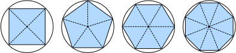

# Giải tích
<a id="sec_calculus"></a>

Trong một thời gian dài, cách tính diện tích hình tròn vẫn là một bí ẩn.
Rồi, ở Hy Lạp cổ đại, nhà toán học Archimedes
đã nghĩ ra ý tưởng thông minh
là nội tiếp một chuỗi các đa giác
với số đỉnh ngày càng tăng
bên trong một hình tròn
([fig_circle_area](#fig_circle_area)).
Với đa giác có $n$ đỉnh,
ta thu được $n$ tam giác.
Chiều cao của mỗi tam giác tiến đến bán kính $r$
khi ta chia hình tròn thành nhiều phần hơn.
Đồng thời, đáy của tam giác tiến đến $2 \pi r/n$,
vì tỉ lệ giữa cung và cát tuyến tiến đến 1
khi số đỉnh rất lớn.
Do đó, diện tích đa giác tiến đến
$n \cdot r \cdot \frac{1}{2} (2 \pi r/n) = \pi r^2$.


<a id="fig_circle_area"></a>

Quy trình lấy giới hạn này là nền tảng của cả
*giải tích vi phân* và *giải tích tích phân*.
Phần trước có thể cho chúng ta biết cách tăng
hoặc giảm giá trị của một hàm bằng cách
thao tác với các đối số của nó.
Điều này rất hữu ích cho các *bài toán tối ưu hóa*
mà chúng ta gặp trong deep learning,
nơi ta liên tục cập nhật các tham số
nhằm giảm hàm mất mát.
Tối ưu hóa giải quyết cách khớp mô hình với dữ liệu huấn luyện,
và giải tích là điều kiện tiên quyết quan trọng của nó.
Tuy nhiên, đừng quên rằng mục tiêu cuối cùng của chúng ta
là thực hiện tốt trên *dữ liệu chưa từng thấy*.
Vấn đề đó được gọi là *tổng quát hóa*
và sẽ là trọng tâm của các chương khác.


```python
%matplotlib inline
from d2l import torch as d2l
from matplotlib_inline import backend_inline
import numpy as np
```


## Đạo hàm và Vi phân

Nói đơn giản, *đạo hàm* là tốc độ thay đổi
của một hàm theo sự thay đổi của các đối số của nó.
Đạo hàm có thể cho chúng ta biết hàm mất mát
sẽ tăng hay giảm nhanh như thế nào nếu ta
*tăng* hoặc *giảm* từng tham số
một lượng vô cùng nhỏ.
Chính thức, đối với các hàm $f: \mathbb{R} \rightarrow \mathbb{R}$,
ánh xạ từ số vô hướng sang số vô hướng,
[***đạo hàm* của $f$ tại điểm $x$ được định nghĩa là**]

(**$$f'(x) = \lim_{h \rightarrow 0} \frac{f(x+h) - f(x)}{h}.$$**)

Số hạng ở vế phải được gọi là *giới hạn*
và nó cho chúng ta biết điều gì xảy ra
với giá trị của một biểu thức
khi một biến được chỉ định
tiến đến một giá trị cụ thể.
Giới hạn này cho chúng ta biết
tỉ lệ giữa nhiễu loạn $h$
và sự thay đổi giá trị hàm
$f(x + h) - f(x)$ hội tụ đến đâu
khi ta thu nhỏ kích thước về không.

Khi $f'(x)$ tồn tại, $f$ được nói là
*khả vi* tại $x$;
và khi $f'(x)$ tồn tại với mọi $x$
trên một tập hợp, ví dụ: khoảng $[a,b]$,
ta nói $f$ khả vi trên tập hợp này.
Không phải tất cả các hàm đều khả vi,
bao gồm nhiều hàm mà ta muốn tối ưu hóa,
chẳng hạn như độ chính xác và diện tích dưới
đường cong ROC (AUC).
Tuy nhiên, vì tính toán đạo hàm của hàm mất mát
là bước quan trọng trong hầu hết
các thuật toán để huấn luyện mạng nơ-ron sâu,
ta thường tối ưu hóa một *hàm thay thế* khả vi.

Ta có thể diễn giải đạo hàm
$f'(x)$
là tốc độ thay đổi *tức thời*
của $f(x)$ theo $x$.
Hãy cùng xây dựng trực giác qua một ví dụ.
(**Đặt $u = f(x) = 3x^2-4x$.**)


```python
def f(x):
    return 3 * x ** 2 - 4 * x
```


[**Đặt $x=1$, ta thấy $\frac{f(x+h) - f(x)}{h}$**] (**tiến đến $2$
khi $h$ tiến đến $0$.**)
Mặc dù thí nghiệm này thiếu
tính chặt chẽ của chứng minh toán học,
ta có thể nhanh chóng thấy rằng quả thật $f'(1) = 2$.

```python
for h in 10.0**np.arange(-1, -6, -1):
    print(f'h={h:.5f}, numerical limit={(f(1+h)-f(1))/h:.5f}')
```

Có một số quy ước ký hiệu tương đương cho đạo hàm.
Cho $y = f(x)$, các biểu thức sau là tương đương:

$$f'(x) = y' = \frac{dy}{dx} = \frac{df}{dx} = \frac{d}{dx} f(x) = Df(x) = D_x f(x),$$

trong đó các ký hiệu $\frac{d}{dx}$ và $D$ là *toán tử vi phân*.
Dưới đây, ta trình bày đạo hàm của một số hàm phổ biến:

$$\begin{aligned} \frac{d}{dx} C & = 0 && \textrm{với hằng số $C$ bất kỳ} \\ \frac{d}{dx} x^n & = n x^{n-1} && \textrm{với } n \neq 0 \\ \frac{d}{dx} e^x & = e^x \\ \frac{d}{dx} \ln x & = x^{-1}. \end{aligned}$$

Các hàm được tạo thành từ các hàm khả vi
thường bản thân cũng khả vi.
Các quy tắc sau rất hữu ích
khi làm việc với các hàm hợp
của các hàm khả vi $f$ và $g$ bất kỳ,
và hằng số $C$.

$$\begin{aligned} \frac{d}{dx} [C f(x)] & = C \frac{d}{dx} f(x) && \textrm{Quy tắc hằng số nhân} \\ \frac{d}{dx} [f(x) + g(x)] & = \frac{d}{dx} f(x) + \frac{d}{dx} g(x) && \textrm{Quy tắc tổng} \\ \frac{d}{dx} [f(x) g(x)] & = f(x) \frac{d}{dx} g(x) + g(x) \frac{d}{dx} f(x) && \textrm{Quy tắc tích} \\ \frac{d}{dx} \frac{f(x)}{g(x)} & = \frac{g(x) \frac{d}{dx} f(x) - f(x) \frac{d}{dx} g(x)}{g^2(x)} && \textrm{Quy tắc thương} \end{aligned}$$

Sử dụng điều này, ta có thể áp dụng các quy tắc
để tìm đạo hàm của $3 x^2 - 4x$ thông qua

$$\frac{d}{dx} [3 x^2 - 4x] = 3 \frac{d}{dx} x^2 - 4 \frac{d}{dx} x = 6x - 4.$$

Thay $x = 1$ vào cho thấy rằng, quả thật,
đạo hàm bằng $2$ tại vị trí này.
Lưu ý rằng đạo hàm cho chúng ta biết
*độ dốc* của một hàm
tại một vị trí cụ thể.

## Tiện ích Trực quan hóa

[**Ta có thể trực quan hóa độ dốc của các hàm bằng thư viện `matplotlib`**].
Ta cần định nghĩa một vài hàm.
Như tên gọi của nó, `use_svg_display`
yêu cầu `matplotlib` xuất đồ họa
ở định dạng SVG để có hình ảnh sắc nét hơn.
Chú thích `#@save` là một modifier đặc biệt
cho phép ta lưu bất kỳ hàm,
lớp hoặc khối code nào vào gói `d2l`
để ta có thể gọi lại sau
mà không cần lặp lại code,
ví dụ: qua `d2l.use_svg_display()`.

```python
def use_svg_display():  
    """Use the svg format to display a plot in Jupyter."""
    backend_inline.set_matplotlib_formats('svg')
```

Tiện lợi thay, ta có thể đặt kích thước hình với `set_figsize`.
Vì câu lệnh import `from matplotlib import pyplot as plt`
đã được đánh dấu `#@save` trong gói `d2l`, ta có thể gọi `d2l.plt`.

```python
def set_figsize(figsize=(3.5, 2.5)):  
    """Set the figure size for matplotlib."""
    use_svg_display()
    d2l.plt.rcParams['figure.figsize'] = figsize
```

Hàm `set_axes` có thể liên kết các trục
với các thuộc tính, bao gồm nhãn, phạm vi,
và tỉ lệ.

```python
def set_axes(axes, xlabel, ylabel, xlim, ylim, xscale, yscale, legend):
    """Set the axes for matplotlib."""
    axes.set_xlabel(xlabel), axes.set_ylabel(ylabel)
    axes.set_xscale(xscale), axes.set_yscale(yscale)
    axes.set_xlim(xlim),     axes.set_ylim(ylim)
    if legend:
        axes.legend(legend)
    axes.grid()
```

Với ba hàm này, ta có thể định nghĩa hàm `plot`
để vẽ chồng nhiều đường cong.
Phần lớn code ở đây chỉ để đảm bảo
rằng kích thước và shape của các đầu vào khớp nhau.

```python
def plot(X, Y=None, xlabel=None, ylabel=None, legend=[], xlim=None,
         ylim=None, xscale='linear', yscale='linear',
         fmts=('-', 'm--', 'g-.', 'r:'), figsize=(3.5, 2.5), axes=None):
    """Plot data points."""

    def has_one_axis(X):  # True if X (tensor or list) has 1 axis
        return (hasattr(X, "ndim") and X.ndim == 1 or isinstance(X, list)
                and not hasattr(X[0], "__len__"))
    
    if has_one_axis(X): X = [X]
    if Y is None:
        X, Y = [[]] * len(X), X
    elif has_one_axis(Y):
        Y = [Y]
    if len(X) != len(Y):
        X = X * len(Y)
        
    set_figsize(figsize)
    if axes is None:
        axes = d2l.plt.gca()
    axes.cla()
    for x, y, fmt in zip(X, Y, fmts):
        axes.plot(x,y,fmt) if len(x) else axes.plot(y,fmt)
    set_axes(axes, xlabel, ylabel, xlim, ylim, xscale, yscale, legend)
```

Bây giờ ta có thể [**vẽ hàm $u = f(x)$ và tiếp tuyến của nó $y = 2x - 3$ tại $x=1$**],
trong đó hệ số $2$ là độ dốc của tiếp tuyến.

```python
x = np.arange(0, 3, 0.1)
plot(x, [f(x), 2 * x - 3], 'x', 'f(x)', legend=['f(x)', 'Tangent line (x=1)'])
```

## Đạo hàm Riêng và Gradient
<a id="subsec_calculus-grad"></a>

Cho đến nay, ta đã vi phân
các hàm của một biến duy nhất.
Trong deep learning, ta cũng cần làm việc
với các hàm của *nhiều* biến.
Ta giới thiệu ngắn gọn các khái niệm đạo hàm
áp dụng cho các hàm *đa biến* như vậy.

Cho $y = f(x_1, x_2, \ldots, x_n)$ là một hàm $n$ biến.
*Đạo hàm riêng* của $y$
theo tham số thứ $i$ của nó $x_i$ là

$$ \frac{\partial y}{\partial x_i} = \lim_{h \rightarrow 0} \frac{f(x_1, \ldots, x_{i-1}, x_i+h, x_{i+1}, \ldots, x_n) - f(x_1, \ldots, x_i, \ldots, x_n)}{h}.$$

Để tính $\frac{\partial y}{\partial x_i}$,
ta có thể coi $x_1, \ldots, x_{i-1}, x_{i+1}, \ldots, x_n$ là các hằng số
và tính đạo hàm của $y$ theo $x_i$.
Các quy ước ký hiệu sau cho đạo hàm riêng
đều phổ biến và đều có cùng ý nghĩa:

$$\frac{\partial y}{\partial x_i} = \frac{\partial f}{\partial x_i} = \partial_{x_i} f = \partial_i f = f_{x_i} = f_i = D_i f = D_{x_i} f.$$

Ta có thể nối các đạo hàm riêng
của một hàm đa biến
theo tất cả các biến của nó
để thu được một vector được gọi là
*gradient* của hàm.
Giả sử đầu vào của hàm
$f: \mathbb{R}^n \rightarrow \mathbb{R}$
là vector $n$ chiều
$\mathbf{x} = [x_1, x_2, \ldots, x_n]^\top$
và đầu ra là một số vô hướng.
Gradient của hàm $f$
theo $\mathbf{x}$
là một vector gồm $n$ đạo hàm riêng:

$$\nabla_{\mathbf{x}} f(\mathbf{x}) = \left[\partial_{x_1} f(\mathbf{x}), \partial_{x_2} f(\mathbf{x}), \ldots
\partial_{x_n} f(\mathbf{x})\right]^\top.$$ 

Khi không có sự mơ hồ,
$\nabla_{\mathbf{x}} f(\mathbf{x})$
thường được thay thế
bằng $\nabla f(\mathbf{x})$.
Các quy tắc sau rất hữu ích
khi vi phân các hàm đa biến:

* Với mọi $\mathbf{A} \in \mathbb{R}^{m \times n}$ ta có $\nabla_{\mathbf{x}} \mathbf{A} \mathbf{x} = \mathbf{A}^\top$ và $\nabla_{\mathbf{x}} \mathbf{x}^\top \mathbf{A}  = \mathbf{A}$.
* Với ma trận vuông $\mathbf{A} \in \mathbb{R}^{n \times n}$ ta có $\nabla_{\mathbf{x}} \mathbf{x}^\top \mathbf{A} \mathbf{x}  = (\mathbf{A} + \mathbf{A}^\top)\mathbf{x}$ và đặc biệt
$\nabla_{\mathbf{x}} \|\mathbf{x} \|^2 = \nabla_{\mathbf{x}} \mathbf{x}^\top \mathbf{x} = 2\mathbf{x}$.

Tương tự, với ma trận $\mathbf{X}$ bất kỳ,
ta có $\nabla_{\mathbf{X}} \|\mathbf{X} \|_\textrm{F}^2 = 2\mathbf{X}$.


## Quy tắc Dây chuyền

Trong deep learning, các gradient cần tính
thường khó tính toán
vì ta đang làm việc với
các hàm lồng nhau sâu
(của hàm (của hàm...)).
May mắn thay, *quy tắc dây chuyền* xử lý được điều này.
Quay lại với các hàm một biến,
giả sử $y = f(g(x))$
và các hàm cơ bản
$y=f(u)$ và $u=g(x)$
đều khả vi.
Quy tắc dây chuyền phát biểu rằng

$$\frac{dy}{dx} = \frac{dy}{du} \frac{du}{dx}.$$

Chuyển sang các hàm đa biến,
giả sử $y = f(\mathbf{u})$ có các biến
$u_1, u_2, \ldots, u_m$,
trong đó mỗi $u_i = g_i(\mathbf{x})$
có các biến $x_1, x_2, \ldots, x_n$,
tức là $\mathbf{u} = g(\mathbf{x})$.
Khi đó quy tắc dây chuyền phát biểu rằng

$$\frac{\partial y}{\partial x_{i}} = \frac{\partial y}{\partial u_{1}} \frac{\partial u_{1}}{\partial x_{i}} + \frac{\partial y}{\partial u_{2}} \frac{\partial u_{2}}{\partial x_{i}} + \ldots + \frac{\partial y}{\partial u_{m}} \frac{\partial u_{m}}{\partial x_{i}} \ \textrm{ và do đó } \ \nabla_{\mathbf{x}} y =  \mathbf{A} \nabla_{\mathbf{u}} y,$$

trong đó $\mathbf{A} \in \mathbb{R}^{n \times m}$ là một *ma trận*
chứa đạo hàm của vector $\mathbf{u}$
theo vector $\mathbf{x}$.
Như vậy, việc tính gradient đòi hỏi
tính một tích vector-ma trận.
Đây là một trong những lý do chính tại sao đại số tuyến tính
là một khối xây dựng không thể thiếu
trong việc xây dựng các hệ thống deep learning.


## Thảo luận

Mặc dù chúng ta chỉ mới chạm bề mặt của một chủ đề sâu,
một số khái niệm đã trở nên rõ ràng:
thứ nhất, các quy tắc hợp thành cho vi phân
có thể được áp dụng một cách thường quy, cho phép
ta tính gradient *tự động*.
Nhiệm vụ này không đòi hỏi sáng tạo và do đó
ta có thể tập trung sức lực nhận thức vào nơi khác.
Thứ hai, tính đạo hàm của các hàm có giá trị vector
đòi hỏi ta nhân ma trận khi ta truy vết
đồ thị phụ thuộc của các biến từ đầu ra đến đầu vào.
Đặc biệt, đồ thị này được duyệt theo hướng *xuôi*
khi ta đánh giá một hàm
và theo hướng *ngược*
khi ta tính gradient.
Các chương sau sẽ giới thiệu chính thức về lan truyền ngược,
một thủ tục tính toán để áp dụng quy tắc dây chuyền.

Từ góc độ tối ưu hóa, gradient cho phép ta
xác định cách di chuyển các tham số của mô hình
để giảm hàm mất mát,
và mỗi bước của các thuật toán tối ưu hóa được sử dụng
xuyên suốt cuốn sách này sẽ cần tính gradient.

## Bài tập

1. Cho đến nay ta đã coi các quy tắc đạo hàm là hiển nhiên.
   Dùng định nghĩa và giới hạn để chứng minh các tính chất
   cho (i) $f(x) = c$, (ii) $f(x) = x^n$, (iii) $f(x) = e^x$ và (iv) $f(x) = \log x$.
1. Theo cách tương tự, chứng minh quy tắc tích, tổng và thương từ các nguyên lý đầu tiên.
1. Chứng minh rằng quy tắc hằng số nhân là trường hợp đặc biệt của quy tắc tích.
1. Tính đạo hàm của $f(x) = x^x$.
1. $f'(x) = 0$ tại $x$ nào đó có nghĩa là gì?
   Cho ví dụ về hàm $f$
   và vị trí $x$ mà điều này có thể xảy ra.
1. Vẽ đồ thị hàm $y = f(x) = x^3 - \frac{1}{x}$
   và vẽ tiếp tuyến của nó tại $x = 1$.
1. Tìm gradient của hàm
   $f(\mathbf{x}) = 3x_1^2 + 5e^{x_2}$.
1. Gradient của hàm
   $f(\mathbf{x}) = \|\mathbf{x}\|_2$ là gì? Điều gì xảy ra khi $\mathbf{x} = \mathbf{0}$?
1. Bạn có thể viết ra quy tắc dây chuyền cho trường hợp
   $u = f(x, y, z)$ và $x = x(a, b)$, $y = y(a, b)$, và $z = z(a, b)$ không?
1. Cho hàm $f(x)$ khả nghịch,
   hãy tính đạo hàm của nghịch đảo $f^{-1}(x)$ của nó.
   Ta có $f^{-1}(f(x)) = x$ và ngược lại $f(f^{-1}(y)) = y$.
   Gợi ý: dùng các tính chất này trong phép suy luận của bạn.


[Thảo luận](https://discuss.d2l.ai/t/33)
