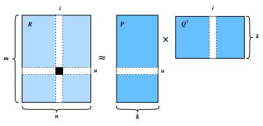

# Phân rã ma trận

Phân rã ma trận [Koren.Bell.Volinsky.2009] là một thuật toán đã được thiết lập vững chắc trong tài liệu về hệ thống gợi ý. Phiên bản đầu tiên của mô hình phân rã ma trận được Simon Funk đề xuất trong một [bài blog](https://sifter.org/%7Esimon/journal/20061211.html) nổi tiếng, trong đó ông mô tả ý tưởng phân rã ma trận tương tác. Sau đó, nó trở nên được biết đến rộng rãi nhờ cuộc thi Netflix được tổ chức năm 2006. Khi đó, Netflix, một công ty phát trực tuyến nội dung và cho thuê video, đã công bố một cuộc thi nhằm cải thiện hiệu năng hệ thống gợi ý của họ. Đội tốt nhất có thể cải thiện 10 phần trăm so với baseline của Netflix, tức Cinematch, sẽ giành giải thưởng một triệu USD. Vì vậy, cuộc thi này đã thu hút rất nhiều sự chú ý tới lĩnh vực nghiên cứu hệ thống gợi ý. Sau đó, giải thưởng lớn thuộc về đội BellKor's Pragmatic Chaos, một đội kết hợp giữa BellKor, Pragmatic Theory và BigChaos (hiện giờ bạn không cần bận tâm về các thuật toán này). Mặc dù điểm số cuối cùng là kết quả của một nghiệm ensemble (tức là sự kết hợp của nhiều thuật toán), thuật toán phân rã ma trận đã đóng vai trò then chốt trong tổ hợp cuối cùng. Báo cáo kỹ thuật của nghiệm đoạt Giải thưởng lớn Netflix [Toscher.Jahrer.Bell.2009] cung cấp phần giới thiệu chi tiết về mô hình được áp dụng. Trong phần này, chúng ta sẽ đi sâu vào chi tiết của mô hình phân rã ma trận và cách triển khai nó.


## Mô hình phân rã ma trận

Phân rã ma trận là một lớp các mô hình lọc cộng tác. Cụ thể, mô hình phân rã ma trận tương tác người dùng-vật phẩm (ví dụ, ma trận rating) thành tích của hai ma trận hạng thấp hơn, nắm bắt cấu trúc hạng thấp của các tương tác người dùng-vật phẩm.

Gọi $\mathbf{R} \in \mathbb{R}^{m \times n}$ là ma trận tương tác với $m$ người dùng và $n$ vật phẩm, và các giá trị của $\mathbf{R}$ biểu diễn các rating tường minh. Tương tác người dùng-vật phẩm sẽ được phân rã thành một ma trận tiềm ẩn người dùng $\mathbf{P} \in \mathbb{R}^{m \times k}$ và một ma trận tiềm ẩn vật phẩm $\mathbf{Q} \in \mathbb{R}^{n \times k}$, trong đó $k \ll m, n$ là kích thước nhân tố tiềm ẩn. Gọi $\mathbf{p}_u$ là hàng thứ $u^\textrm{th}$ của $\mathbf{P}$ và $\mathbf{q}_i$ là hàng thứ $i^\textrm{th}$ của $\mathbf{Q}$. Với một vật phẩm $i$ cho trước, các phần tử của $\mathbf{q}_i$ đo mức độ vật phẩm sở hữu các đặc trưng như thể loại và ngôn ngữ của một bộ phim. Với một người dùng $u$ cho trước, các phần tử của $\mathbf{p}_u$ đo mức độ quan tâm của người dùng đối với các đặc trưng tương ứng của vật phẩm. Các nhân tố tiềm ẩn này có thể đo các chiều hiển nhiên như đã nêu trong các ví dụ đó, hoặc hoàn toàn không diễn giải được. Các rating dự đoán có thể được ước lượng bằng

$$\hat{\mathbf{R}} = \mathbf{PQ}^\top$$

trong đó $\hat{\mathbf{R}}\in \mathbb{R}^{m \times n}$ là ma trận rating dự đoán có cùng hình dạng với $\mathbf{R}$. Một vấn đề chính của quy tắc dự đoán này là nó không thể mô hình hóa độ lệch của người dùng/vật phẩm. Ví dụ, một số người dùng có xu hướng cho rating cao hơn, hoặc một số vật phẩm luôn nhận rating thấp hơn do chất lượng kém hơn. Những độ lệch này rất phổ biến trong các ứng dụng thực tế. Để nắm bắt các độ lệch này, các hạng độ lệch riêng cho người dùng và riêng cho vật phẩm được đưa vào. Cụ thể, rating dự đoán mà người dùng $u$ cho vật phẩm $i$ được tính bằng

$$
\hat{\mathbf{R}}_{ui} = \mathbf{p}_u\mathbf{q}^\top_i + b_u + b_i
$$

Sau đó, chúng ta huấn luyện mô hình phân rã ma trận bằng cách cực tiểu hóa sai số bình phương trung bình giữa điểm rating dự đoán và điểm rating thực. Hàm mục tiêu được định nghĩa như sau:

$$
\underset{\mathbf{P}, \mathbf{Q}, b}{\mathrm{argmin}} \sum_{(u, i) \in \mathcal{K}} \| \mathbf{R}_{ui} -
\hat{\mathbf{R}}_{ui} \|^2 + \lambda (\| \mathbf{P} \|^2_F + \| \mathbf{Q}
\|^2_F + b_u^2 + b_i^2 )
$$

trong đó $\lambda$ biểu thị hệ số điều chuẩn. Hạng điều chuẩn $\lambda (\| \mathbf{P} \|^2_F + \| \mathbf{Q}
\|^2_F + b_u^2 + b_i^2 )$ được dùng để tránh overfitting bằng cách phạt độ lớn của các tham số. Các cặp $(u, i)$ mà $\mathbf{R}_{ui}$ đã biết được lưu trong tập
$\mathcal{K}=\{(u, i) \mid \mathbf{R}_{ui} \textrm{ is known}\}$. Các tham số mô hình có thể được học bằng một thuật toán tối ưu hóa, chẳng hạn Stochastic Gradient Descent và Adam.

Một minh họa trực quan của mô hình phân rã ma trận được trình bày dưới đây:



Trong phần còn lại của mục này, chúng ta sẽ giải thích cách triển khai phân rã ma trận và huấn luyện mô hình trên bộ dữ liệu MovieLens.

```python
#@tab mxnet
from d2l import mxnet as d2l
from mxnet import autograd, gluon, np, npx
from mxnet.gluon import nn
import mxnet as mx
npx.set_np()
```

## Triển khai mô hình

Đầu tiên, chúng ta triển khai mô hình phân rã ma trận được mô tả ở trên. Các nhân tố tiềm ẩn của người dùng và vật phẩm có thể được tạo bằng `nn.Embedding`. `input_dim` là số vật phẩm/người dùng và `output_dim` là số chiều của các nhân tố tiềm ẩn $k$. Chúng ta cũng có thể dùng `nn.Embedding` để tạo độ lệch người dùng/vật phẩm bằng cách đặt `output_dim` bằng một. Trong hàm `forward`, id người dùng và vật phẩm được dùng để tra cứu các embedding.

```python
#@tab mxnet
class MF(nn.Block):
    def __init__(self, num_factors, num_users, num_items, **kwargs):
        super(MF, self).__init__(**kwargs)
        self.P = nn.Embedding(input_dim=num_users, output_dim=num_factors)
        self.Q = nn.Embedding(input_dim=num_items, output_dim=num_factors)
        self.user_bias = nn.Embedding(num_users, 1)
        self.item_bias = nn.Embedding(num_items, 1)

    def forward(self, user_id, item_id):
        P_u = self.P(user_id)
        Q_i = self.Q(item_id)
        b_u = self.user_bias(user_id)
        b_i = self.item_bias(item_id)
        outputs = (P_u * Q_i).sum(axis=1) + np.squeeze(b_u) + np.squeeze(b_i)
        return outputs.flatten()
```

## Thước đo đánh giá

Tiếp theo, chúng ta triển khai thước đo RMSE (sai số căn trung bình bình phương), vốn thường được dùng để đo khác biệt giữa điểm rating do mô hình dự đoán và các rating thực sự quan sát được (ground truth) [Gunawardana.Shani.2015]. RMSE được định nghĩa là:

$$
\textrm{RMSE} = \sqrt{\frac{1}{|\mathcal{T}|}\sum_{(u, i) \in \mathcal{T}}(\mathbf{R}_{ui} -\hat{\mathbf{R}}_{ui})^2}
$$

trong đó $\mathcal{T}$ là tập gồm các cặp người dùng và vật phẩm mà bạn muốn đánh giá trên đó. $|\mathcal{T}|$ là kích thước của tập này. Chúng ta có thể dùng hàm RMSE do `mx.metric` cung cấp.

```python
#@tab mxnet
def evaluator(net, test_iter, devices):
    rmse = mx.metric.RMSE()  # Get the RMSE
    rmse_list = []
    for idx, (users, items, ratings) in enumerate(test_iter):
        u = gluon.utils.split_and_load(users, devices, even_split=False)
        i = gluon.utils.split_and_load(items, devices, even_split=False)
        r_ui = gluon.utils.split_and_load(ratings, devices, even_split=False)
        r_hat = [net(u, i) for u, i in zip(u, i)]
        rmse.update(labels=r_ui, preds=r_hat)
        rmse_list.append(rmse.get()[1])
    return float(np.mean(np.array(rmse_list)))
```

## Huấn luyện và đánh giá mô hình


Trong hàm huấn luyện, chúng ta dùng mất mát $\ell_2$ với weight decay. Cơ chế weight decay có cùng tác dụng với điều chuẩn $\ell_2$.

```python
#@tab mxnet
def train_recsys_rating(net, train_iter, test_iter, loss, trainer, num_epochs,
                        devices=d2l.try_all_gpus(), evaluator=None,
                        **kwargs):
    timer = d2l.Timer()
    animator = d2l.Animator(xlabel='epoch', xlim=[1, num_epochs], ylim=[0, 2],
                            legend=['train loss', 'test RMSE'])
    for epoch in range(num_epochs):
        metric, l = d2l.Accumulator(3), 0.
        for i, values in enumerate(train_iter):
            timer.start()
            input_data = []
            values = values if isinstance(values, list) else [values]
            for v in values:
                input_data.append(gluon.utils.split_and_load(v, devices))
            train_feat = input_data[:-1] if len(values) > 1 else input_data
            train_label = input_data[-1]
            with autograd.record():
                preds = [net(*t) for t in zip(*train_feat)]
                ls = [loss(p, s) for p, s in zip(preds, train_label)]
            [l.backward() for l in ls]
            l += sum([l.asnumpy() for l in ls]).mean() / len(devices)
            trainer.step(values[0].shape[0])
            metric.add(l, values[0].shape[0], values[0].size)
            timer.stop()
        if len(kwargs) > 0:  # It will be used in section AutoRec
            test_rmse = evaluator(net, test_iter, kwargs['inter_mat'],
                                  devices)
        else:
            test_rmse = evaluator(net, test_iter, devices)
        train_l = l / (i + 1)
        animator.add(epoch + 1, (train_l, test_rmse))
    print(f'train loss {metric[0] / metric[1]:.3f}, '
          f'test RMSE {test_rmse:.3f}')
    print(f'{metric[2] * num_epochs / timer.sum():.1f} examples/sec '
          f'on {str(devices)}')
```

Cuối cùng, hãy kết hợp mọi thứ lại với nhau và huấn luyện mô hình. Ở đây, chúng ta đặt số chiều nhân tố tiềm ẩn là 30.

```python
#@tab mxnet
devices = d2l.try_all_gpus()
num_users, num_items, train_iter, test_iter = d2l.split_and_load_ml100k(
    test_ratio=0.1, batch_size=512)
net = MF(30, num_users, num_items)
net.initialize(ctx=devices, force_reinit=True, init=mx.init.Normal(0.01))
lr, num_epochs, wd, optimizer = 0.002, 20, 1e-5, 'adam'
loss = gluon.loss.L2Loss()
trainer = gluon.Trainer(net.collect_params(), optimizer,
                        {"learning_rate": lr, 'wd': wd})
train_recsys_rating(net, train_iter, test_iter, loss, trainer, num_epochs,
                    devices, evaluator)
```

Dưới đây, chúng ta dùng mô hình đã huấn luyện để dự đoán rating mà một người dùng (ID 20) có thể cho một vật phẩm (ID 30).

```python
#@tab mxnet
scores = net(np.array([20], dtype='int', ctx=devices[0]),
             np.array([30], dtype='int', ctx=devices[0]))
scores
```

## Tóm tắt

* Mô hình phân rã ma trận được sử dụng rộng rãi trong các hệ thống gợi ý. Nó có thể được dùng để dự đoán rating mà một người dùng có thể cho một vật phẩm.
* Chúng ta có thể triển khai và huấn luyện phân rã ma trận cho các hệ thống gợi ý.


## Bài tập

* Thay đổi kích thước của các nhân tố tiềm ẩn. Kích thước của các nhân tố tiềm ẩn ảnh hưởng đến hiệu năng mô hình như thế nào?
* Thử các optimizer, tốc độ học và hệ số weight decay khác nhau.
* Kiểm tra điểm rating dự đoán của những người dùng khác cho một bộ phim cụ thể.
