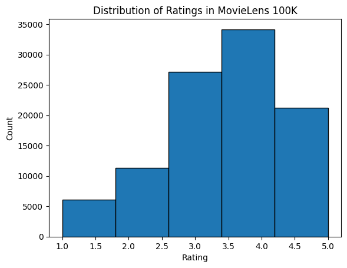

#  Bộ dữ liệu MovieLens

Có nhiều bộ dữ liệu sẵn có cho nghiên cứu về gợi ý. Trong số đó, bộ dữ liệu [MovieLens](https://movielens.org/) có lẽ là một trong những bộ phổ biến hơn. MovieLens là một hệ thống gợi ý phim phi thương mại trên nền web. Nó được tạo ra vào năm 1997 và vận hành bởi GroupLens, một phòng thí nghiệm nghiên cứu tại Đại học Minnesota, nhằm thu thập dữ liệu đánh giá phim cho mục đích nghiên cứu. Dữ liệu MovieLens có vai trò quan trọng trong nhiều nghiên cứu, bao gồm gợi ý cá nhân hóa và tâm lý học xã hội.

## Lấy dữ liệu

Bộ dữ liệu MovieLens được lưu trữ trên trang web [GroupLens](https://grouplens.org/datasets/movielens/). Có một số phiên bản khác nhau. Chúng ta sẽ sử dụng bộ dữ liệu MovieLens 100K [Herlocker.Konstan.Borchers.ea.1999]. Bộ dữ liệu này gồm $100,000$ đánh giá, từ 1 đến 5 sao, của 943 người dùng trên 1682 phim. Nó đã được làm sạch sao cho mỗi người dùng đã đánh giá ít nhất 20 phim. Một số thông tin nhân khẩu học đơn giản như tuổi, giới tính, thể loại ứng với người dùng và vật phẩm cũng có sẵn. Chúng ta có thể tải [ml-100k.zip](http://files.grouplens.org/datasets/movielens/ml-100k.zip) và giải nén tệp `u.data`, chứa toàn bộ $100,000$ đánh giá ở định dạng csv. Có nhiều tệp khác trong thư mục; mô tả chi tiết cho từng tệp có thể được tìm thấy trong tệp [README](http://files.grouplens.org/datasets/movielens/ml-100k-README.txt) của bộ dữ liệu.

Trước hết, hãy nhập các gói cần thiết để chạy các thí nghiệm trong phần này.

```python
#@tab mxnet
from d2l import mxnet as d2l
from mxnet import gluon, np
import os
import pandas as pd
```




Sau đó, chúng ta tải bộ dữ liệu MovieLens 100k và nạp các tương tác dưới dạng `DataFrame`.

```python
#@tab mxnet
d2l.DATA_HUB['ml-100k'] = (
    'https://files.grouplens.org/datasets/movielens/ml-100k.zip',
    'cd4dcac4241c8a4ad7badc7ca635da8a69dddb83')
def read_data_ml100k():
    data_dir = d2l.download_extract('ml-100k')
    names = ['user_id', 'item_id', 'rating', 'timestamp']
    data = pd.read_csv(os.path.join(data_dir, 'u.data'), sep='\t',
                       names=names, engine='python')
    num_users = data.user_id.unique().shape[0]
    num_items = data.item_id.unique().shape[0]
    return data, num_users, num_items
```

## Thống kê của bộ dữ liệu

Hãy nạp dữ liệu và kiểm tra thủ công năm bản ghi đầu tiên. Đây là một cách hiệu quả để hiểu cấu trúc dữ liệu và xác minh rằng dữ liệu đã được nạp đúng.

```python
#@tab mxnet
data, num_users, num_items = read_data_ml100k()
sparsity = 1 - len(data) / (num_users * num_items)
print(f'number of users: {num_users}, number of items: {num_items}')
print(f'matrix sparsity: {sparsity:f}')
print(data.head(5))
```

Chúng ta có thể thấy rằng mỗi dòng gồm bốn cột, bao gồm "user id" 1-943, "item id" 1-1682, "rating" 1-5 và "timestamp". Chúng ta có thể xây dựng một ma trận tương tác kích thước $n \times m$, trong đó $n$ và $m$ lần lượt là số người dùng và số vật phẩm. Bộ dữ liệu này chỉ ghi lại các đánh giá đã tồn tại, vì vậy chúng ta cũng có thể gọi nó là ma trận rating, và sẽ dùng ma trận tương tác và ma trận rating thay thế cho nhau trong trường hợp các giá trị của ma trận này biểu diễn đúng các rating. Phần lớn các giá trị trong ma trận rating là chưa biết vì người dùng chưa đánh giá đa số phim. Chúng ta cũng hiển thị độ thưa của bộ dữ liệu này. Độ thưa được định nghĩa là `1 - số phần tử khác không / (số người dùng * số vật phẩm)`. Rõ ràng, ma trận tương tác cực kỳ thưa (tức là độ thưa = 93.695%). Các bộ dữ liệu thực tế có thể chịu mức độ thưa lớn hơn, và đây đã là một thách thức lâu dài trong việc xây dựng các hệ thống gợi ý. Một giải pháp khả thi là sử dụng thêm thông tin phụ trợ như đặc trưng người dùng/vật phẩm để giảm bớt độ thưa.

Sau đó, chúng ta vẽ phân phối số lượng của các rating khác nhau. Đúng như kỳ vọng, nó có vẻ là một phân phối chuẩn, với phần lớn rating tập trung ở 3-4.

```python
#@tab mxnet
d2l.plt.hist(data['rating'], bins=5, ec='black')
d2l.plt.xlabel('Rating')
d2l.plt.ylabel('Count')
d2l.plt.title('Distribution of Ratings in MovieLens 100K')
d2l.plt.show()
```

## Chia bộ dữ liệu

Chúng ta chia bộ dữ liệu thành tập huấn luyện và tập kiểm tra. Hàm sau cung cấp hai chế độ chia, bao gồm `random` và `seq-aware`. Ở chế độ `random`, hàm chia ngẫu nhiên 100k tương tác mà không xét timestamp, và mặc định sử dụng 90% dữ liệu làm mẫu huấn luyện, 10% còn lại làm mẫu kiểm tra. Ở chế độ `seq-aware`, chúng ta giữ lại vật phẩm mà một người dùng đã đánh giá gần đây nhất để kiểm tra, và dùng các tương tác lịch sử của người dùng làm tập huấn luyện. Các tương tác lịch sử của người dùng được sắp xếp từ cũ nhất đến mới nhất dựa trên timestamp. Chế độ này sẽ được sử dụng trong phần gợi ý nhận biết chuỗi.

```python
#@tab mxnet
def split_data_ml100k(data, num_users, num_items,
                      split_mode='random', test_ratio=0.1):
    """Split the dataset in random mode or seq-aware mode."""
    if split_mode == 'seq-aware':
        train_items, test_items, train_list = {}, {}, []
        for line in data.itertuples():
            u, i, rating, time = line[1], line[2], line[3], line[4]
            train_items.setdefault(u, []).append((u, i, rating, time))
            if u not in test_items or test_items[u][-1] < time:
                test_items[u] = (i, rating, time)
        for u in range(1, num_users + 1):
            train_list.extend(sorted(train_items[u], key=lambda k: k[3]))
        test_data = [(key, *value) for key, value in test_items.items()]
        train_data = [item for item in train_list if item not in test_data]
        train_data = pd.DataFrame(train_data)
        test_data = pd.DataFrame(test_data)
    else:
        mask = [True if x == 1 else False for x in np.random.uniform(
            0, 1, (len(data))) < 1 - test_ratio]
        neg_mask = [not x for x in mask]
        train_data, test_data = data[mask], data[neg_mask]
    return train_data, test_data
```

Lưu ý rằng trong thực tế, ngoài tập kiểm tra, sử dụng một tập validation là thực hành tốt. Tuy nhiên, chúng ta bỏ qua điều đó để trình bày ngắn gọn. Trong trường hợp này, tập kiểm tra của chúng ta có thể được xem là tập validation giữ lại.

## Nạp dữ liệu

Sau khi chia bộ dữ liệu, để thuận tiện, chúng ta sẽ chuyển tập huấn luyện và tập kiểm tra thành các danh sách và từ điển/ma trận. Hàm sau đọc dataframe từng dòng một và đánh số chỉ mục của người dùng/vật phẩm bắt đầu từ 0. Sau đó, hàm trả về các danh sách người dùng, vật phẩm, rating và một từ điển/ma trận ghi lại các tương tác. Chúng ta có thể chỉ định loại phản hồi là `explicit` hoặc `implicit`.

```python
#@tab mxnet
def load_data_ml100k(data, num_users, num_items, feedback='explicit'):
    users, items, scores = [], [], []
    inter = np.zeros((num_items, num_users)) if feedback == 'explicit' else {}
    for line in data.itertuples():
        user_index, item_index = int(line[1] - 1), int(line[2] - 1)
        score = int(line[3]) if feedback == 'explicit' else 1
        users.append(user_index)
        items.append(item_index)
        scores.append(score)
        if feedback == 'implicit':
            inter.setdefault(user_index, []).append(item_index)
        else:
            inter[item_index, user_index] = score
    return users, items, scores, inter
```

Sau đó, chúng ta kết hợp các bước trên lại với nhau, và hàm này sẽ được sử dụng trong phần tiếp theo. Kết quả được bao bọc bằng `Dataset` và `DataLoader`. Lưu ý rằng `last_batch` của `DataLoader` cho dữ liệu huấn luyện được đặt thành chế độ `rollover` (các mẫu còn lại được chuyển sang epoch tiếp theo), và thứ tự được xáo trộn.

```python
#@tab mxnet
def split_and_load_ml100k(split_mode='seq-aware', feedback='explicit',
                          test_ratio=0.1, batch_size=256):
    data, num_users, num_items = read_data_ml100k()
    train_data, test_data = split_data_ml100k(
        data, num_users, num_items, split_mode, test_ratio)
    train_u, train_i, train_r, _ = load_data_ml100k(
        train_data, num_users, num_items, feedback)
    test_u, test_i, test_r, _ = load_data_ml100k(
        test_data, num_users, num_items, feedback)
    train_set = gluon.data.ArrayDataset(
        np.array(train_u), np.array(train_i), np.array(train_r))
    test_set = gluon.data.ArrayDataset(
        np.array(test_u), np.array(test_i), np.array(test_r))
    train_iter = gluon.data.DataLoader(
        train_set, shuffle=True, last_batch='rollover',
        batch_size=batch_size)
    test_iter = gluon.data.DataLoader(
        test_set, batch_size=batch_size)
    return num_users, num_items, train_iter, test_iter
```

## Tóm tắt

* Các bộ dữ liệu MovieLens được sử dụng rộng rãi cho nghiên cứu về gợi ý. Chúng được công khai và miễn phí sử dụng.
* Chúng ta định nghĩa các hàm để tải xuống và tiền xử lý bộ dữ liệu MovieLens 100k cho việc sử dụng tiếp trong các phần sau.

## Bài tập

* Bạn có thể tìm thấy những bộ dữ liệu gợi ý tương tự nào khác?
* Hãy xem trang [https://movielens.org/](https://movielens.org/) để biết thêm thông tin về MovieLens.
