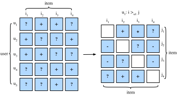

# Xếp hạng cá nhân hóa cho hệ thống gợi ý

Trong các phần trước, chúng ta chỉ xét phản hồi tường minh và các mô hình được huấn luyện, kiểm tra trên các rating đã quan sát được. Những phương pháp như vậy có hai nhược điểm: Thứ nhất, trong các kịch bản thực tế, phần lớn phản hồi không tường minh mà là ngầm định, và phản hồi tường minh có thể tốn kém hơn để thu thập. Thứ hai, các cặp người dùng-vật phẩm chưa quan sát, vốn có thể dự đoán sở thích của người dùng, lại bị bỏ qua hoàn toàn, khiến các phương pháp này không phù hợp cho những trường hợp rating không bị thiếu ngẫu nhiên mà thiếu do sở thích của người dùng. Các cặp người dùng-vật phẩm chưa quan sát là một hỗn hợp của phản hồi âm thực sự (người dùng không quan tâm đến vật phẩm) và giá trị thiếu (người dùng có thể tương tác với vật phẩm trong tương lai). Chúng ta chỉ đơn giản bỏ qua các cặp chưa quan sát trong phân rã ma trận và AutoRec. Rõ ràng, các mô hình này không có khả năng phân biệt giữa các cặp đã quan sát và chưa quan sát, và thường không phù hợp cho các tác vụ xếp hạng cá nhân hóa.

Vì mục tiêu này, một lớp các mô hình gợi ý hướng tới việc tạo các danh sách gợi ý được xếp hạng từ phản hồi ngầm định đã trở nên phổ biến. Nhìn chung, các mô hình xếp hạng cá nhân hóa có thể được tối ưu bằng các cách tiếp cận pointwise, pairwise hoặc listwise. Các cách tiếp cận pointwise xét một tương tác tại một thời điểm và huấn luyện một bộ phân loại hoặc bộ hồi quy để dự đoán sở thích riêng lẻ. Phân rã ma trận và AutoRec được tối ưu bằng các mục tiêu pointwise. Các cách tiếp cận pairwise xét một cặp vật phẩm cho mỗi người dùng và hướng tới xấp xỉ thứ tự tối ưu cho cặp đó. Thông thường, các cách tiếp cận pairwise phù hợp hơn với tác vụ xếp hạng vì dự đoán thứ tự tương đối gợi nhớ đến bản chất của xếp hạng. Các cách tiếp cận listwise xấp xỉ thứ tự của toàn bộ danh sách vật phẩm, ví dụ, tối ưu trực tiếp các thước đo xếp hạng như Normalized Discounted Cumulative Gain ([NDCG](https://en.wikipedia.org/wiki/Discounted_cumulative_gain)). Tuy nhiên, các cách tiếp cận listwise phức tạp và tốn tính toán hơn so với cách tiếp cận pointwise hoặc pairwise. Trong phần này, chúng ta sẽ giới thiệu hai mục tiêu/mất mát pairwise, mất mát Bayesian Personalized Ranking và mất mát Hinge, cùng các triển khai tương ứng.

## Mất mát Bayesian Personalized Ranking và cách triển khai

Bayesian personalized ranking (BPR) [Rendle.Freudenthaler.Gantner.ea.2009] là một mất mát xếp hạng cá nhân hóa pairwise được suy ra từ bộ ước lượng hậu nghiệm cực đại. Nó đã được sử dụng rộng rãi trong nhiều mô hình gợi ý hiện có. Dữ liệu huấn luyện của BPR gồm cả các cặp dương và cặp âm (giá trị thiếu). Nó giả định rằng người dùng thích vật phẩm dương hơn tất cả các vật phẩm chưa quan sát khác.

Một cách hình thức, dữ liệu huấn luyện được xây dựng bằng các bộ ở dạng $(u, i, j)$, biểu diễn rằng người dùng $u$ thích vật phẩm $i$ hơn vật phẩm $j$. Công thức Bayes của BPR, với mục tiêu tối đa hóa xác suất hậu nghiệm, được cho dưới đây:

$$
p(\Theta \mid >_u )  \propto  p(>_u \mid \Theta) p(\Theta)
$$

Trong đó $\Theta$ biểu diễn các tham số của một mô hình gợi ý bất kỳ, còn $>_u$ biểu diễn thứ tự xếp hạng toàn phần cá nhân hóa mong muốn của tất cả vật phẩm cho người dùng $u$. Chúng ta có thể thiết lập bộ ước lượng hậu nghiệm cực đại để suy ra tiêu chí tối ưu hóa tổng quát cho tác vụ xếp hạng cá nhân hóa.

$$
\begin{aligned}
\textrm{BPR-OPT} : &= \ln p(\Theta \mid >_u) \\
         & \propto \ln p(>_u \mid \Theta) p(\Theta) \\
         &= \ln \prod_{(u, i, j \in D)} \sigma(\hat{y}_{ui} - \hat{y}_{uj}) p(\Theta) \\
         &= \sum_{(u, i, j \in D)} \ln \sigma(\hat{y}_{ui} - \hat{y}_{uj}) + \ln p(\Theta) \\
         &= \sum_{(u, i, j \in D)} \ln \sigma(\hat{y}_{ui} - \hat{y}_{uj}) - \lambda_\Theta \|\Theta \|^2
\end{aligned}
$$


trong đó $D \stackrel{\textrm{def}}{=} \{(u, i, j) \mid i \in I^+_u \wedge j \in I \backslash I^+_u \}$ là tập huấn luyện, với $I^+_u$ biểu thị các vật phẩm mà người dùng $u$ thích, $I$ biểu thị tất cả vật phẩm, và $I \backslash I^+_u$ chỉ tất cả vật phẩm khác, ngoại trừ các vật phẩm người dùng đã thích. $\hat{y}_{ui}$ và $\hat{y}_{uj}$ lần lượt là điểm dự đoán của người dùng $u$ cho vật phẩm $i$ và $j$. Tiên nghiệm $p(\Theta)$ là một phân phối chuẩn với trung bình bằng 0 và ma trận phương sai-hiệp phương sai $\Sigma_\Theta$. Ở đây, chúng ta đặt $\Sigma_\Theta = \lambda_\Theta I$.


Chúng ta sẽ triển khai lớp cơ sở `mxnet.gluon.loss.Loss` và ghi đè phương thức `forward` để xây dựng mất mát Bayesian personalized ranking. Chúng ta bắt đầu bằng cách nhập lớp Loss và mô-đun np.

```python
#@tab mxnet
from mxnet import gluon, np, npx
npx.set_np()
```

Triển khai của mất mát BPR như sau.

```python
#@tab mxnet
class BPRLoss(gluon.loss.Loss):
    def __init__(self, weight=None, batch_axis=0, **kwargs):
        super(BPRLoss, self).__init__(weight=None, batch_axis=0, **kwargs)

    def forward(self, positive, negative):
        distances = positive - negative
        loss = - np.sum(np.log(npx.sigmoid(distances)), 0, keepdims=True)
        return loss
```

## Mất mát Hinge và cách triển khai

Mất mát Hinge cho xếp hạng có dạng khác với [hinge loss](https://mxnet.incubator.apache.org/api/python/gluon/loss.html#mxnet.gluon.loss.HingeLoss) được cung cấp trong thư viện gluon, vốn thường được dùng trong các bộ phân loại như SVM. Mất mát được dùng cho xếp hạng trong hệ thống gợi ý có dạng sau.

$$
 \sum_{(u, i, j \in D)} \max( m - \hat{y}_{ui} + \hat{y}_{uj}, 0)
$$

trong đó $m$ là kích thước lề an toàn. Nó nhằm đẩy các vật phẩm âm ra xa các vật phẩm dương. Tương tự BPR, nó hướng tới tối ưu khoảng cách tương đối giữa các mẫu dương và âm thay vì các đầu ra tuyệt đối, nhờ đó rất phù hợp với hệ thống gợi ý.

```python
#@tab mxnet
class HingeLossbRec(gluon.loss.Loss):
    def __init__(self, weight=None, batch_axis=0, **kwargs):
        super(HingeLossbRec, self).__init__(weight=None, batch_axis=0,
                                            **kwargs)

    def forward(self, positive, negative, margin=1):
        distances = positive - negative
        loss = np.sum(np.maximum(- distances + margin, 0))
        return loss
```

Hai mất mát này có thể thay thế cho nhau trong xếp hạng cá nhân hóa cho gợi ý.

## Tóm tắt

- Có ba loại mất mát xếp hạng khả dụng cho tác vụ xếp hạng cá nhân hóa trong hệ thống gợi ý, cụ thể là các phương pháp pointwise, pairwise và listwise.
- Hai mất mát pairwise, mất mát Bayesian personalized ranking và mất mát hinge, có thể được sử dụng thay thế cho nhau.

## Bài tập

- Có biến thể nào của BPR và hinge loss không?
- Bạn có thể tìm thấy mô hình gợi ý nào dùng BPR hoặc hinge loss không?
