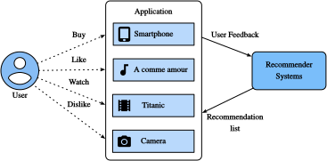

# Tổng quan về hệ thống gợi ý

Trong thập kỷ qua, Internet đã phát triển thành một nền tảng cho các dịch vụ trực tuyến quy mô lớn, làm thay đổi sâu sắc cách chúng ta giao tiếp, đọc tin tức, mua sản phẩm và xem phim. Đồng thời, số lượng mục chưa từng có (chúng ta dùng thuật ngữ *item* để chỉ phim, tin tức, sách và sản phẩm) được cung cấp trực tuyến đòi hỏi một hệ thống có thể giúp chúng ta khám phá các mục mình ưa thích. Vì vậy, hệ thống gợi ý là các công cụ lọc thông tin mạnh mẽ có thể hỗ trợ dịch vụ cá nhân hóa và cung cấp trải nghiệm được điều chỉnh cho từng người dùng. Tóm lại, hệ thống gợi ý đóng vai trò then chốt trong việc tận dụng lượng dữ liệu dồi dào sẵn có để làm cho các lựa chọn trở nên dễ quản lý. Ngày nay, hệ thống gợi ý nằm ở lõi của nhiều nhà cung cấp dịch vụ trực tuyến như Amazon, Netflix và YouTube. Nhắc lại ví dụ về các sách học sâu được Amazon gợi ý trong [subsec_recommender_systems](#subsec_recommender_systems). Lợi ích của việc sử dụng hệ thống gợi ý có hai mặt: một mặt, nó có thể giảm đáng kể nỗ lực của người dùng trong việc tìm mục và giảm bớt vấn đề quá tải thông tin. Mặt khác, nó có thể thêm giá trị kinh doanh cho các nhà cung cấp dịch vụ trực tuyến và là một nguồn doanh thu quan trọng. Chương này sẽ giới thiệu các khái niệm nền tảng, mô hình cổ điển và các tiến bộ gần đây với học sâu trong lĩnh vực hệ thống gợi ý, cùng với các ví dụ được triển khai.

## Collaborative Filtering

Chúng ta bắt đầu hành trình với một khái niệm quan trọng trong hệ thống gợi ý: collaborative filtering
(CF), được đặt tên lần đầu bởi hệ thống Tapestry [Goldberg.Nichols.Oki.ea.1992], chỉ việc "mọi người cộng tác để giúp nhau thực hiện quá trình lọc nhằm xử lý lượng lớn email và thông điệp được đăng lên newsgroup". Thuật ngữ này đã được làm phong phú thêm với nhiều nghĩa. Theo nghĩa rộng, đó là quá trình
lọc thông tin hoặc mẫu bằng các kỹ thuật liên quan đến sự cộng tác giữa nhiều người dùng, agent và nguồn dữ liệu. CF có nhiều hình thức và đã có rất nhiều phương pháp CF được đề xuất kể từ khi xuất hiện.

Nhìn chung, các kỹ thuật CF có thể được phân loại thành: CF dựa trên bộ nhớ, CF dựa trên mô hình, và dạng lai của chúng [Su.Khoshgoftaar.2009]. Các kỹ thuật CF dựa trên bộ nhớ tiêu biểu là CF dựa trên láng giềng gần nhất như user-based CF và item-based CF [Sarwar.Karypis.Konstan.ea.2001]. Các mô hình nhân tố ẩn như matrix factorization là ví dụ của CF dựa trên mô hình. CF dựa trên bộ nhớ có hạn chế khi xử lý dữ liệu thưa và quy mô lớn vì nó tính các giá trị tương đồng dựa trên các item chung. Các phương pháp dựa trên mô hình trở nên phổ biến hơn nhờ
khả năng xử lý thưa và khả năng mở rộng tốt hơn. Nhiều cách tiếp cận CF dựa trên mô hình có thể được mở rộng bằng mạng nơ-ron, dẫn đến các mô hình linh hoạt và có khả năng mở rộng hơn với tăng tốc tính toán trong học sâu [Zhang.Yao.Sun.ea.2019]. Nhìn chung, CF chỉ dùng dữ liệu tương tác người dùng-item để đưa ra dự đoán và gợi ý. Bên cạnh CF, các hệ thống gợi ý dựa trên nội dung và dựa trên ngữ cảnh cũng hữu ích trong việc kết hợp mô tả nội dung của item/người dùng và các tín hiệu ngữ cảnh như dấu thời gian và vị trí. Rõ ràng, chúng ta có thể cần điều chỉnh loại/cấu trúc mô hình khi có các dữ liệu đầu vào khác nhau.

## Phản hồi tường minh và phản hồi ngầm định

Để học sở thích của người dùng, hệ thống cần thu thập phản hồi từ họ. Phản hồi có thể là tường minh hoặc ngầm định [Hu.Koren.Volinsky.2008]. Ví dụ, [IMDb](https://www.imdb.com/) thu thập đánh giá sao từ một đến mười sao cho phim. YouTube cung cấp các nút thích và không thích để người dùng thể hiện sở thích. Rõ ràng việc thu thập phản hồi tường minh yêu cầu người dùng chủ động chỉ ra mối quan tâm của họ. Tuy nhiên, phản hồi tường minh không phải lúc nào cũng sẵn có vì nhiều người dùng có thể không muốn đánh giá sản phẩm. Tương đối mà nói, phản hồi ngầm định thường sẵn có vì nó chủ yếu liên quan đến mô hình hóa hành vi ngầm như click của người dùng. Do đó, nhiều hệ thống gợi ý tập trung vào phản hồi ngầm định, phản ánh gián tiếp ý kiến của người dùng thông qua quan sát hành vi người dùng. Có nhiều dạng phản hồi ngầm định, bao gồm lịch sử mua hàng, lịch sử duyệt, lượt xem và thậm chí chuyển động chuột. Ví dụ, một người dùng mua nhiều sách của cùng một tác giả có lẽ thích tác giả đó. Lưu ý rằng phản hồi ngầm định vốn có nhiễu. Chúng ta chỉ có thể *đoán* sở thích và động cơ thật của họ. Việc một người dùng xem một bộ phim không nhất thiết cho thấy họ có quan điểm tích cực về bộ phim đó.

## Các tác vụ gợi ý

Nhiều tác vụ gợi ý đã được nghiên cứu trong vài thập kỷ qua. Dựa trên miền ứng dụng, có gợi ý phim, gợi ý tin tức, gợi ý điểm quan tâm [Ye.Yin.Lee.ea.2011], v.v. Cũng có thể phân biệt các tác vụ dựa trên loại phản hồi và dữ liệu đầu vào, ví dụ tác vụ dự đoán rating nhằm dự đoán các rating tường minh. Gợi ý top-$n$ (xếp hạng item) xếp hạng tất cả item cho từng người dùng một cách cá nhân dựa trên phản hồi ngầm định. Nếu thông tin dấu thời gian cũng được bao gồm, chúng ta có thể xây dựng gợi ý nhận biết chuỗi [Quadrana.Cremonesi.Jannach.2018]. Một tác vụ phổ biến khác được gọi là dự đoán click-through rate, cũng dựa trên phản hồi ngầm định, nhưng có thể tận dụng nhiều đặc trưng phân loại. Gợi ý cho người dùng mới và gợi ý item mới cho người dùng hiện có được gọi là gợi ý cold-start [Schein.Popescul.Ungar.ea.2002].

## Tóm tắt

* Hệ thống gợi ý quan trọng đối với từng người dùng và các ngành công nghiệp. Collaborative filtering là một khái niệm then chốt trong gợi ý.
* Có hai loại phản hồi: phản hồi ngầm định và phản hồi tường minh. Nhiều tác vụ gợi ý đã được khám phá trong thập kỷ qua.

## Bài tập

1. Bạn có thể giải thích hệ thống gợi ý ảnh hưởng đến đời sống hằng ngày của bạn như thế nào không?
2. Bạn nghĩ có thể nghiên cứu những tác vụ gợi ý thú vị nào?

[Thảo luận](https://discuss.d2l.ai/t/398)
