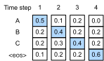
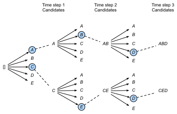

# Tìm Kiếm Chùm

Trong [sec_seq2seq](#sec_seq2seq),
chúng ta đã giới thiệu kiến trúc bộ mã hóa--bộ giải mã,
và các kỹ thuật tiêu chuẩn để huấn luyện chúng từ đầu đến cuối. Tuy nhiên, khi dự đoán trong thời gian kiểm tra,
chúng ta chỉ đề cập đến chiến lược *tham lam*,
trong đó tại mỗi bước thời gian chúng ta chọn token
được cho xác suất dự đoán cao nhất của việc đến tiếp theo,
cho đến khi, tại một bước thời gian nào đó,
chúng ta thấy rằng đã dự đoán
token kết-chuỗi đặc biệt "&lt;eos&gt;".
Trong phần này, chúng ta sẽ bắt đầu
bằng cách hình thức hóa chiến lược *tìm kiếm tham lam* này
và xác định một số vấn đề
mà các nhà thực hành thường gặp phải.
Sau đó, chúng ta so sánh chiến lược này
với hai giải pháp thay thế:
*tìm kiếm toàn diện* (minh họa nhưng không thực tế)
và *tìm kiếm chùm* (phương pháp tiêu chuẩn trong thực tế).

Hãy bắt đầu bằng cách thiết lập ký hiệu toán học của chúng ta,
mượn quy ước từ [sec_seq2seq](#sec_seq2seq).
Tại bất kỳ bước thời gian $t'$ nào, bộ giải mã xuất ra
các dự đoán đại diện cho xác suất
của mỗi token trong từ vựng
đến tiếp theo trong chuỗi
(giá trị có khả năng của $y_{t'+1}$),
điều kiện hóa trên các token trước
$y_1, \ldots, y_{t'}$ và
biến ngữ cảnh $\mathbf{c}$,
được tạo ra bởi bộ mã hóa
để biểu diễn chuỗi đầu vào.
Để định lượng chi phí tính toán,
ký hiệu bởi $\mathcal{Y}$
từ vựng đầu ra
(bao gồm token kết-chuỗi đặc biệt "&lt;eos&gt;").
Hãy cũng chỉ định số lượng token tối đa
của một chuỗi đầu ra là $T'$.
Mục tiêu của chúng ta là tìm kiếm đầu ra lý tưởng từ tất cả
$\mathcal{O}(\left|\mathcal{Y}\right|^{T'})$
chuỗi đầu ra có thể.
Lưu ý rằng điều này ước tính hơi quá mức
số lượng đầu ra phân biệt
vì không có token tiếp theo
khi token "&lt;eos&gt;" xảy ra.
Tuy nhiên, với mục đích của chúng ta,
con số này nắm bắt gần đúng
kích thước của không gian tìm kiếm.

## Tìm Kiếm Tham Lam

Xét chiến lược *tìm kiếm tham lam* đơn giản từ [sec_seq2seq](#sec_seq2seq).
Ở đây, tại bất kỳ bước thời gian $t'$ nào,
chúng ta đơn giản chọn token
với xác suất có điều kiện cao nhất
từ $\mathcal{Y}$, tức là,

$$y_{t'} = \operatorname*{argmax}_{y \in \mathcal{Y}} P(y \mid y_1, \ldots, y_{t'-1}, \mathbf{c}).$$

Khi mô hình của chúng ta xuất ra "&lt;eos&gt;"
(hoặc chúng ta đạt độ dài tối đa $T'$)
chuỗi đầu ra hoàn chỉnh.

Chiến lược này có vẻ hợp lý,
và trên thực tế nó không tệ lắm!
Xét việc nó đơn giản về mặt tính toán đến mức nào,
bạn sẽ khó có thể đạt được hiệu quả hơn với ít chi phí hơn.
Tuy nhiên, nếu chúng ta bỏ qua hiệu quả trong một phút,
có vẻ hợp lý hơn khi tìm kiếm
*chuỗi có khả năng nhất*,
không phải chuỗi (được chọn tham lam) của *các token có khả năng nhất*.
Hóa ra là hai đối tượng này có thể khá khác nhau.
Chuỗi có khả năng nhất là chuỗi tối đa hóa biểu thức
$\prod_{t'=1}^{T'} P(y_{t'} \mid y_1, \ldots, y_{t'-1}, \mathbf{c})$.
Trong ví dụ dịch máy của chúng ta,
nếu bộ giải mã thực sự phục hồi các xác suất
của quá trình tạo cơ bản,
thì điều này sẽ cho chúng ta bản dịch có khả năng nhất.
Thật không may, không có đảm bảo
rằng tìm kiếm tham lam sẽ cho chúng ta chuỗi này.

Hãy minh họa bằng một ví dụ.
Giả sử có bốn token
"A", "B", "C" và "&lt;eos&gt;" trong từ điển đầu ra.
Trong [fig_s2s-prob1](#fig_s2s-prob1),
bốn con số dưới mỗi bước thời gian đại diện cho
xác suất có điều kiện của việc tạo ra "A", "B", "C",
và "&lt;eos&gt;" tương ứng, tại bước thời gian đó.

Tại mỗi bước thời gian, tìm kiếm tham lam chọn
token với xác suất có điều kiện cao nhất.
Do đó, chuỗi đầu ra "A", "B", "C" và "&lt;eos&gt;"
sẽ được dự đoán ([fig_s2s-prob1](#fig_s2s-prob1)).
Xác suất có điều kiện của chuỗi đầu ra này
là $0.5\times0.4\times0.4\times0.6 = 0.048$.

Tiếp theo, hãy nhìn vào một ví dụ khác trong [fig_s2s-prob2](#fig_s2s-prob2).
Không giống như trong [fig_s2s-prob1](#fig_s2s-prob1),
tại bước thời gian 2 chúng ta chọn token "C",
có xác suất có điều kiện *cao thứ hai*.

Vì các chuỗi con đầu ra tại bước thời gian 1 và 2,
mà bước thời gian 3 dựa trên,
đã thay đổi từ "A" và "B" trong [fig_s2s-prob1](#fig_s2s-prob1)
sang "A" và "C" trong [fig_s2s-prob2](#fig_s2s-prob2),
xác suất có điều kiện của mỗi token
tại bước thời gian 3 cũng đã thay đổi trong [fig_s2s-prob2](#fig_s2s-prob2).
Giả sử rằng chúng ta chọn token "B" tại bước thời gian 3.
Bây giờ bước thời gian 4 điều kiện hóa trên
chuỗi con đầu ra tại ba bước thời gian đầu tiên
"A", "C" và "B",
đã thay đổi từ "A", "B" và "C" trong [fig_s2s-prob1](#fig_s2s-prob1).
Do đó, xác suất có điều kiện của việc tạo ra
mỗi token tại bước thời gian 4 trong [fig_s2s-prob2](#fig_s2s-prob2)
cũng khác với trong [fig_s2s-prob1](#fig_s2s-prob1).
Kết quả là, xác suất có điều kiện của chuỗi đầu ra
"A", "C", "B" và "&lt;eos&gt;" trong [fig_s2s-prob2](#fig_s2s-prob2)
là $0.5\times0.3 \times0.6\times0.6=0.054$,
lớn hơn xác suất của tìm kiếm tham lam trong [fig_s2s-prob1](#fig_s2s-prob1).
Trong ví dụ này, chuỗi đầu ra "A", "B", "C" và "&lt;eos&gt;"
thu được bằng tìm kiếm tham lam không phải là tối ưu.

## Tìm Kiếm Toàn Diện

Nếu mục tiêu là thu được chuỗi có khả năng nhất,
chúng ta có thể xem xét sử dụng *tìm kiếm toàn diện*:
liệt kê tất cả các chuỗi đầu ra có thể
với xác suất có điều kiện của chúng,
và sau đó xuất ra chuỗi đạt điểm
xác suất dự đoán cao nhất.

Mặc dù điều này chắc chắn sẽ cho chúng ta những gì chúng ta muốn,
nhưng nó sẽ đến với chi phí tính toán cấm đoán
là $\mathcal{O}(\left|\mathcal{Y}\right|^{T'})$,
hàm mũ theo độ dài chuỗi và với cơ số khổng lồ
được cho bởi kích thước từ vựng.
Ví dụ, khi $|\mathcal{Y}|=10000$ và $T'=10$,
cả hai là số nhỏ khi so sánh với các số trong ứng dụng thực tế, chúng ta sẽ cần đánh giá $10000^{10} = 10^{40}$ chuỗi, điều này đã vượt quá khả năng của bất kỳ máy tính nào có thể tưởng tượng được.
Mặt khác, chi phí tính toán của tìm kiếm tham lam là
$\mathcal{O}(\left|\mathcal{Y}\right|T')$:
rẻ đến kỳ diệu nhưng xa tối ưu.
Ví dụ, khi $|\mathcal{Y}|=10000$ và $T'=10$,
chúng ta chỉ cần đánh giá $10000\times10=10^5$ chuỗi.

## Tìm Kiếm Chùm

Bạn có thể xem các chiến lược giải mã chuỗi như nằm trên một phổ,
với *tìm kiếm chùm* đạt được sự thỏa hiệp
giữa hiệu quả của tìm kiếm tham lam
và tính tối ưu của tìm kiếm toàn diện.
Phiên bản đơn giản nhất của tìm kiếm chùm
được đặc trưng bởi một siêu tham số duy nhất,
*kích thước chùm*, $k$.
Hãy giải thích thuật ngữ này.
Tại bước thời gian 1, chúng ta chọn $k$ token
với xác suất dự đoán cao nhất.
Mỗi cái trong số đó sẽ là token đầu tiên của
$k$ chuỗi đầu ra ứng viên, tương ứng.
Tại mỗi bước thời gian tiếp theo,
dựa trên $k$ chuỗi đầu ra ứng viên
tại bước thời gian trước,
chúng ta tiếp tục chọn $k$ chuỗi đầu ra ứng viên
với xác suất dự đoán cao nhất
từ $k\left|\mathcal{Y}\right|$ lựa chọn có thể.

[fig_beam-search](#fig_beam-search) minh họa
quá trình tìm kiếm chùm bằng một ví dụ.
Giả sử rằng từ vựng đầu ra
chỉ chứa năm phần tử:
$\mathcal{Y} = \{A, B, C, D, E\}$,
trong đó một trong số đó là "&lt;eos&gt;".
Gọi kích thước chùm là hai và
độ dài tối đa của chuỗi đầu ra là ba.
Tại bước thời gian 1,
giả sử rằng các token với xác suất có điều kiện cao nhất
$P(y_1 \mid \mathbf{c})$ là $A$ và $C$.
Tại bước thời gian 2, với tất cả $y_2 \in \mathcal{Y},$
chúng ta tính toán

$$\begin{aligned}P(A, y_2 \mid \mathbf{c}) = P(A \mid \mathbf{c})P(y_2 \mid A, \mathbf{c}),\\ P(C, y_2 \mid \mathbf{c}) = P(C \mid \mathbf{c})P(y_2 \mid C, \mathbf{c}),\end{aligned}$$  

và chọn hai giá trị lớn nhất trong số mười giá trị này, chẳng hạn
$P(A, B \mid \mathbf{c})$ và $P(C, E \mid \mathbf{c})$.
Sau đó tại bước thời gian 3, với tất cả $y_3 \in \mathcal{Y}$, chúng ta tính toán

$$\begin{aligned}P(A, B, y_3 \mid \mathbf{c}) = P(A, B \mid \mathbf{c})P(y_3 \mid A, B, \mathbf{c}),\\P(C, E, y_3 \mid \mathbf{c}) = P(C, E \mid \mathbf{c})P(y_3 \mid C, E, \mathbf{c}),\end{aligned}$$ 

và chọn hai giá trị lớn nhất trong số mười giá trị này, chẳng hạn
$P(A, B, D \mid \mathbf{c})$ và $P(C, E, D \mid  \mathbf{c}).$
Kết quả là, chúng ta thu được sáu chuỗi đầu ra ứng viên:
(i) $A$; (ii) $C$; (iii) $A$, $B$; (iv) $C$, $E$; (v) $A$, $B$, $D$; và (vi) $C$, $E$, $D$.

Cuối cùng, chúng ta thu được tập hợp các chuỗi đầu ra ứng viên cuối cùng
dựa trên sáu chuỗi này (ví dụ: loại bỏ các phần bao gồm và sau "&lt;eos&gt;").
Sau đó chúng ta chọn chuỗi đầu ra tối đa hóa điểm sau:

$$ \frac{1}{L^\alpha} \log P(y_1, \ldots, y_{L}\mid \mathbf{c}) = \frac{1}{L^\alpha} \sum_{t'=1}^L \log P(y_{t'} \mid y_1, \ldots, y_{t'-1}, \mathbf{c});$$

ở đây $L$ là độ dài của chuỗi ứng viên cuối cùng
và $\alpha$ thường được đặt là 0.75.
Vì chuỗi dài hơn có nhiều số hạng logarit hơn
trong tổng của :eqref:`eq_beam-search-score`,
số hạng $L^\alpha$ trong mẫu số phạt
các chuỗi dài.

Chi phí tính toán của tìm kiếm chùm là $\mathcal{O}(k\left|\mathcal{Y}\right|T')$.
Kết quả này nằm giữa kết quả của tìm kiếm tham lam và tìm kiếm toàn diện.
Tìm kiếm tham lam có thể được coi là trường hợp đặc biệt của tìm kiếm chùm
khi kích thước chùm được đặt là 1.

## Tóm Tắt

Các chiến lược tìm kiếm chuỗi bao gồm
tìm kiếm tham lam, tìm kiếm toàn diện và tìm kiếm chùm.
Tìm kiếm chùm cung cấp sự đánh đổi giữa độ chính xác và
chi phí tính toán thông qua lựa chọn linh hoạt kích thước chùm.

## Bài Tập

1. Chúng ta có thể coi tìm kiếm toàn diện là một loại tìm kiếm chùm đặc biệt không? Tại sao hay tại sao không?
1. Áp dụng tìm kiếm chùm trong bài toán dịch máy trong [sec_seq2seq](#sec_seq2seq). Kích thước chùm ảnh hưởng như thế nào đến kết quả dịch và tốc độ dự đoán?
1. Chúng ta đã sử dụng mô hình hóa ngôn ngữ để tạo văn bản theo các tiền tố do người dùng cung cấp trong [sec_rnn-scratch](#sec_rnn-scratch). Loại chiến lược tìm kiếm nào nó sử dụng? Bạn có thể cải thiện nó không?

[Thảo luận](https://discuss.d2l.ai/t/338)
