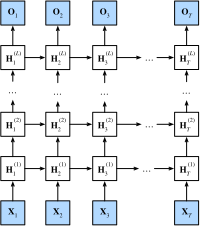

# Mạng Nơ-ron Hồi Tiếp Sâu

<a id="sec_deep_rnn"></a>

Cho đến nay, chúng ta đã tập trung vào việc định nghĩa các mạng
gồm một đầu vào chuỗi,
một lớp RNN ẩn duy nhất,
và một lớp đầu ra.
Mặc dù chỉ có một lớp ẩn
giữa đầu vào tại bất kỳ bước thời gian nào
và đầu ra tương ứng,
có một nghĩa nào đó mà các mạng này là sâu.
Các đầu vào từ bước thời gian đầu tiên có thể ảnh hưởng
đến các đầu ra tại bước thời gian cuối $T$
(thường là hàng trăm hoặc hàng nghìn bước sau).
Các đầu vào này đi qua $T$ lần áp dụng
của lớp hồi tiếp trước khi đến
đầu ra cuối cùng.
Tuy nhiên, chúng ta thường cũng muốn giữ khả năng
diễn đạt các mối quan hệ phức tạp
giữa các đầu vào tại một bước thời gian nhất định
và các đầu ra tại chính bước thời gian đó.
Do đó chúng ta thường xây dựng các RNN sâu
không chỉ theo chiều thời gian
mà còn theo chiều từ đầu vào đến đầu ra.
Đây chính xác là khái niệm về độ sâu
mà chúng ta đã gặp
trong quá trình phát triển các MLP
và CNN sâu.


Phương pháp tiêu chuẩn để xây dựng loại RNN sâu này
đơn giản đến bất ngờ: chúng ta xếp chồng các RNN lên nhau.
Cho một chuỗi có độ dài $T$, RNN đầu tiên tạo ra
một chuỗi đầu ra, cũng có độ dài $T$.
Những đầu ra này, lần lượt, tạo thành các đầu vào cho lớp RNN tiếp theo.
Trong phần ngắn này, chúng ta minh họa mẫu thiết kế này
và trình bày một ví dụ đơn giản về cách lập trình các RNN xếp chồng như vậy.
Dưới đây, trong [fig_deep_rnn](#fig_deep_rnn), chúng ta minh họa
một RNN sâu với $L$ lớp ẩn.
Mỗi trạng thái ẩn hoạt động trên một đầu vào chuỗi
và tạo ra một đầu ra chuỗi.
Hơn nữa, bất kỳ ô RNN nào (hộp trắng trong [fig_deep_rnn](#fig_deep_rnn)) tại mỗi bước thời gian
phụ thuộc vào cả giá trị của cùng lớp
tại bước thời gian trước
và giá trị của lớp trước
tại cùng bước thời gian.


<a id="fig_deep_rnn"></a>

Về mặt hình thức, giả sử chúng ta có đầu vào minibatch
$\mathbf{X}_t \in \mathbb{R}^{n \times d}$
(số ví dụ $=n$; số đầu vào trong mỗi ví dụ $=d$) tại bước thời gian $t$.
Tại cùng bước thời gian,
gọi trạng thái ẩn của lớp ẩn thứ $l$ ($l=1,\ldots,L$) là $\mathbf{H}_t^{(l)} \in \mathbb{R}^{n \times h}$
(số đơn vị ẩn $=h$)
và biến lớp đầu ra là
$\mathbf{O}_t \in \mathbb{R}^{n \times q}$
(số đầu ra: $q$).
Đặt $\mathbf{H}_t^{(0)} = \mathbf{X}_t$,
trạng thái ẩn của
lớp ẩn thứ $l$
sử dụng hàm kích hoạt $\phi_l$
được tính như sau:

$$\mathbf{H}_t^{(l)} = \phi_l(\mathbf{H}_t^{(l-1)} \mathbf{W}_{\textrm{xh}}^{(l)} + \mathbf{H}_{t-1}^{(l)} \mathbf{W}_{\textrm{hh}}^{(l)}  + \mathbf{b}_\textrm{h}^{(l)}),$$

trong đó các trọng số $\mathbf{W}_{\textrm{xh}}^{(l)} \in \mathbb{R}^{h \times h}$ và $\mathbf{W}_{\textrm{hh}}^{(l)} \in \mathbb{R}^{h \times h}$, cùng với
hệ số chặn $\mathbf{b}_\textrm{h}^{(l)} \in \mathbb{R}^{1 \times h}$,
là các tham số mô hình của lớp ẩn thứ $l$.

Cuối cùng, việc tính toán lớp đầu ra
chỉ dựa trên trạng thái ẩn
của lớp ẩn cuối cùng thứ $L$:

$$\mathbf{O}_t = \mathbf{H}_t^{(L)} \mathbf{W}_{\textrm{hq}} + \mathbf{b}_\textrm{q},$$

trong đó trọng số $\mathbf{W}_{\textrm{hq}} \in \mathbb{R}^{h \times q}$
và hệ số chặn $\mathbf{b}_\textrm{q} \in \mathbb{R}^{1 \times q}$
là các tham số mô hình của lớp đầu ra.

Cũng như với MLP, số lớp ẩn $L$
và số đơn vị ẩn $h$ là các siêu tham số
mà chúng ta có thể điều chỉnh.
Độ rộng lớp RNN phổ biến ($h$) nằm trong khoảng $(64, 2056)$,
và độ sâu phổ biến ($L$) nằm trong khoảng $(1, 8)$.
Ngoài ra, chúng ta có thể dễ dàng có được RNN có cổng sâu
bằng cách thay thế tính toán trạng thái ẩn trong :eqref:`eq_deep_rnn_H`
bằng tính toán từ LSTM hoặc GRU.


```python
from d2l import torch as d2l
import torch
from torch import nn
```


## Lập Trình Từ Đầu

Để lập trình RNN nhiều lớp từ đầu,
chúng ta có thể coi mỗi lớp là một instance `RNNScratch`
với các tham số có thể học riêng của nó.


```python
class StackedRNNScratch(d2l.Module):
    def __init__(self, num_inputs, num_hiddens, num_layers, sigma=0.01):
        super().__init__()
        self.save_hyperparameters()
        self.rnns = nn.Sequential(*[d2l.RNNScratch(
            num_inputs if i==0 else num_hiddens, num_hiddens, sigma)
                                    for i in range(num_layers)])
```


Tính toán tiến đa lớp
đơn giản thực hiện tính toán tiến
từng lớp một.

```python
@d2l.add_to_class(StackedRNNScratch)
def forward(self, inputs, Hs=None):
    outputs = inputs
    if Hs is None: Hs = [None] * self.num_layers
    for i in range(self.num_layers):
        outputs, Hs[i] = self.rnns[i](outputs, Hs[i])
        outputs = d2l.stack(outputs, 0)
    return outputs, Hs
```

Ví dụ, chúng ta huấn luyện mô hình GRU sâu trên
tập dữ liệu *The Time Machine* (giống như trong [sec_rnn-scratch](#sec_rnn-scratch)).
Để đơn giản, chúng ta đặt số lớp là 2.

```python
data = d2l.TimeMachine(batch_size=1024, num_steps=32)
if tab.selected('mxnet', 'pytorch', 'jax'):
    rnn_block = StackedRNNScratch(num_inputs=len(data.vocab),
                                  num_hiddens=32, num_layers=2)
    model = d2l.RNNLMScratch(rnn_block, vocab_size=len(data.vocab), lr=2)
    trainer = d2l.Trainer(max_epochs=100, gradient_clip_val=1, num_gpus=1)
if tab.selected('tensorflow'):
    with d2l.try_gpu():
        rnn_block = StackedRNNScratch(num_inputs=len(data.vocab),
                                  num_hiddens=32, num_layers=2)
        model = d2l.RNNLMScratch(rnn_block, vocab_size=len(data.vocab), lr=2)
    trainer = d2l.Trainer(max_epochs=100, gradient_clip_val=1)
trainer.fit(model, data)
```

## Lập Trình Súc Tích


```python
class GRU(d2l.RNN):  
    """The multilayer GRU model."""
    def __init__(self, num_inputs, num_hiddens, num_layers, dropout=0):
        d2l.Module.__init__(self)
        self.save_hyperparameters()
        self.rnn = nn.GRU(num_inputs, num_hiddens, num_layers,
                          dropout=dropout)
```


Các quyết định kiến trúc như chọn siêu tham số
rất giống với các quyết định trong [sec_gru](#sec_gru).
Chúng ta chọn cùng số lượng đầu vào và đầu ra
bằng số token phân biệt, tức là `vocab_size`.
Số đơn vị ẩn vẫn là 32.
Điểm khác biệt duy nhất là bây giờ chúng ta
(**chọn một số lớp ẩn không nhỏ
bằng cách chỉ định giá trị `num_layers`.**)


```python
model.predict('it has', 20, data.vocab, d2l.try_gpu())
```


## Tóm Tắt

Trong RNN sâu, thông tin trạng thái ẩn được truyền
đến bước thời gian tiếp theo của lớp hiện tại
và bước thời gian hiện tại của lớp tiếp theo.
Có nhiều loại RNN sâu khác nhau, chẳng hạn như LSTM, GRU hoặc RNN thông thường.
Thuận tiện là tất cả các mô hình này đều có sẵn
như các phần của các API cấp cao của các framework deep learning.
Khởi tạo mô hình đòi hỏi phải cẩn thận.
Nhìn chung, RNN sâu đòi hỏi công sức đáng kể
(như tốc độ học và cắt gradient)
để đảm bảo hội tụ đúng.

## Bài Tập

1. Thay thế GRU bằng LSTM và so sánh độ chính xác và tốc độ huấn luyện.
1. Tăng dữ liệu huấn luyện để bao gồm nhiều cuốn sách. Bạn có thể đạt độ hỗn loạn thấp đến mức nào?
1. Bạn có muốn kết hợp các nguồn từ các tác giả khác nhau khi mô hình hóa văn bản không? Tại sao đây là ý tưởng tốt? Điều gì có thể xảy ra sai?


[Thảo luận](https://discuss.d2l.ai/t/1058)
