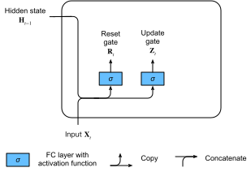
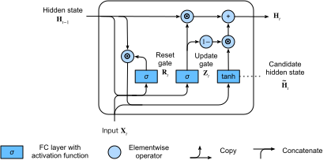

# Gated Recurrent Units (GRU)
<a id="sec_gru"></a>


Khi RNN và đặc biệt là kiến trúc LSTM ([sec_lstm](#sec_lstm))
nhanh chóng trở nên phổ biến trong thập niên 2010,
một số nhà nghiên cứu bắt đầu thử nghiệm
với các kiến trúc đơn giản hóa với hy vọng
giữ lại ý tưởng then chốt về việc kết hợp
trạng thái nội bộ và các cơ chế cổng nhân,
nhưng nhằm tăng tốc độ tính toán.
Gated recurrent unit (GRU) [Cho.Van-Merrienboer.Bahdanau.ea.2014]
cung cấp một phiên bản tinh gọn của ô nhớ LSTM,
thường đạt hiệu năng tương đương
nhưng có lợi thế là tính toán nhanh hơn
[Chung.Gulcehre.Cho.ea.2014].


```python
from d2l import torch as d2l
import torch
from torch import nn
```


## Cổng Đặt lại và Cổng Cập nhật

Ở đây, ba cổng của LSTM được thay bằng hai cổng:
*cổng đặt lại* và *cổng cập nhật*.
Giống như với LSTM, các cổng này dùng kích hoạt sigmoid,
buộc giá trị của chúng nằm trong khoảng $(0, 1)$.
Về trực giác, cổng đặt lại kiểm soát mức độ trạng thái trước đó
mà chúng ta có thể vẫn muốn ghi nhớ.
Tương tự, cổng cập nhật cho phép chúng ta kiểm soát
mức độ trạng thái mới chỉ là bản sao của trạng thái cũ.
[fig_gru_1](#fig_gru_1) minh họa các đầu vào cho cả
cổng đặt lại và cổng cập nhật trong một GRU,
với đầu vào của bước thời gian hiện tại
và trạng thái ẩn của bước thời gian trước đó.
Đầu ra của các cổng được tạo bởi
hai lớp kết nối đầy đủ
với hàm kích hoạt sigmoid.


<a id="fig_gru_1"></a>

Về mặt toán học, tại một bước thời gian $t$ cho trước,
giả sử đầu vào là một minibatch
$\mathbf{X}_t \in \mathbb{R}^{n \times d}$
(số ví dụ $=n$; số đầu vào $=d$)
và trạng thái ẩn của bước thời gian trước đó
là $\mathbf{H}_{t-1} \in \mathbb{R}^{n \times h}$
(số đơn vị ẩn $=h$).
Khi đó cổng đặt lại $\mathbf{R}_t \in \mathbb{R}^{n \times h}$
và cổng cập nhật $\mathbf{Z}_t \in \mathbb{R}^{n \times h}$ được tính như sau:

$$
\begin{aligned}
\mathbf{R}_t = \sigma(\mathbf{X}_t \mathbf{W}_{\textrm{xr}} + \mathbf{H}_{t-1} \mathbf{W}_{\textrm{hr}} + \mathbf{b}_\textrm{r}),\\
\mathbf{Z}_t = \sigma(\mathbf{X}_t \mathbf{W}_{\textrm{xz}} + \mathbf{H}_{t-1} \mathbf{W}_{\textrm{hz}} + \mathbf{b}_\textrm{z}),
\end{aligned}
$$

trong đó $\mathbf{W}_{\textrm{xr}}, \mathbf{W}_{\textrm{xz}} \in \mathbb{R}^{d \times h}$
và $\mathbf{W}_{\textrm{hr}}, \mathbf{W}_{\textrm{hz}} \in \mathbb{R}^{h \times h}$
là các tham số trọng số, còn $\mathbf{b}_\textrm{r}, \mathbf{b}_\textrm{z} \in \mathbb{R}^{1 \times h}$
là các tham số hệ số chặn.


## Trạng thái Ẩn Ứng viên

Tiếp theo, chúng ta tích hợp cổng đặt lại $\mathbf{R}_t$
với cơ chế cập nhật thông thường
trong :eqref:`rnn_h_with_state`,
dẫn đến
*trạng thái ẩn ứng viên*
$\tilde{\mathbf{H}}_t \in \mathbb{R}^{n \times h}$ sau đây tại bước thời gian $t$:

$$\tilde{\mathbf{H}}_t = \tanh(\mathbf{X}_t \mathbf{W}_{\textrm{xh}} + \left(\mathbf{R}_t \odot \mathbf{H}_{t-1}\right) \mathbf{W}_{\textrm{hh}} + \mathbf{b}_\textrm{h}),$$

trong đó $\mathbf{W}_{\textrm{xh}} \in \mathbb{R}^{d \times h}$ và $\mathbf{W}_{\textrm{hh}} \in \mathbb{R}^{h \times h}$
là các tham số trọng số,
$\mathbf{b}_\textrm{h} \in \mathbb{R}^{1 \times h}$
là hệ số chặn,
và ký hiệu $\odot$ là toán tử tích Hadamard (theo từng phần tử).
Ở đây chúng ta dùng hàm kích hoạt tanh.

Kết quả là một *ứng viên*, vì chúng ta vẫn cần
kết hợp tác động của cổng cập nhật.
So với :eqref:`rnn_h_with_state`,
ảnh hưởng của các trạng thái trước đó
bây giờ có thể được giảm bớt bằng
phép nhân theo từng phần tử của
$\mathbf{R}_t$ và $\mathbf{H}_{t-1}$
trong :eqref:`gru_tilde_H`.
Bất cứ khi nào các phần tử trong cổng đặt lại $\mathbf{R}_t$ gần 1,
chúng ta thu được một RNN vanilla như trong :eqref:`rnn_h_with_state`.
Đối với tất cả các phần tử của cổng đặt lại $\mathbf{R}_t$ gần 0,
trạng thái ẩn ứng viên là kết quả của một MLP với $\mathbf{X}_t$ làm đầu vào.
Do đó, bất kỳ trạng thái ẩn đã tồn tại nào cũng được *đặt lại* về mặc định.

[fig_gru_2](#fig_gru_2) minh họa luồng tính toán sau khi áp dụng cổng đặt lại.


<a id="fig_gru_2"></a>


## Trạng thái Ẩn

Cuối cùng, chúng ta cần kết hợp ảnh hưởng của cổng cập nhật $\mathbf{Z}_t$.
Điều này xác định mức độ mà trạng thái ẩn mới $\mathbf{H}_t \in \mathbb{R}^{n \times h}$
khớp với trạng thái cũ $\mathbf{H}_{t-1}$ so với mức độ
nó giống trạng thái ứng viên mới $\tilde{\mathbf{H}}_t$.
Cổng cập nhật $\mathbf{Z}_t$ có thể được dùng cho mục đích này,
đơn giản bằng cách lấy các tổ hợp lồi theo từng phần tử
của $\mathbf{H}_{t-1}$ và $\tilde{\mathbf{H}}_t$.
Điều này dẫn đến phương trình cập nhật cuối cùng cho GRU:

$$\mathbf{H}_t = \mathbf{Z}_t \odot \mathbf{H}_{t-1}  + (1 - \mathbf{Z}_t) \odot \tilde{\mathbf{H}}_t.$$


Bất cứ khi nào cổng cập nhật $\mathbf{Z}_t$ gần 1,
chúng ta chỉ giữ lại trạng thái cũ.
Trong trường hợp này, thông tin từ $\mathbf{X}_t$ bị bỏ qua,
trên thực tế là bỏ qua bước thời gian $t$ trong chuỗi phụ thuộc.
Ngược lại, bất cứ khi nào $\mathbf{Z}_t$ gần 0,
trạng thái tiềm ẩn mới $\mathbf{H}_t$ tiến gần đến trạng thái tiềm ẩn ứng viên $\tilde{\mathbf{H}}_t$.
[fig_gru_3](#fig_gru_3) cho thấy luồng tính toán sau khi cổng cập nhật hoạt động.


<a id="fig_gru_3"></a>


Tóm lại, GRU có hai đặc trưng phân biệt sau:

* Cổng đặt lại giúp nắm bắt các phụ thuộc ngắn hạn trong chuỗi.
* Cổng cập nhật giúp nắm bắt các phụ thuộc dài hạn trong chuỗi.

## Triển khai từ Đầu

Để hiểu rõ hơn về mô hình GRU, hãy triển khai nó từ đầu.

### (**Khởi tạo Tham số Mô hình**)

Bước đầu tiên là khởi tạo các tham số mô hình.
Chúng ta lấy mẫu các trọng số từ một phân phối Gaussian
với độ lệch chuẩn là `sigma` và đặt hệ số chặn bằng 0.
Siêu tham số `num_hiddens` định nghĩa số đơn vị ẩn.
Chúng ta khởi tạo tất cả trọng số và hệ số chặn liên quan đến cổng cập nhật,
cổng đặt lại, và trạng thái ẩn ứng viên.


### Định nghĩa Mô hình

Bây giờ chúng ta đã sẵn sàng [**định nghĩa phép tính xuôi của GRU**].
Cấu trúc của nó giống với ô RNN cơ bản,
ngoại trừ việc các phương trình cập nhật phức tạp hơn.


### Huấn luyện

[**Huấn luyện**] một mô hình ngôn ngữ trên tập dữ liệu *The Time Machine*
hoạt động đúng theo cùng cách như trong [sec_rnn-scratch](#sec_rnn-scratch).

```python
data = d2l.TimeMachine(batch_size=1024, num_steps=32)
if tab.selected('mxnet', 'pytorch', 'jax'):
    gru = GRUScratch(num_inputs=len(data.vocab), num_hiddens=32)
    model = d2l.RNNLMScratch(gru, vocab_size=len(data.vocab), lr=4)
    trainer = d2l.Trainer(max_epochs=50, gradient_clip_val=1, num_gpus=1)
if tab.selected('tensorflow'):
    with d2l.try_gpu():
        gru = GRUScratch(num_inputs=len(data.vocab), num_hiddens=32)
        model = d2l.RNNLMScratch(gru, vocab_size=len(data.vocab), lr=4)
    trainer = d2l.Trainer(max_epochs=50, gradient_clip_val=1)
trainer.fit(model, data)
```

## [**Triển khai Súc tích**]

Trong các API cấp cao, chúng ta có thể trực tiếp khởi tạo một mô hình GRU.
Điều này đóng gói toàn bộ chi tiết cấu hình mà chúng ta đã trình bày tường minh ở trên.


Mã nhanh hơn đáng kể khi huấn luyện vì nó dùng các toán tử đã biên dịch
thay vì Python.

```python
if tab.selected('mxnet', 'pytorch', 'tensorflow'):
    gru = GRU(num_inputs=len(data.vocab), num_hiddens=32)
if tab.selected('jax'):
    gru = GRU(num_hiddens=32)
if tab.selected('mxnet', 'pytorch', 'jax'):
    model = d2l.RNNLM(gru, vocab_size=len(data.vocab), lr=4)
if tab.selected('tensorflow'):
    with d2l.try_gpu():
        model = d2l.RNNLM(gru, vocab_size=len(data.vocab), lr=4)
trainer.fit(model, data)
```

Sau khi huấn luyện, chúng ta in ra perplexity trên tập huấn luyện
và chuỗi dự đoán theo tiền tố đã cung cấp.


## Tóm tắt

So với LSTM, GRU đạt hiệu năng tương tự nhưng có xu hướng nhẹ hơn về mặt tính toán.
Nhìn chung, so với RNN đơn giản, các RNN có cổng, giống như LSTM và GRU,
có thể nắm bắt tốt hơn các phụ thuộc cho những chuỗi có khoảng cách bước thời gian lớn.
GRU chứa RNN cơ bản như một trường hợp cực hạn khi cổng đặt lại được bật.
Chúng cũng có thể bỏ qua các chuỗi con bằng cách bật cổng cập nhật.


## Bài tập

1. Giả sử chúng ta chỉ muốn dùng đầu vào tại bước thời gian $t'$ để dự đoán đầu ra tại bước thời gian $t > t'$. Giá trị tốt nhất cho cổng đặt lại và cổng cập nhật tại mỗi bước thời gian là gì?
1. Điều chỉnh các siêu tham số và phân tích ảnh hưởng của chúng lên thời gian chạy, perplexity, và chuỗi đầu ra.
1. So sánh thời gian chạy, perplexity, và các chuỗi đầu ra giữa các triển khai `rnn.RNN` và `rnn.GRU`.
1. Điều gì xảy ra nếu bạn chỉ triển khai một phần của GRU, ví dụ chỉ có cổng đặt lại hoặc chỉ có cổng cập nhật?


[Discussions](https://discuss.d2l.ai/t/1056)
