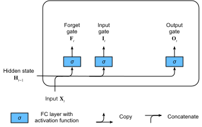
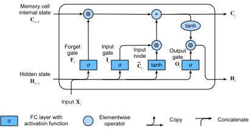

# Bộ Nhớ Ngắn Hạn Dài (LSTM)
<a id="sec_lstm"></a>


Ngay sau khi các mạng RNN kiểu Elman đầu tiên được huấn luyện bằng lan truyền ngược
[elman1990finding], các vấn đề về học phụ thuộc dài hạn
(do gradient biến mất và bùng nổ)
trở nên nổi bật, khi Bengio và Hochreiter
thảo luận về vấn đề này
[bengio1994learning, Hochreiter.Bengio.Frasconi.ea.2001].
Hochreiter đã phát biểu vấn đề này từ năm 1991 trong luận văn Thạc sĩ của mình, mặc dù kết quả
không được biết đến rộng rãi vì luận văn được viết bằng tiếng Đức.
Trong khi cắt gradient giúp xử lý gradient bùng nổ,
việc xử lý gradient biến mất dường như
đòi hỏi một giải pháp phức tạp hơn.
Một trong những kỹ thuật đầu tiên và thành công nhất
để giải quyết gradient biến mất
xuất hiện dưới dạng mô hình bộ nhớ ngắn hạn dài (LSTM)
do Hochreiter.Schmidhuber.1997 đề xuất.
LSTM giống với mạng nơ-ron hồi tiếp tiêu chuẩn
nhưng ở đây mỗi nút hồi tiếp thông thường
được thay thế bằng một *ô nhớ*.
Mỗi ô nhớ chứa một *trạng thái nội bộ*,
tức là một nút với cạnh hồi tiếp tự kết nối có trọng số cố định bằng 1,
đảm bảo rằng gradient có thể truyền qua nhiều bước thời gian
mà không bị biến mất hay bùng nổ.

Thuật ngữ "bộ nhớ ngắn hạn dài" xuất phát từ trực giác sau.
Mạng nơ-ron hồi tiếp đơn giản
có *bộ nhớ dài hạn* dưới dạng các trọng số.
Các trọng số thay đổi chậm trong quá trình huấn luyện,
mã hóa kiến thức chung về dữ liệu.
Chúng cũng có *bộ nhớ ngắn hạn*
dưới dạng các kích hoạt tạm thời,
truyền từ mỗi nút đến các nút tiếp theo.
Mô hình LSTM giới thiệu một loại lưu trữ trung gian qua ô nhớ.
Một ô nhớ là đơn vị tổng hợp,
được xây dựng từ các nút đơn giản hơn
theo một mẫu kết nối cụ thể,
với sự bổ sung mới lạ của các nút nhân.


```python
from d2l import torch as d2l
import torch
from torch import nn
```


## Ô Nhớ Có Cổng

Mỗi ô nhớ được trang bị một *trạng thái nội bộ*
và một số cổng nhân xác định liệu
(i) một đầu vào nhất định có ảnh hưởng đến trạng thái nội bộ không (the *cổng đầu vào*),
(ii) trạng thái nội bộ có nên được xóa về $0$ không (the *cổng quên*),
và (iii) trạng thái nội bộ của một nơ-ron nhất định
có được phép ảnh hưởng đến đầu ra của ô không (the *cổng đầu ra*).


### Trạng Thái Ẩn Có Cổng

Điểm phân biệt chính giữa RNN thông thường và LSTM
là LSTM hỗ trợ kiểm soát bằng cổng của trạng thái ẩn.
Điều này có nghĩa là chúng ta có các cơ chế chuyên dụng cho
khi nào trạng thái ẩn nên được *cập nhật* và
cả khi nào nó nên được *đặt lại*.
Các cơ chế này được học và chúng giải quyết các vấn đề được liệt kê ở trên.
Chẳng hạn, nếu token đầu tiên rất quan trọng
chúng ta sẽ học không cập nhật trạng thái ẩn sau quan sát đầu tiên.
Tương tự, chúng ta sẽ học cách bỏ qua các quan sát tạm thời không liên quan.
Cuối cùng, chúng ta sẽ học cách đặt lại trạng thái ẩn bất cứ khi nào cần thiết.
Chúng ta thảo luận điều này chi tiết dưới đây.

### Cổng Đầu Vào, Cổng Quên và Cổng Đầu Ra

Dữ liệu đưa vào các cổng LSTM là
đầu vào tại bước thời gian hiện tại và
trạng thái ẩn của bước thời gian trước,
như minh họa trong [fig_lstm_0](#fig_lstm_0).
Ba lớp kết nối đầy đủ với hàm kích hoạt sigmoid
tính toán các giá trị của cổng đầu vào, cổng quên và cổng đầu ra.
Do hàm kích hoạt sigmoid,
tất cả các giá trị của ba cổng
đều nằm trong khoảng $(0, 1)$.
Ngoài ra, chúng ta yêu cầu một *nút đầu vào*,
thường được tính với hàm kích hoạt *tanh*.
Theo trực giác, *cổng đầu vào* xác định bao nhiêu
giá trị của nút đầu vào nên được thêm vào
trạng thái nội bộ của ô nhớ hiện tại.
*Cổng quên* xác định liệu có giữ
giá trị hiện tại của bộ nhớ hay xóa nó.
Và *cổng đầu ra* xác định liệu
ô nhớ có nên ảnh hưởng đến đầu ra
tại bước thời gian hiện tại không.



<a id="fig_lstm_0"></a>

Về mặt toán học, giả sử có $h$ đơn vị ẩn,
kích thước batch là $n$, và số lượng đầu vào là $d$.
Do đó, đầu vào là $\mathbf{X}_t \in \mathbb{R}^{n \times d}$
và trạng thái ẩn của bước thời gian trước
là $\mathbf{H}_{t-1} \in \mathbb{R}^{n \times h}$.
Tương ứng, các cổng tại bước thời gian $t$
được định nghĩa như sau: cổng đầu vào là $\mathbf{I}_t \in \mathbb{R}^{n \times h}$,
cổng quên là $\mathbf{F}_t \in \mathbb{R}^{n \times h}$,
và cổng đầu ra là $\mathbf{O}_t \in \mathbb{R}^{n \times h}$.
Chúng được tính như sau:

$$
\begin{aligned}
\mathbf{I}_t &= \sigma(\mathbf{X}_t \mathbf{W}_{\textrm{xi}} + \mathbf{H}_{t-1} \mathbf{W}_{\textrm{hi}} + \mathbf{b}_\textrm{i}),\\
\mathbf{F}_t &= \sigma(\mathbf{X}_t \mathbf{W}_{\textrm{xf}} + \mathbf{H}_{t-1} \mathbf{W}_{\textrm{hf}} + \mathbf{b}_\textrm{f}),\\
\mathbf{O}_t &= \sigma(\mathbf{X}_t \mathbf{W}_{\textrm{xo}} + \mathbf{H}_{t-1} \mathbf{W}_{\textrm{ho}} + \mathbf{b}_\textrm{o}),
\end{aligned}
$$

trong đó $\mathbf{W}_{\textrm{xi}}, \mathbf{W}_{\textrm{xf}}, \mathbf{W}_{\textrm{xo}} \in \mathbb{R}^{d \times h}$ và $\mathbf{W}_{\textrm{hi}}, \mathbf{W}_{\textrm{hf}}, \mathbf{W}_{\textrm{ho}} \in \mathbb{R}^{h \times h}$ là các tham số trọng số
và $\mathbf{b}_\textrm{i}, \mathbf{b}_\textrm{f}, \mathbf{b}_\textrm{o} \in \mathbb{R}^{1 \times h}$ là các tham số hệ số chặn.
Lưu ý rằng broadcasting
(xem [subsec_broadcasting](#subsec_broadcasting))
được kích hoạt trong quá trình tính tổng.
Chúng ta sử dụng hàm sigmoid
(như đã giới thiệu trong [sec_mlp](#sec_mlp))
để ánh xạ các giá trị đầu vào vào khoảng $(0, 1)$.


### Nút Đầu Vào

Tiếp theo chúng ta thiết kế ô nhớ.
Vì chúng ta chưa chỉ định hành động của các cổng khác nhau,
đầu tiên chúng ta giới thiệu *nút đầu vào*
$\tilde{\mathbf{C}}_t \in \mathbb{R}^{n \times h}$.
Việc tính toán nó tương tự như ba cổng được mô tả ở trên,
nhưng sử dụng hàm $\tanh$ với phạm vi giá trị $(-1, 1)$ làm hàm kích hoạt.
Điều này dẫn đến phương trình sau tại bước thời gian $t$:

$$\tilde{\mathbf{C}}_t = \textrm{tanh}(\mathbf{X}_t \mathbf{W}_{\textrm{xc}} + \mathbf{H}_{t-1} \mathbf{W}_{\textrm{hc}} + \mathbf{b}_\textrm{c}),$$

trong đó $\mathbf{W}_{\textrm{xc}} \in \mathbb{R}^{d \times h}$ và $\mathbf{W}_{\textrm{hc}} \in \mathbb{R}^{h \times h}$ là các tham số trọng số và $\mathbf{b}_\textrm{c} \in \mathbb{R}^{1 \times h}$ là tham số hệ số chặn.

Minh họa nhanh về nút đầu vào được hiển thị trong [fig_lstm_1](#fig_lstm_1).


<a id="fig_lstm_1"></a>


### Trạng Thái Nội Bộ Của Ô Nhớ

Trong LSTM, cổng đầu vào $\mathbf{I}_t$ điều khiển
bao nhiêu dữ liệu mới chúng ta đưa vào thông qua $\tilde{\mathbf{C}}_t$
và cổng quên $\mathbf{F}_t$ giải quyết
bao nhiêu trạng thái nội bộ cũ của ô $\mathbf{C}_{t-1} \in \mathbb{R}^{n \times h}$ chúng ta giữ lại.
Sử dụng toán tử tích Hadamard (theo phần tử) $\odot$
chúng ta đến phương trình cập nhật sau:

$$\mathbf{C}_t = \mathbf{F}_t \odot \mathbf{C}_{t-1} + \mathbf{I}_t \odot \tilde{\mathbf{C}}_t.$$

Nếu cổng quên luôn bằng 1 và cổng đầu vào luôn bằng 0,
trạng thái nội bộ của ô nhớ $\mathbf{C}_{t-1}$
sẽ không đổi mãi mãi,
truyền không thay đổi đến mỗi bước thời gian tiếp theo.
Tuy nhiên, cổng đầu vào và cổng quên
cung cấp cho mô hình tính linh hoạt để có thể học
khi nào giữ giá trị này không đổi
và khi nào làm thay đổi nó để phản hồi
với các đầu vào tiếp theo.
Trong thực tế, thiết kế này giảm nhẹ vấn đề gradient biến mất,
dẫn đến các mô hình dễ huấn luyện hơn nhiều,
đặc biệt khi đối mặt với các tập dữ liệu có độ dài chuỗi dài.

Do đó chúng ta đến biểu đồ luồng trong [fig_lstm_2](#fig_lstm_2).


<a id="fig_lstm_2"></a>


### Trạng Thái Ẩn

Cuối cùng, chúng ta cần định nghĩa cách tính đầu ra
của ô nhớ, tức là trạng thái ẩn $\mathbf{H}_t \in \mathbb{R}^{n \times h}$, như được nhìn thấy bởi các lớp khác.
Đây là nơi cổng đầu ra phát huy tác dụng.
Trong LSTM, đầu tiên chúng ta áp dụng $\tanh$ cho trạng thái nội bộ của ô nhớ
và sau đó áp dụng thêm một phép nhân theo điểm,
lần này với cổng đầu ra.
Điều này đảm bảo rằng các giá trị của $\mathbf{H}_t$
luôn nằm trong khoảng $(-1, 1)$:

$$\mathbf{H}_t = \mathbf{O}_t \odot \tanh(\mathbf{C}_t).$$


Bất cứ khi nào cổng đầu ra gần bằng 1,
chúng ta cho phép trạng thái nội bộ của ô nhớ ảnh hưởng đến các lớp tiếp theo không bị cản,
trong khi đối với các giá trị cổng đầu ra gần 0,
chúng ta ngăn bộ nhớ hiện tại ảnh hưởng đến các lớp khác của mạng
tại bước thời gian hiện tại.
Lưu ý rằng một ô nhớ có thể tích lũy thông tin
qua nhiều bước thời gian mà không ảnh hưởng đến phần còn lại của mạng
(miễn là cổng đầu ra nhận các giá trị gần 0),
và sau đó đột ngột ảnh hưởng đến mạng tại một bước thời gian tiếp theo
ngay khi cổng đầu ra lật từ các giá trị gần 0
sang các giá trị gần 1. [fig_lstm_3](#fig_lstm_3) có minh họa đồ họa về luồng dữ liệu.


<a id="fig_lstm_3"></a>


## Lập Trình Từ Đầu

Bây giờ hãy lập trình LSTM từ đầu.
Giống như các thí nghiệm trong [sec_rnn-scratch](#sec_rnn-scratch),
đầu tiên chúng ta tải tập dữ liệu *The Time Machine*.

### [**Khởi Tạo Tham Số Mô Hình**]

Tiếp theo, chúng ta cần định nghĩa và khởi tạo các tham số mô hình.
Như trước, siêu tham số `num_hiddens`
xác định số lượng đơn vị ẩn.
Chúng ta khởi tạo các trọng số theo phân phối Gaussian
với độ lệch chuẩn 0.01,
và chúng ta đặt các hệ số chặn về 0.


### [**Huấn Luyện**] và Dự Đoán

Hãy huấn luyện mô hình LSTM bằng cách khởi tạo lớp `RNNLMScratch` từ [sec_rnn-scratch](#sec_rnn-scratch).

```python
data = d2l.TimeMachine(batch_size=1024, num_steps=32)
if tab.selected('mxnet', 'pytorch', 'jax'):
    lstm = LSTMScratch(num_inputs=len(data.vocab), num_hiddens=32)
    model = d2l.RNNLMScratch(lstm, vocab_size=len(data.vocab), lr=4)
    trainer = d2l.Trainer(max_epochs=50, gradient_clip_val=1, num_gpus=1)
if tab.selected('tensorflow'):
    with d2l.try_gpu():
        lstm = LSTMScratch(num_inputs=len(data.vocab), num_hiddens=32)
        model = d2l.RNNLMScratch(lstm, vocab_size=len(data.vocab), lr=4)
    trainer = d2l.Trainer(max_epochs=50, gradient_clip_val=1)
trainer.fit(model, data)
```

## [**Lập Trình Súc Tích**]

Sử dụng các API cấp cao,
chúng ta có thể trực tiếp khởi tạo mô hình LSTM.
Điều này đóng gói tất cả các chi tiết cấu hình
mà chúng ta đã làm rõ ràng ở trên.
Mã chạy nhanh hơn đáng kể vì nó sử dụng
các toán tử đã biên dịch thay vì Python
cho nhiều chi tiết mà chúng ta đã trình bày trước đó.


```python
class LSTM(d2l.RNN):
    def __init__(self, num_inputs, num_hiddens):
        d2l.Module.__init__(self)
        self.save_hyperparameters()
        self.rnn = nn.LSTM(num_inputs, num_hiddens)

    def forward(self, inputs, H_C=None):
        return self.rnn(inputs, H_C)
```


```python
if tab.selected('pytorch'):
    lstm = LSTM(num_inputs=len(data.vocab), num_hiddens=32)
if tab.selected('mxnet', 'tensorflow', 'jax'):
    lstm = LSTM(num_hiddens=32)
if tab.selected('mxnet', 'pytorch', 'jax'):
    model = d2l.RNNLM(lstm, vocab_size=len(data.vocab), lr=4)
if tab.selected('tensorflow'):
    with d2l.try_gpu():
        model = d2l.RNNLM(lstm, vocab_size=len(data.vocab), lr=4)
trainer.fit(model, data)
```


LSTM là mô hình tự hồi quy biến ẩn nguyên mẫu với kiểm soát trạng thái phức tạp.
Nhiều biến thể đã được đề xuất trong những năm qua, ví dụ: nhiều lớp, kết nối phần dư, các loại chuẩn hóa khác nhau. Tuy nhiên, việc huấn luyện LSTM và các mô hình chuỗi khác (như GRU) khá tốn kém do phụ thuộc phạm vi dài của chuỗi.
Sau này chúng ta sẽ gặp các mô hình thay thế như Transformer có thể được sử dụng trong một số trường hợp.


## Tóm Tắt

Mặc dù LSTM được công bố vào năm 1997,
chúng đạt được sự nổi bật lớn
với một số chiến thắng trong các cuộc thi dự đoán vào giữa những năm 2000,
và trở thành mô hình thống trị cho học chuỗi từ năm 2011
cho đến sự trỗi dậy của các mô hình Transformer, bắt đầu từ năm 2017.
Ngay cả Transformer cũng nợ một số ý tưởng chính của mình
từ các cải tiến thiết kế kiến trúc được giới thiệu bởi LSTM.


LSTM có ba loại cổng:
cổng đầu vào, cổng quên và cổng đầu ra
kiểm soát luồng thông tin.
Đầu ra lớp ẩn của LSTM bao gồm trạng thái ẩn và trạng thái nội bộ của ô nhớ.
Chỉ có trạng thái ẩn được truyền vào lớp đầu ra trong khi
trạng thái nội bộ của ô nhớ vẫn hoàn toàn nội bộ.
LSTM có thể giảm nhẹ gradient biến mất và bùng nổ.


## Bài Tập

1. Điều chỉnh các siêu tham số và phân tích ảnh hưởng của chúng đối với thời gian chạy, độ hỗn loạn và chuỗi đầu ra.
1. Bạn cần thay đổi mô hình như thế nào để tạo ra các từ thích hợp thay vì chỉ là các chuỗi ký tự?
1. So sánh chi phí tính toán cho GRU, LSTM và RNN thông thường cho một chiều ẩn nhất định. Chú ý đặc biệt đến chi phí huấn luyện và suy luận.
1. Vì ô nhớ ứng viên đảm bảo phạm vi giá trị nằm trong khoảng $-1$ và $1$ bằng cách sử dụng hàm $\tanh$, tại sao trạng thái ẩn cần sử dụng hàm $\tanh$ một lần nữa để đảm bảo phạm vi giá trị đầu ra nằm trong khoảng $-1$ và $1$?
1. Lập trình mô hình LSTM để dự đoán chuỗi thời gian thay vì dự đoán chuỗi ký tự.


[Thảo luận](https://discuss.d2l.ai/t/1057)
