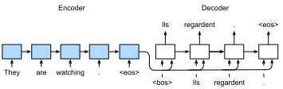
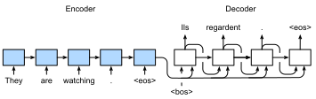

# Học Chuỗi-sang-Chuỗi cho Dịch Máy
<a id="sec_seq2seq"></a>

Trong các bài toán chuỗi-sang-chuỗi như dịch máy
(như đã thảo luận trong [sec_machine_translation](#sec_machine_translation)),
nơi đầu vào và đầu ra đều gồm
các chuỗi không được căn chỉnh có độ dài thay đổi,
chúng ta thường dựa vào các kiến trúc bộ mã hóa--bộ giải mã
([sec_encoder-decoder](#sec_encoder-decoder)).
Trong phần này,
chúng ta sẽ minh họa ứng dụng
của một kiến trúc bộ mã hóa--bộ giải mã,
trong đó cả bộ mã hóa và bộ giải mã
được lập trình dưới dạng RNN,
cho nhiệm vụ dịch máy
[Sutskever.Vinyals.Le.2014, Cho.Van-Merrienboer.Gulcehre.ea.2014].

Ở đây, RNN bộ mã hóa sẽ lấy một chuỗi có độ dài thay đổi làm đầu vào
và biến đổi nó thành một trạng thái ẩn có hình dạng cố định.
Sau này, trong [chap_attention-and-transformers](#chap_attention-and-transformers),
chúng ta sẽ giới thiệu các cơ chế attention,
cho phép chúng ta truy cập các đầu vào đã mã hóa
mà không cần phải nén toàn bộ đầu vào
thành một biểu diễn có độ dài cố định duy nhất.

Sau đó để tạo ra chuỗi đầu ra,
một token tại một thời điểm,
mô hình bộ giải mã,
gồm một RNN riêng biệt,
sẽ dự đoán từng token đích tiếp theo
dựa trên cả chuỗi đầu vào
và các token trước đó trong đầu ra.
Trong quá trình huấn luyện, bộ giải mã thường
được điều kiện hóa trên các token trước đó
trong nhãn "ground truth" chính thức.
Tuy nhiên, tại thời điểm kiểm tra, chúng ta sẽ muốn điều kiện hóa
mỗi đầu ra của bộ giải mã trên các token đã được dự đoán.
Lưu ý rằng nếu chúng ta bỏ qua bộ mã hóa,
bộ giải mã trong kiến trúc chuỗi-sang-chuỗi
hoạt động giống như một mô hình ngôn ngữ thông thường.
[fig_seq2seq](#fig_seq2seq) minh họa
cách sử dụng hai RNN
cho học chuỗi-sang-chuỗi
trong dịch máy.



<a id="fig_seq2seq"></a>

Trong [fig_seq2seq](#fig_seq2seq),
token đặc biệt "&lt;eos&gt;"
đánh dấu kết thúc của chuỗi.
Mô hình của chúng ta có thể dừng đưa ra dự đoán
sau khi token này được tạo ra.
Tại bước thời gian ban đầu của bộ giải mã RNN,
có hai quyết định thiết kế đặc biệt cần lưu ý:
Đầu tiên, chúng ta bắt đầu mỗi đầu vào bằng token đặc biệt
bắt đầu-chuỗi "&lt;bos&gt;".
Thứ hai, chúng ta có thể đưa
trạng thái ẩn cuối cùng của bộ mã hóa
vào bộ giải mã
tại mỗi bước giải mã duy nhất [Cho.Van-Merrienboer.Gulcehre.ea.2014].
Trong một số thiết kế khác,
chẳng hạn như của Sutskever.Vinyals.Le.2014,
trạng thái ẩn cuối cùng của bộ mã hóa RNN
được sử dụng
để khởi tạo trạng thái ẩn của bộ giải mã
chỉ tại bước giải mã đầu tiên.


```python
import collections
from d2l import torch as d2l
import math
import torch
from torch import nn
from torch.nn import functional as F
```


## Teacher Forcing

Trong khi chạy bộ mã hóa trên chuỗi đầu vào
là tương đối đơn giản,
việc xử lý đầu vào và đầu ra
của bộ giải mã đòi hỏi nhiều chú ý hơn.
Cách tiếp cận phổ biến nhất đôi khi được gọi là *teacher forcing*.
Ở đây, chuỗi đích gốc (nhãn token)
được đưa vào bộ giải mã làm đầu vào.
Cụ thể hơn,
token bắt đầu-chuỗi đặc biệt
và chuỗi đích gốc,
không bao gồm token cuối cùng,
được nối lại làm đầu vào cho bộ giải mã,
trong khi đầu ra của bộ giải mã (nhãn để huấn luyện) là
chuỗi đích gốc,
dịch chuyển một token:
"&lt;bos&gt;", "Ils", "regardent", "." $\rightarrow$
"Ils", "regardent", ".", "&lt;eos&gt;" ([fig_seq2seq](#fig_seq2seq)).

Lập trình của chúng ta trong
[subsec_loading-seq-fixed-len](#subsec_loading-seq-fixed-len)
đã chuẩn bị dữ liệu huấn luyện cho teacher forcing,
trong đó việc dịch chuyển token cho học tự giám sát
tương tự như huấn luyện mô hình ngôn ngữ trong
[sec_language-model](#sec_language-model).
Một cách tiếp cận thay thế là
đưa token *dự đoán*
từ bước thời gian trước
làm đầu vào hiện tại cho bộ giải mã.


Trong phần sau, chúng ta giải thích thiết kế
được mô tả trong [fig_seq2seq](#fig_seq2seq)
chi tiết hơn.
Chúng ta sẽ huấn luyện mô hình này cho dịch máy
trên tập dữ liệu Anh--Pháp như đã giới thiệu trong
[sec_machine_translation](#sec_machine_translation).

## Bộ Mã Hóa

Nhớ lại rằng bộ mã hóa biến đổi một chuỗi đầu vào có độ dài thay đổi
thành một *biến ngữ cảnh* có hình dạng cố định $\mathbf{c}$ (xem [fig_seq2seq](#fig_seq2seq)).


Xét một ví dụ chuỗi đơn (batch size 1).
Giả sử chuỗi đầu vào là $x_1, \ldots, x_T$,
sao cho $x_t$ là token thứ $t$.
Tại bước thời gian $t$, RNN biến đổi
vector đặc trưng đầu vào $\mathbf{x}_t$ cho $x_t$
và trạng thái ẩn $\mathbf{h} _{t-1}$
từ bước thời gian trước
thành trạng thái ẩn hiện tại $\mathbf{h}_t$.
Chúng ta có thể sử dụng hàm $f$ để biểu diễn
phép biến đổi của lớp hồi tiếp trong RNN:

$$\mathbf{h}_t = f(\mathbf{x}_t, \mathbf{h}_{t-1}). $$

Nhìn chung, bộ mã hóa biến đổi
các trạng thái ẩn ở tất cả các bước thời gian
thành biến ngữ cảnh thông qua hàm $q$ tùy chỉnh:

$$\mathbf{c} =  q(\mathbf{h}_1, \ldots, \mathbf{h}_T).$$

Ví dụ, trong [fig_seq2seq](#fig_seq2seq),
biến ngữ cảnh chỉ là trạng thái ẩn $\mathbf{h}_T$
tương ứng với biểu diễn của bộ mã hóa RNN
sau khi xử lý token cuối cùng của chuỗi đầu vào.

Trong ví dụ này, chúng ta đã sử dụng RNN một chiều
để thiết kế bộ mã hóa,
trong đó trạng thái ẩn chỉ phụ thuộc vào chuỗi con đầu vào
tại và trước bước thời gian của trạng thái ẩn.
Chúng ta cũng có thể xây dựng bộ mã hóa sử dụng RNN hai chiều.
Trong trường hợp đó, trạng thái ẩn phụ thuộc vào chuỗi con trước và sau bước thời gian
(bao gồm đầu vào tại bước thời gian hiện tại),
mã hóa thông tin của toàn bộ chuỗi.


Bây giờ hãy [**lập trình bộ mã hóa RNN**].
Lưu ý rằng chúng ta sử dụng *lớp nhúng*
để thu được vector đặc trưng cho mỗi token trong chuỗi đầu vào.
Trọng số của lớp nhúng là một ma trận,
trong đó số hàng tương ứng với
kích thước của từ vựng đầu vào (`vocab_size`)
và số cột tương ứng với
chiều của vector đặc trưng (`embed_size`).
Với bất kỳ chỉ số token đầu vào $i$ nào,
lớp nhúng lấy hàng thứ $i$ (bắt đầu từ 0) của ma trận trọng số
để trả về vector đặc trưng của nó.
Ở đây chúng ta lập trình bộ mã hóa với GRU nhiều lớp.


```python
def init_seq2seq(module):  
    """Initialize weights for sequence-to-sequence learning."""
    if type(module) == nn.Linear:
         nn.init.xavier_uniform_(module.weight)
    if type(module) == nn.GRU:
        for param in module._flat_weights_names:
            if "weight" in param:
                nn.init.xavier_uniform_(module._parameters[param])
```

```python
class Seq2SeqEncoder(d2l.Encoder):  
    """The RNN encoder for sequence-to-sequence learning."""
    def __init__(self, vocab_size, embed_size, num_hiddens, num_layers,
                 dropout=0):
        super().__init__()
        self.embedding = nn.Embedding(vocab_size, embed_size)
        self.rnn = d2l.GRU(embed_size, num_hiddens, num_layers, dropout)
        self.apply(init_seq2seq)
            
    def forward(self, X, *args):
        # X shape: (batch_size, num_steps)
        embs = self.embedding(d2l.astype(d2l.transpose(X), d2l.int64))
        # embs shape: (num_steps, batch_size, embed_size)
        outputs, state = self.rnn(embs)
        # outputs shape: (num_steps, batch_size, num_hiddens)
        # state shape: (num_layers, batch_size, num_hiddens)
        return outputs, state
```


Hãy sử dụng một ví dụ cụ thể
để [**minh họa lập trình bộ mã hóa ở trên.**]
Dưới đây, chúng ta khởi tạo bộ mã hóa GRU hai lớp
với số đơn vị ẩn là 16.
Cho một minibatch đầu vào chuỗi `X`
(batch size $=4$; số bước thời gian $=9$),
các trạng thái ẩn của lớp cuối cùng
ở tất cả các bước thời gian
(`enc_outputs` được trả về bởi các lớp hồi tiếp của bộ mã hóa)
là một tensor có hình dạng
(số bước thời gian, batch size, số đơn vị ẩn).

```python
vocab_size, embed_size, num_hiddens, num_layers = 10, 8, 16, 2
batch_size, num_steps = 4, 9
encoder = Seq2SeqEncoder(vocab_size, embed_size, num_hiddens, num_layers)
X = d2l.zeros((batch_size, num_steps))
if tab.selected('pytorch', 'mxnet', 'tensorflow'):
    enc_outputs, enc_state = encoder(X)
if tab.selected('jax'):
    (enc_outputs, enc_state), _ = encoder.init_with_output(d2l.get_key(), X)

d2l.check_shape(enc_outputs, (num_steps, batch_size, num_hiddens))
```

Vì chúng ta đang sử dụng GRU ở đây,
hình dạng của các trạng thái ẩn nhiều lớp
tại bước thời gian cuối cùng là
(số lớp ẩn, batch size, số đơn vị ẩn).

```python
if tab.selected('mxnet', 'pytorch', 'jax'):
    d2l.check_shape(enc_state, (num_layers, batch_size, num_hiddens))
if tab.selected('tensorflow'):
    d2l.check_len(enc_state, num_layers)
    d2l.check_shape(enc_state[0], (batch_size, num_hiddens))
```

## [**Bộ Giải Mã**]
<a id="sec_seq2seq_decoder"></a>

Cho một chuỗi đầu ra đích $y_1, y_2, \ldots, y_{T'}$
cho mỗi bước thời gian $t'$
(chúng ta sử dụng $t^\prime$ để phân biệt với các bước thời gian của chuỗi đầu vào),
bộ giải mã gán một xác suất dự đoán
cho mỗi token có thể xảy ra tại bước $y_{t'+1}$
điều kiện hóa trên các token trước trong đích
$y_1, \ldots, y_{t'}$
và biến ngữ cảnh
$\mathbf{c}$, tức là $P(y_{t'+1} \mid y_1, \ldots, y_{t'}, \mathbf{c})$.

Để dự đoán token tiếp theo $t^\prime+1$ trong chuỗi đích,
bộ giải mã RNN lấy token đích $y_{t^\prime}$ của bước trước,
trạng thái ẩn RNN từ bước thời gian trước $\mathbf{s}_{t^\prime-1}$,
và biến ngữ cảnh $\mathbf{c}$ làm đầu vào của nó,
và biến đổi chúng thành trạng thái ẩn
$\mathbf{s}_{t^\prime}$ tại bước thời gian hiện tại.
Chúng ta có thể sử dụng hàm $g$ để biểu diễn
phép biến đổi của lớp ẩn của bộ giải mã:

$$\mathbf{s}_{t^\prime} = g(y_{t^\prime-1}, \mathbf{c}, \mathbf{s}_{t^\prime-1}).$$

Sau khi thu được trạng thái ẩn của bộ giải mã,
chúng ta có thể sử dụng lớp đầu ra và phép toán softmax
để tính toán phân phối dự đoán
$p(y_{t^{\prime}+1} \mid y_1, \ldots, y_{t^\prime}, \mathbf{c})$
trên token đầu ra tiếp theo ${t^\prime+1}$.

Theo [fig_seq2seq](#fig_seq2seq),
khi lập trình bộ giải mã như sau,
chúng ta trực tiếp sử dụng trạng thái ẩn tại bước thời gian cuối cùng
của bộ mã hóa
để khởi tạo trạng thái ẩn của bộ giải mã.
Điều này yêu cầu rằng bộ mã hóa RNN và bộ giải mã RNN
có cùng số lớp và đơn vị ẩn.
Để tích hợp thêm thông tin chuỗi đầu vào đã mã hóa,
biến ngữ cảnh được nối
với đầu vào của bộ giải mã ở tất cả các bước thời gian.
Để dự đoán phân phối xác suất của token đầu ra,
chúng ta sử dụng một lớp kết nối đầy đủ
để biến đổi trạng thái ẩn
tại lớp cuối cùng của bộ giải mã RNN.


```python
class Seq2SeqDecoder(d2l.Decoder):
    """The RNN decoder for sequence to sequence learning."""
    def __init__(self, vocab_size, embed_size, num_hiddens, num_layers,
                 dropout=0):
        super().__init__()
        self.embedding = nn.Embedding(vocab_size, embed_size)
        self.rnn = d2l.GRU(embed_size+num_hiddens, num_hiddens,
                           num_layers, dropout)
        self.dense = nn.LazyLinear(vocab_size)
        self.apply(init_seq2seq)
            
    def init_state(self, enc_all_outputs, *args):
        return enc_all_outputs

    def forward(self, X, state):
        # X shape: (batch_size, num_steps)
        # embs shape: (num_steps, batch_size, embed_size)
        embs = self.embedding(d2l.astype(d2l.transpose(X), d2l.int32))
        enc_output, hidden_state = state
        # context shape: (batch_size, num_hiddens)
        context = enc_output[-1]
        # Broadcast context to (num_steps, batch_size, num_hiddens)
        context = context.repeat(embs.shape[0], 1, 1)
        # Concat at the feature dimension
        embs_and_context = d2l.concat((embs, context), -1)
        outputs, hidden_state = self.rnn(embs_and_context, hidden_state)
        outputs = d2l.swapaxes(self.dense(outputs), 0, 1)
        # outputs shape: (batch_size, num_steps, vocab_size)
        # hidden_state shape: (num_layers, batch_size, num_hiddens)
        return outputs, [enc_output, hidden_state]
```


Để [**minh họa bộ giải mã đã lập trình**],
dưới đây chúng ta khởi tạo nó với cùng các siêu tham số từ bộ mã hóa đã đề cập ở trên.
Như chúng ta có thể thấy, hình dạng đầu ra của bộ giải mã trở thành (batch size, số bước thời gian, kích thước từ vựng),
trong đó chiều cuối cùng của tensor lưu trữ phân phối token dự đoán.

```python
decoder = Seq2SeqDecoder(vocab_size, embed_size, num_hiddens, num_layers)
if tab.selected('mxnet', 'pytorch', 'tensorflow'):
    state = decoder.init_state(encoder(X))
    dec_outputs, state = decoder(X, state)
if tab.selected('jax'):
    state = decoder.init_state(encoder.init_with_output(d2l.get_key(), X)[0])
    (dec_outputs, state), _ = decoder.init_with_output(d2l.get_key(), X,
                                                       state)


d2l.check_shape(dec_outputs, (batch_size, num_steps, vocab_size))
if tab.selected('mxnet', 'pytorch', 'jax'):
    d2l.check_shape(state[1], (num_layers, batch_size, num_hiddens))
if tab.selected('tensorflow'):
    d2l.check_len(state[1], num_layers)
    d2l.check_shape(state[1][0], (batch_size, num_hiddens))
```

Các lớp trong mô hình bộ mã hóa--bộ giải mã RNN ở trên
được tóm tắt trong [fig_seq2seq_details](#fig_seq2seq_details).


<a id="fig_seq2seq_details"></a>


## Bộ Mã Hóa--Bộ Giải Mã cho Học Chuỗi-sang-Chuỗi


Tổng hợp tất cả vào mã như sau:


## Hàm Mất Mát Với Che Giấu

Ở mỗi bước thời gian, bộ giải mã dự đoán
một phân phối xác suất cho các token đầu ra.
Cũng như với mô hình hóa ngôn ngữ,
chúng ta có thể áp dụng softmax
để thu được phân phối
và tính toán mất mát entropy chéo để tối ưu hóa.
Nhớ lại từ [sec_machine_translation](#sec_machine_translation)
rằng các token đệm đặc biệt
được thêm vào cuối các chuỗi
và vì vậy các chuỗi có độ dài thay đổi
có thể được tải hiệu quả
trong các minibatch có cùng hình dạng.
Tuy nhiên, dự đoán các token đệm
nên được loại trừ khỏi tính toán mất mát.
Để đạt mục đích này, chúng ta có thể
[**che giấu các mục không liên quan bằng giá trị không**]
sao cho phép nhân
của bất kỳ dự đoán không liên quan nào
với không bằng không.


## [**Huấn Luyện**]
<a id="sec_seq2seq_training"></a>

Bây giờ chúng ta có thể [**tạo và huấn luyện mô hình bộ mã hóa--bộ giải mã RNN**]
cho học chuỗi-sang-chuỗi trên tập dữ liệu dịch máy.

```python
data = d2l.MTFraEng(batch_size=128) 
embed_size, num_hiddens, num_layers, dropout = 256, 256, 2, 0.2
if tab.selected('mxnet', 'pytorch', 'jax'):
    encoder = Seq2SeqEncoder(
        len(data.src_vocab), embed_size, num_hiddens, num_layers, dropout)
    decoder = Seq2SeqDecoder(
        len(data.tgt_vocab), embed_size, num_hiddens, num_layers, dropout)
if tab.selected('mxnet', 'pytorch'):
    model = Seq2Seq(encoder, decoder, tgt_pad=data.tgt_vocab['<pad>'],
                    lr=0.005)
if tab.selected('jax'):
    model = Seq2Seq(encoder, decoder, tgt_pad=data.tgt_vocab['<pad>'],
                    lr=0.005, training=True)
if tab.selected('mxnet', 'pytorch', 'jax'):
    trainer = d2l.Trainer(max_epochs=30, gradient_clip_val=1, num_gpus=1)
if tab.selected('tensorflow'):
    with d2l.try_gpu():
        encoder = Seq2SeqEncoder(
            len(data.src_vocab), embed_size, num_hiddens, num_layers, dropout)
        decoder = Seq2SeqDecoder(
            len(data.tgt_vocab), embed_size, num_hiddens, num_layers, dropout)
        model = Seq2Seq(encoder, decoder, tgt_pad=data.tgt_vocab['<pad>'],
                        lr=0.005)
    trainer = d2l.Trainer(max_epochs=30, gradient_clip_val=1)
trainer.fit(model, data)
```

## [**Dự Đoán**]

Để dự đoán chuỗi đầu ra
tại mỗi bước,
token dự đoán từ bước thời gian trước
được đưa vào bộ giải mã làm đầu vào.
Một chiến lược đơn giản là lấy mẫu bất kỳ token nào
đã được bộ giải mã gán xác suất cao nhất
khi dự đoán tại mỗi bước.
Như trong quá trình huấn luyện, tại bước thời gian ban đầu
token bắt đầu-chuỗi ("&lt;bos&gt;")
được đưa vào bộ giải mã.
Quá trình dự đoán này
được minh họa trong [fig_seq2seq_predict](#fig_seq2seq_predict).
Khi token kết-chuỗi ("&lt;eos&gt;") được dự đoán,
việc dự đoán chuỗi đầu ra hoàn chỉnh.



<a id="fig_seq2seq_predict"></a>

Trong phần tiếp theo, chúng ta sẽ giới thiệu
các chiến lược tinh vi hơn
dựa trên tìm kiếm chùm ([sec_beam-search](#sec_beam-search)).


## Đánh Giá Các Chuỗi Dự Đoán

Chúng ta có thể đánh giá một chuỗi dự đoán
bằng cách so sánh nó với
chuỗi đích (ground truth).
Nhưng chính xác thì thước đo phù hợp
để so sánh độ tương đồng giữa hai chuỗi là gì?


Bilingual Evaluation Understudy (BLEU),
mặc dù ban đầu được đề xuất để đánh giá
kết quả dịch máy [Papineni.Roukos.Ward.ea.2002],
đã được sử dụng rộng rãi để đo lường
chất lượng các chuỗi đầu ra cho các ứng dụng khác nhau.
Về nguyên tắc, với bất kỳ $n$-gram ([subsec_markov-models-and-n-grams](#subsec_markov-models-and-n-grams)) nào trong chuỗi dự đoán,
BLEU đánh giá liệu $n$-gram này có xuất hiện
trong chuỗi đích không.

Ký hiệu bởi $p_n$ độ chính xác của $n$-gram,
được định nghĩa là tỷ lệ
của số $n$-gram khớp trong
các chuỗi dự đoán và đích
so với số $n$-gram trong chuỗi dự đoán.
Để giải thích, cho một chuỗi đích $A$, $B$, $C$, $D$, $E$, $F$,
và một chuỗi dự đoán $A$, $B$, $B$, $C$, $D$,
chúng ta có $p_1 = 4/5$, $p_2 = 3/4$, $p_3 = 1/3$ và $p_4 = 0$.
Bây giờ gọi $\textrm{len}_{\textrm{label}}$ và $\textrm{len}_{\textrm{pred}}$
là số token trong chuỗi đích
và chuỗi dự đoán, tương ứng.
Sau đó, BLEU được định nghĩa là

$$ \exp\left(\min\left(0, 1 - \frac{\textrm{len}_{\textrm{label}}}{\textrm{len}_{\textrm{pred}}}\right)\right) \prod_{n=1}^k p_n^{1/2^n},$$

trong đó $k$ là $n$-gram dài nhất để khớp.

Dựa trên định nghĩa BLEU trong :eqref:`eq_bleu`,
bất cứ khi nào chuỗi dự đoán giống với chuỗi đích, BLEU là 1.
Hơn nữa,
vì khớp $n$-gram dài hơn khó hơn,
BLEU gán trọng số lớn hơn
khi $n$-gram dài hơn có độ chính xác cao.
Cụ thể, khi $p_n$ cố định,
$p_n^{1/2^n}$ tăng khi $n$ tăng (bài báo gốc sử dụng $p_n^{1/n}$).
Hơn nữa,
vì
dự đoán các chuỗi ngắn hơn
có xu hướng tạo ra giá trị $p_n$ cao hơn,
hệ số trước số hạng nhân trong :eqref:`eq_bleu`
phạt các chuỗi dự đoán ngắn hơn.
Ví dụ, khi $k=2$,
cho chuỗi đích $A$, $B$, $C$, $D$, $E$, $F$ và chuỗi dự đoán $A$, $B$,
mặc dù $p_1 = p_2 = 1$, hệ số phạt $\exp(1-6/2) \approx 0.14$ làm giảm BLEU.

Chúng ta [**lập trình phép đo BLEU**] như sau.

```python
def bleu(pred_seq, label_seq, k):  
    """Compute the BLEU."""
    pred_tokens, label_tokens = pred_seq.split(' '), label_seq.split(' ')
    len_pred, len_label = len(pred_tokens), len(label_tokens)
    score = math.exp(min(0, 1 - len_label / len_pred))
    for n in range(1, min(k, len_pred) + 1):
        num_matches, label_subs = 0, collections.defaultdict(int)
        for i in range(len_label - n + 1):
            label_subs[' '.join(label_tokens[i: i + n])] += 1
        for i in range(len_pred - n + 1):
            if label_subs[' '.join(pred_tokens[i: i + n])] > 0:
                num_matches += 1
                label_subs[' '.join(pred_tokens[i: i + n])] -= 1
        score *= math.pow(num_matches / (len_pred - n + 1), math.pow(0.5, n))
    return score
```

Cuối cùng,
chúng ta sử dụng bộ mã hóa--bộ giải mã RNN đã huấn luyện
để [**dịch một số câu tiếng Anh sang tiếng Pháp**]
và tính BLEU của kết quả.

```python
engs = ['go .', 'i lost .', 'he\'s calm .', 'i\'m home .']
fras = ['va !', 'j\'ai perdu .', 'il est calme .', 'je suis chez moi .']
if tab.selected('pytorch', 'mxnet', 'tensorflow'):
    preds, _ = model.predict_step(
        data.build(engs, fras), d2l.try_gpu(), data.num_steps)
if tab.selected('jax'):
    preds, _ = model.predict_step(trainer.state.params, data.build(engs, fras),
                                  data.num_steps)
for en, fr, p in zip(engs, fras, preds):
    translation = []
    for token in data.tgt_vocab.to_tokens(p):
        if token == '<eos>':
            break
        translation.append(token)        
    print(f'{en} => {translation}, bleu,'
          f'{bleu(" ".join(translation), fr, k=2):.3f}')
```

## Tóm Tắt

Theo thiết kế của kiến trúc bộ mã hóa--bộ giải mã, chúng ta có thể sử dụng hai RNN để thiết kế mô hình cho học chuỗi-sang-chuỗi.
Trong huấn luyện bộ mã hóa--bộ giải mã, cách tiếp cận teacher forcing đưa các chuỗi đầu ra gốc (trái ngược với dự đoán) vào bộ giải mã.
Khi lập trình bộ mã hóa và bộ giải mã, chúng ta có thể sử dụng RNN nhiều lớp.
Chúng ta có thể sử dụng mặt nạ để lọc ra các tính toán không liên quan, chẳng hạn như khi tính toán mất mát.
Để đánh giá các chuỗi đầu ra,
BLEU là một phép đo phổ biến khớp $n$-gram giữa chuỗi dự đoán và chuỗi đích.


## Bài Tập

1. Bạn có thể điều chỉnh các siêu tham số để cải thiện kết quả dịch không?
1. Chạy lại thử nghiệm mà không sử dụng mặt nạ trong tính toán mất mát. Bạn quan sát thấy kết quả gì? Tại sao?
1. Nếu bộ mã hóa và bộ giải mã khác nhau về số lớp hoặc số đơn vị ẩn, làm thế nào chúng ta có thể khởi tạo trạng thái ẩn của bộ giải mã?
1. Trong huấn luyện, thay thế teacher forcing bằng đưa dự đoán tại bước thời gian trước vào bộ giải mã. Điều này ảnh hưởng như thế nào đến hiệu suất?
1. Chạy lại thử nghiệm bằng cách thay thế GRU bằng LSTM.
1. Có cách nào khác để thiết kế lớp đầu ra của bộ giải mã không?


[Thảo luận](https://discuss.d2l.ai/t/1062)
