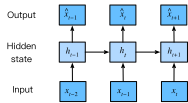

# Làm việc với Chuỗi
<a id="sec_sequence"></a>

Cho đến nay, chúng ta đã tập trung vào các mô hình mà đầu vào
bao gồm một vector đặc trưng duy nhất $\mathbf{x} \in \mathbb{R}^d$.
Sự thay đổi quan điểm chính khi phát triển các mô hình
có khả năng xử lý dữ liệu tuần tự là bây giờ chúng ta
tập trung vào các đầu vào bao gồm một danh sách có thứ tự
các vector đặc trưng $\mathbf{x}_1, \dots, \mathbf{x}_T$,
trong đó mỗi vector đặc trưng $\mathbf{x}_t$ được
đánh chỉ số bởi một bước thời gian $t \in \mathbb{Z}^+$
nằm trong $\mathbb{R}^d$.

Một số tập dữ liệu bao gồm một chuỗi lớn duy nhất.
Hãy xem xét, ví dụ, các luồng cực dài
của các số liệu đọc từ cảm biến có thể có sẵn cho các nhà khoa học khí hậu.
Trong những trường hợp như vậy, chúng ta có thể tạo tập dữ liệu huấn luyện
bằng cách lấy mẫu ngẫu nhiên các chuỗi con có độ dài được xác định trước.
Thường xuyên hơn, dữ liệu của chúng ta đến dưới dạng một tập hợp các chuỗi.
Hãy xem xét các ví dụ sau:
(i) một tập hợp các tài liệu,
mỗi tài liệu được biểu diễn dưới dạng chuỗi từ của riêng nó,
và mỗi tài liệu có độ dài riêng $T_i$;
(ii) biểu diễn chuỗi của
các lần bệnh nhân nằm viện,
trong đó mỗi lần nằm viện bao gồm một số sự kiện
và độ dài chuỗi phụ thuộc xấp xỉ
vào thời gian nằm viện.


Trước đây, khi xử lý các đầu vào riêng lẻ,
chúng ta giả định rằng chúng được lấy mẫu độc lập
từ cùng một phân phối nền $P(X)$.
Trong khi chúng ta vẫn giả định rằng toàn bộ chuỗi
(ví dụ: toàn bộ tài liệu hoặc quỹ đạo bệnh nhân)
được lấy mẫu độc lập,
chúng ta không thể giả định rằng dữ liệu đến
tại mỗi bước thời gian là độc lập với nhau.
Ví dụ, các từ có khả năng xuất hiện sau trong tài liệu
phụ thuộc nhiều vào các từ xuất hiện trước đó trong tài liệu.
Thuốc mà bệnh nhân có thể nhận được
vào ngày thứ 10 của một lần nhập viện
phụ thuộc nhiều vào những gì đã xảy ra
trong chín ngày trước đó.

Điều này không nên gây bất ngờ.
Nếu chúng ta không tin rằng các phần tử trong một chuỗi có liên quan với nhau,
chúng ta sẽ không bận tâm mô hình hóa chúng dưới dạng một chuỗi ngay từ đầu.
Hãy xem xét tính hữu ích của các tính năng tự động điền
phổ biến trên các công cụ tìm kiếm và các ứng dụng email hiện đại.
Chúng hữu ích chính xác vì thường có thể
dự đoán (không hoàn hảo, nhưng tốt hơn đoán ngẫu nhiên)
những phần tiếp theo có thể có của một chuỗi,
khi có một tiền tố ban đầu.
Đối với hầu hết các mô hình chuỗi,
chúng ta không yêu cầu tính độc lập,
hay thậm chí tính dừng, của các chuỗi.
Thay vào đó, chúng ta chỉ yêu cầu
bản thân các chuỗi được lấy mẫu
từ một phân phối nền cố định nào đó
trên toàn bộ các chuỗi.

Cách tiếp cận linh hoạt này cho phép các hiện tượng như
(i) tài liệu trông khác nhau đáng kể
ở phần đầu so với phần cuối;
hoặc (ii) tình trạng bệnh nhân phát triển theo hướng
hồi phục hoặc tử vong
trong suốt quá trình nằm viện;
hoặc (iii) sở thích của khách hàng phát triển theo những cách có thể dự đoán được
trong quá trình tương tác liên tục với hệ thống gợi ý.


Đôi khi chúng ta muốn dự đoán một mục tiêu cố định $y$
khi có đầu vào có cấu trúc tuần tự
(ví dụ: phân loại cảm xúc dựa trên đánh giá phim).
Những lúc khác, chúng ta muốn dự đoán một mục tiêu có cấu trúc tuần tự
($y_1, \ldots, y_T$)
khi có đầu vào cố định (ví dụ: chú thích ảnh).
Vẫn còn những lúc khác, mục tiêu của chúng ta là dự đoán các mục tiêu có cấu trúc tuần tự
dựa trên các đầu vào có cấu trúc tuần tự
(ví dụ: dịch máy hoặc chú thích video).
Các nhiệm vụ chuỗi-sang-chuỗi như vậy có hai dạng:
(i) *căn chỉnh*: trong đó đầu vào tại mỗi bước thời gian
tương ứng với một mục tiêu tương ứng (ví dụ: gán nhãn từ loại);
(ii) *không căn chỉnh*: trong đó đầu vào và mục tiêu
không nhất thiết thể hiện sự tương ứng từng bước
(ví dụ: dịch máy).

Trước khi lo lắng về việc xử lý các mục tiêu thuộc bất kỳ loại nào,
chúng ta có thể giải quyết vấn đề đơn giản nhất:
mô hình hóa mật độ không có giám sát (còn gọi là *mô hình hóa chuỗi*).
Ở đây, khi có một tập hợp các chuỗi,
mục tiêu của chúng ta là ước tính hàm khối xác suất
cho biết chúng ta có thể quan sát thấy bất kỳ chuỗi nào đó như thế nào,
tức là $p(\mathbf{x}_1, \ldots, \mathbf{x}_T)$.


```python
%matplotlib inline
from d2l import torch as d2l
import torch
from torch import nn
```


## Mô hình Tự hồi quy


Trước khi giới thiệu các mạng nơ-ron chuyên biệt
được thiết kế để xử lý dữ liệu có cấu trúc tuần tự,
hãy cùng xem qua một số dữ liệu chuỗi thực tế
và xây dựng một số trực giác cơ bản và các công cụ thống kê.
Cụ thể, chúng ta sẽ tập trung vào dữ liệu giá cổ phiếu
từ chỉ số FTSE 100 ([fig_ftse100](#fig_ftse100)).
Tại mỗi *bước thời gian* $t \in \mathbb{Z}^+$, chúng ta quan sát
giá, $x_t$, của chỉ số tại thời điểm đó.


<a id="fig_ftse100"></a>


Bây giờ giả sử một nhà giao dịch muốn thực hiện các giao dịch ngắn hạn,
chiến lược tham gia hoặc thoát khỏi chỉ số,
tùy thuộc vào việc họ có tin
rằng nó sẽ tăng hay giảm
trong bước thời gian tiếp theo.
Không có bất kỳ đặc trưng nào khác
(tin tức, dữ liệu báo cáo tài chính, v.v.),
tín hiệu duy nhất có sẵn để dự đoán
giá trị tiếp theo là lịch sử giá cho đến nay.
Do đó, nhà giao dịch quan tâm đến việc biết
phân phối xác suất

$$P(x_t \mid x_{t-1}, \ldots, x_1)$$

trên các giá mà chỉ số có thể đạt được
ở bước thời gian tiếp theo.
Trong khi việc ước tính toàn bộ phân phối
trên một biến ngẫu nhiên có giá trị liên tục
có thể khó khăn, nhà giao dịch sẽ hài lòng với
việc tập trung vào một vài thống kê quan trọng của phân phối,
đặc biệt là giá trị kỳ vọng và phương sai.
Một chiến lược đơn giản để ước tính kỳ vọng có điều kiện

$$\mathbb{E}[(x_t \mid x_{t-1}, \ldots, x_1)],$$

sẽ là áp dụng một mô hình hồi quy tuyến tính
(nhớ lại [sec_linear_regression](#sec_linear_regression)).
Các mô hình như vậy hồi quy giá trị của một tín hiệu
theo các giá trị trước đó của cùng tín hiệu đó
được gọi một cách tự nhiên là *mô hình tự hồi quy*.
Chỉ có một vấn đề lớn: số lượng đầu vào,
$x_{t-1}, \ldots, x_1$ thay đổi, tùy thuộc vào $t$.
Nói cách khác, số lượng đầu vào tăng lên
với lượng dữ liệu mà chúng ta gặp phải.
Do đó, nếu chúng ta muốn xử lý dữ liệu lịch sử
như một tập huấn luyện, chúng ta phải đối mặt với vấn đề
rằng mỗi ví dụ có số lượng đặc trưng khác nhau.
Phần lớn nội dung tiếp theo trong chương này
sẽ xoay quanh các kỹ thuật
để vượt qua những thách thức này
khi tham gia vào các bài toán mô hình hóa *tự hồi quy* như vậy
trong đó đối tượng quan tâm là
$P(x_t \mid x_{t-1}, \ldots, x_1)$
hoặc một số thống kê của phân phối này.

Một vài chiến lược thường xuyên xuất hiện.
Trước hết,
chúng ta có thể tin rằng mặc dù các chuỗi dài
$x_{t-1}, \ldots, x_1$ có sẵn,
nhưng có thể không cần thiết
phải nhìn lại xa trong lịch sử
khi dự đoán tương lai gần.
Trong trường hợp này, chúng ta có thể thỏa mãn
khi điều kiện hóa trên một cửa sổ có độ dài $\tau$
và chỉ sử dụng $x_{t-1}, \ldots, x_{t-\tau}$ quan sát.
Lợi ích trực tiếp là bây giờ số lượng đối số
luôn giống nhau, ít nhất với $t > \tau$.
Điều này cho phép chúng ta huấn luyện bất kỳ mô hình tuyến tính hoặc mạng sâu nào
đòi hỏi các vector có độ dài cố định làm đầu vào.
Thứ hai, chúng ta có thể phát triển các mô hình duy trì
một tóm tắt $h_t$ về các quan sát trong quá khứ
(xem [fig_sequence-model](#fig_sequence-model))
và đồng thời cập nhật $h_t$
ngoài dự đoán $\hat{x}_t$.
Điều này dẫn đến các mô hình không chỉ ước tính $x_t$
với $\hat{x}_t = P(x_t \mid h_{t})$
mà còn cập nhật dạng
$h_t = g(h_{t-1}, x_{t-1})$.
Vì $h_t$ không bao giờ được quan sát,
các mô hình này còn được gọi là
*mô hình tự hồi quy ẩn*.


<a id="fig_sequence-model"></a>

Để xây dựng dữ liệu huấn luyện từ dữ liệu lịch sử,
thường tạo ra các ví dụ bằng cách lấy mẫu ngẫu nhiên các cửa sổ.
Nói chung, chúng ta không mong đợi thời gian đứng yên.
Tuy nhiên, chúng ta thường giả định rằng trong khi
các giá trị cụ thể của $x_t$ có thể thay đổi,
nhưng các động lực theo đó mỗi quan sát tiếp theo
được tạo ra khi có các quan sát trước thì không thay đổi.
Các nhà thống kê gọi các động lực không thay đổi là *dừng*.


## Mô hình Chuỗi

Đôi khi, đặc biệt khi làm việc với ngôn ngữ,
chúng ta muốn ước tính xác suất kết hợp
của toàn bộ chuỗi.
Đây là nhiệm vụ thường gặp khi làm việc với các chuỗi
bao gồm các *token* rời rạc, chẳng hạn như các từ.
Nói chung, các hàm ước tính này được gọi là *mô hình chuỗi*
và đối với dữ liệu ngôn ngữ tự nhiên, chúng được gọi là *mô hình ngôn ngữ*.
Lĩnh vực mô hình hóa chuỗi đã được thúc đẩy nhiều bởi xử lý ngôn ngữ tự nhiên,
đến mức chúng ta thường mô tả các mô hình chuỗi là "mô hình ngôn ngữ",
ngay cả khi xử lý dữ liệu phi ngôn ngữ.
Mô hình ngôn ngữ hữu ích vì nhiều lý do.
Đôi khi chúng ta muốn đánh giá khả năng xuất hiện của các câu.
Ví dụ, chúng ta có thể muốn so sánh
mức độ tự nhiên của hai đầu ra ứng cử
được tạo bởi một hệ thống dịch máy
hoặc bởi một hệ thống nhận dạng giọng nói.
Nhưng mô hình ngôn ngữ không chỉ cho chúng ta
khả năng *đánh giá* xác suất,
mà còn có khả năng *lấy mẫu* các chuỗi,
và thậm chí tối ưu hóa để tìm các chuỗi có xác suất cao nhất.

Trong khi mô hình ngôn ngữ thoạt nhìn có vẻ không phải là
một bài toán tự hồi quy,
chúng ta có thể rút gọn mô hình ngôn ngữ thành dự đoán tự hồi quy
bằng cách phân tích mật độ kết hợp của chuỗi $p(x_1, \ldots, x_T)$
thành tích các mật độ có điều kiện
theo hướng từ trái sang phải
bằng cách áp dụng quy tắc chuỗi của xác suất:

$$P(x_1, \ldots, x_T) = P(x_1) \prod_{t=2}^T P(x_t \mid x_{t-1}, \ldots, x_1).$$

Lưu ý rằng nếu chúng ta đang làm việc với các tín hiệu rời rạc như các từ,
thì mô hình tự hồi quy phải là một bộ phân loại xác suất,
xuất ra phân phối xác suất đầy đủ
trên từ điển cho bất kỳ từ nào sẽ đến tiếp theo,
khi có ngữ cảnh bên trái.


### Mô hình Markov
<a id="subsec_markov-models"></a>


Bây giờ giả sử chúng ta muốn áp dụng chiến lược được đề cập ở trên,
trong đó chúng ta chỉ điều kiện hóa trên $\tau$ bước thời gian trước đó,
tức là $x_{t-1}, \ldots, x_{t-\tau}$, thay vì
toàn bộ lịch sử chuỗi $x_{t-1}, \ldots, x_1$.
Khi nào chúng ta có thể loại bỏ lịch sử
ngoài $\tau$ bước trước đó
mà không mất bất kỳ sức mạnh dự đoán nào,
chúng ta nói rằng chuỗi thỏa mãn *điều kiện Markov*,
tức là *tương lai độc lập có điều kiện với quá khứ,
khi có lịch sử gần đây*.
Khi $\tau = 1$, chúng ta nói rằng dữ liệu được đặc trưng
bởi một *mô hình Markov bậc một*,
và khi $\tau = k$, chúng ta nói rằng dữ liệu được đặc trưng
bởi một mô hình Markov bậc $k^{\textrm{th}}$.
Khi điều kiện Markov bậc một được thỏa mãn ($\tau = 1$),
phân tích xác suất kết hợp của chúng ta trở thành tích
các xác suất của mỗi từ khi có *từ* trước đó:

$$P(x_1, \ldots, x_T) = P(x_1) \prod_{t=2}^T P(x_t \mid x_{t-1}).$$

Chúng ta thường thấy hữu ích khi làm việc với các mô hình hoạt động
như thể điều kiện Markov được thỏa mãn,
ngay cả khi chúng ta biết rằng điều này chỉ *xấp xỉ* đúng.
Với các tài liệu văn bản thực, chúng ta tiếp tục thu được thông tin
khi đưa vào ngày càng nhiều ngữ cảnh bên trái hơn.
Nhưng những lợi ích này giảm nhanh chóng.
Do đó, đôi khi chúng ta thỏa hiệp, loại bỏ các khó khăn tính toán và thống kê
bằng cách huấn luyện các mô hình mà tính hợp lệ phụ thuộc
vào một điều kiện Markov bậc $k^{\textrm{th}}$.
Ngay cả các mô hình ngôn ngữ dựa trên RNN và Transformer khổng lồ ngày nay
hiếm khi kết hợp hơn hàng nghìn từ ngữ cảnh.


Với dữ liệu rời rạc, một mô hình Markov thực sự
chỉ đơn giản đếm số lần
mỗi từ xuất hiện trong mỗi ngữ cảnh, tạo ra
ước tính tần suất tương đối của $P(x_t \mid x_{t-1})$.
Bất cứ khi nào dữ liệu chỉ nhận các giá trị rời rạc
(như trong ngôn ngữ),
chuỗi từ có khả năng nhất có thể được tính toán hiệu quả
bằng cách sử dụng lập trình động.


### Thứ tự Giải mã

Bạn có thể tự hỏi tại sao chúng ta biểu diễn
sự phân tích của chuỗi văn bản $P(x_1, \ldots, x_T)$
như một chuỗi xác suất có điều kiện từ trái sang phải.
Tại sao không phải từ phải sang trái hay một thứ tự ngẫu nhiên nào khác?
Về nguyên tắc, không có gì sai khi khai triển
$P(x_1, \ldots, x_T)$ theo thứ tự ngược lại.
Kết quả là một phân tích hợp lệ:

$$P(x_1, \ldots, x_T) = P(x_T) \prod_{t=T-1}^1 P(x_t \mid x_{t+1}, \ldots, x_T).$$


Tuy nhiên, có nhiều lý do tại sao việc phân tích văn bản
theo cùng hướng mà chúng ta đọc nó
(từ trái sang phải đối với hầu hết các ngôn ngữ,
nhưng từ phải sang trái đối với tiếng Ả Rập và tiếng Do Thái)
được ưa thích cho nhiệm vụ mô hình hóa ngôn ngữ.
Thứ nhất, đây chỉ là hướng tự nhiên hơn để chúng ta suy nghĩ.
Dù sao đi nữa, tất cả chúng ta đều đọc văn bản mỗi ngày,
và quá trình này được hướng dẫn bởi khả năng của chúng ta
để dự đoán những từ và cụm từ nào
có khả năng xuất hiện tiếp theo.
Hãy nghĩ về bao nhiêu lần bạn đã hoàn thành
câu của người khác.
Do đó, ngay cả khi chúng ta không có lý do nào khác để ưa thích các giải mã có thứ tự như vậy,
chúng sẽ hữu ích chỉ vì chúng ta có trực giác tốt hơn
về những gì nên có xác suất cao khi dự đoán theo thứ tự này.

Thứ hai, bằng cách phân tích theo thứ tự,
chúng ta có thể gán xác suất cho các chuỗi có độ dài tùy ý
sử dụng cùng một mô hình ngôn ngữ.
Để chuyển đổi một xác suất qua các bước $1$ đến $t$
thành một xác suất mở rộng đến từ $t+1$, chúng ta chỉ cần
nhân với xác suất có điều kiện
của token bổ sung khi có các token trước đó:
$P(x_{t+1}, \ldots, x_1) = P(x_{t}, \ldots, x_1) \cdot P(x_{t+1} \mid x_{t}, \ldots, x_1)$.

Thứ ba, chúng ta có các mô hình dự đoán mạnh hơn
để dự đoán các từ liền kề hơn so với
các từ ở các vị trí tùy ý khác.
Trong khi tất cả các thứ tự phân tích đều hợp lệ,
chúng không nhất thiết đại diện cho các bài toán
mô hình hóa dự đoán có độ khó như nhau.
Điều này đúng không chỉ với ngôn ngữ,
mà còn với các loại dữ liệu khác,
ví dụ, khi dữ liệu có cấu trúc nhân quả.
Ví dụ, chúng ta tin rằng các sự kiện tương lai không thể ảnh hưởng đến quá khứ.
Do đó, nếu chúng ta thay đổi $x_t$, chúng ta có thể ảnh hưởng
đến những gì xảy ra với $x_{t+1}$ về phía trước nhưng không phải ngược lại.
Nghĩa là, nếu chúng ta thay đổi $x_t$, phân phối của các sự kiện quá khứ sẽ không thay đổi.
Trong một số ngữ cảnh, điều này khiến việc dự đoán $P(x_{t+1} \mid x_t)$
dễ hơn so với dự đoán $P(x_t \mid x_{t+1})$.
Ví dụ, trong một số trường hợp, chúng ta có thể tìm $x_{t+1} = f(x_t) + \epsilon$
cho một số nhiễu cộng $\epsilon$,
trong khi điều ngược lại không đúng [Hoyer.Janzing.Mooij.ea.2009].
Đây là tin tuyệt vời, vì thường hướng thuận
là hướng mà chúng ta quan tâm đến việc ước tính.
Cuốn sách của Peters.Janzing.Scholkopf.2017 có thêm nội dung về chủ đề này.
Chúng ta chỉ mới chạm bề mặt của nó.


## Huấn luyện

Trước khi tập trung vào dữ liệu văn bản,
hãy thử điều này trước với một số
dữ liệu tổng hợp có giá trị liên tục.

(**Ở đây, 1000 dữ liệu tổng hợp của chúng ta sẽ tuân theo
hàm lượng giác `sin`,
áp dụng cho 0.01 lần bước thời gian.
Để làm cho bài toán thú vị hơn một chút,
chúng ta tạo nhiễu cho mỗi mẫu bằng nhiễu cộng.**)
Từ chuỗi này, chúng ta trích xuất các ví dụ huấn luyện,
mỗi ví dụ bao gồm các đặc trưng và một nhãn.

```python
class Data(d2l.DataModule):
    def __init__(self, batch_size=16, T=1000, num_train=600, tau=4):
        self.save_hyperparameters()
        self.time = d2l.arange(1, T + 1, dtype=d2l.float32)
        if tab.selected('mxnet', 'pytorch'):
            self.x = d2l.sin(0.01 * self.time) + d2l.randn(T) * 0.2
        if tab.selected('tensorflow'):
            self.x = d2l.sin(0.01 * self.time) + d2l.normal([T]) * 0.2
        if tab.selected('jax'):
            key = d2l.get_key()
            self.x = d2l.sin(0.01 * self.time) + jax.random.normal(key,
                                                                   [T]) * 0.2
```

```python
data = Data()
d2l.plot(data.time, data.x, 'time', 'x', xlim=[1, 1000], figsize=(6, 3))
```

Để bắt đầu, chúng ta thử một mô hình hoạt động như thể
dữ liệu thỏa mãn điều kiện Markov bậc $\tau^{\textrm{th}}$,
và do đó dự đoán $x_t$ chỉ sử dụng $\tau$ quan sát trước đó.
[**Do đó với mỗi bước thời gian, chúng ta có một ví dụ
với nhãn $y  = x_t$ và các đặc trưng
$\mathbf{x}_t = [x_{t-\tau}, \ldots, x_{t-1}]$.**]
Người đọc tinh tế có thể nhận thấy rằng
điều này dẫn đến $1000-\tau$ ví dụ,
vì chúng ta thiếu lịch sử đủ cho $y_1, \ldots, y_\tau$.
Trong khi chúng ta có thể đệm $\tau$ chuỗi đầu tiên bằng số không,
để đơn giản, chúng ta bỏ chúng đi.
Tập dữ liệu kết quả chứa $T - \tau$ ví dụ,
trong đó mỗi đầu vào của mô hình có độ dài chuỗi $\tau$.
Chúng ta (**tạo một bộ lặp dữ liệu trên 600 ví dụ đầu tiên**),
bao phủ một khoảng của hàm sin.

```python
@d2l.add_to_class(Data)
def get_dataloader(self, train):
    features = [self.x[i : self.T-self.tau+i] for i in range(self.tau)]
    self.features = d2l.stack(features, 1)
    self.labels = d2l.reshape(self.x[self.tau:], (-1, 1))
    i = slice(0, self.num_train) if train else slice(self.num_train, None)
    return self.get_tensorloader([self.features, self.labels], train, i)
```

Trong ví dụ này, mô hình của chúng ta sẽ là hồi quy tuyến tính chuẩn.

```python
model = d2l.LinearRegression(lr=0.01)
trainer = d2l.Trainer(max_epochs=5)
trainer.fit(model, data)
```

## Dự đoán

[**Để đánh giá mô hình của chúng ta, trước tiên chúng ta kiểm tra
mức độ thực hiện tốt ở dự đoán trước một bước**].


Các dự đoán này trông tốt,
ngay cả gần cuối tại $t=1000$.

Nhưng nếu chúng ta chỉ quan sát dữ liệu chuỗi
cho đến bước thời gian 604 (`n_train + tau`)
và muốn thực hiện dự đoán nhiều bước
vào tương lai thì sao?
Thật không may, chúng ta không thể trực tiếp tính toán
dự đoán trước một bước cho bước thời gian 609,
vì chúng ta không biết các đầu vào tương ứng,
chỉ thấy đến $x_{604}$.
Chúng ta có thể giải quyết vấn đề này bằng cách thay thế
các dự đoán trước đó của chúng ta làm đầu vào cho mô hình
để thực hiện các dự đoán tiếp theo,
chiếu về phía trước, từng bước một,
cho đến khi đạt được bước thời gian mong muốn:

$$\begin{aligned}
\hat{x}_{605} &= f(x_{601}, x_{602}, x_{603}, x_{604}), \\
\hat{x}_{606} &= f(x_{602}, x_{603}, x_{604}, \hat{x}_{605}), \\
\hat{x}_{607} &= f(x_{603}, x_{604}, \hat{x}_{605}, \hat{x}_{606}),\\
\hat{x}_{608} &= f(x_{604}, \hat{x}_{605}, \hat{x}_{606}, \hat{x}_{607}),\\
\hat{x}_{609} &= f(\hat{x}_{605}, \hat{x}_{606}, \hat{x}_{607}, \hat{x}_{608}),\\
&\vdots\end{aligned}$$

Nói chung, với một chuỗi quan sát $x_1, \ldots, x_t$,
đầu ra dự đoán của nó $\hat{x}_{t+k}$ tại bước thời gian $t+k$
được gọi là *dự đoán trước $k$ bước*.
Vì chúng ta đã quan sát đến $x_{604}$,
dự đoán trước $k$ bước của nó là $\hat{x}_{604+k}$.
Nói cách khác, chúng ta sẽ phải
tiếp tục sử dụng các dự đoán của chính mình
để thực hiện các dự đoán nhiều bước.
Hãy xem điều này hoạt động như thế nào.


```python
d2l.plot([data.time[data.tau:], data.time[data.num_train+data.tau:]],
         [onestep_preds, multistep_preds[data.num_train+data.tau:]], 'time',
         'x', legend=['1-step preds', 'multistep preds'], figsize=(6, 3))
```

Thật không may, trong trường hợp này, chúng ta thất bại hoàn toàn.
Các dự đoán hội tụ về một hằng số
khá nhanh sau vài bước.
Tại sao thuật toán lại thực hiện tệ hơn nhiều
khi dự đoán xa hơn vào tương lai?
Về cơ bản, điều này là do thực tế
rằng các sai số tích lũy lại.
Giả sử rằng sau bước 1 chúng ta có một sai số nào đó $\epsilon_1 = \bar\epsilon$.
Bây giờ *đầu vào* cho bước 2 bị nhiễu loạn bởi $\epsilon_1$,
do đó chúng ta chịu một sai số theo thứ bậc
$\epsilon_2 = \bar\epsilon + c \epsilon_1$
cho một hằng số $c$ nào đó, và cứ thế.
Các dự đoán có thể phân kỳ nhanh chóng
khỏi các quan sát thực tế.
Bạn có thể đã quen thuộc
với hiện tượng phổ biến này.
Ví dụ, các dự báo thời tiết cho 24 giờ tới
có xu hướng khá chính xác, nhưng ngoài khoảng đó,
độ chính xác giảm nhanh chóng.
Chúng ta sẽ thảo luận về các phương pháp để cải thiện điều này
trong suốt chương này và hơn thế nữa.

Hãy [**xem xét kỹ hơn những khó khăn trong dự đoán trước $k$ bước**]
bằng cách tính toán các dự đoán trên toàn bộ chuỗi cho $k = 1, 4, 16, 64$.


```python
steps = (1, 4, 16, 64)
preds = k_step_pred(steps[-1])
d2l.plot(data.time[data.tau+steps[-1]-1:],
         [d2l.numpy(preds[k-1]) for k in steps], 'time', 'x',
         legend=[f'{k}-step preds' for k in steps], figsize=(6, 3))
```

Điều này rõ ràng minh họa cách chất lượng dự đoán thay đổi
khi chúng ta cố gắng dự đoán xa hơn vào tương lai.
Trong khi các dự đoán trước 4 bước vẫn trông tốt,
bất cứ điều gì ngoài điều đó gần như vô dụng.

## Tóm tắt

Có sự khác biệt khá lớn về độ khó
giữa nội suy và ngoại suy.
Do đó, nếu bạn có một chuỗi, hãy luôn tôn trọng
thứ tự thời gian của dữ liệu khi huấn luyện,
tức là không bao giờ huấn luyện trên dữ liệu tương lai.
Khi có loại dữ liệu này,
các mô hình chuỗi đòi hỏi các công cụ thống kê chuyên biệt để ước tính.
Hai lựa chọn phổ biến là mô hình tự hồi quy
và mô hình tự hồi quy ẩn.
Đối với các mô hình nhân quả (ví dụ: thời gian tiến về phía trước),
ước tính theo hướng thuận thường
dễ hơn nhiều so với hướng ngược.
Đối với một chuỗi quan sát đến bước thời gian $t$,
đầu ra dự đoán của nó tại bước thời gian $t+k$
là *dự đoán trước $k$ bước*.
Khi chúng ta dự đoán xa hơn trong thời gian bằng cách tăng $k$,
các sai số tích lũy và chất lượng dự đoán giảm,
thường là đáng kể.

## Bài tập

1. Cải thiện mô hình trong thí nghiệm của phần này.
    1. Kết hợp nhiều hơn bốn quan sát trong quá khứ? Bạn thực sự cần bao nhiêu?
    1. Bạn cần bao nhiêu quan sát trong quá khứ nếu không có nhiễu? Gợi ý: bạn có thể viết $\sin$ và $\cos$ dưới dạng một phương trình vi phân.
    1. Bạn có thể kết hợp các quan sát cũ hơn trong khi giữ nguyên tổng số đặc trưng không? Điều này có cải thiện độ chính xác không? Tại sao?
    1. Thay đổi kiến trúc mạng nơ-ron và đánh giá hiệu suất. Bạn có thể huấn luyện mô hình mới với nhiều epoch hơn. Bạn quan sát thấy gì?
1. Một nhà đầu tư muốn tìm một chứng khoán tốt để mua.
   Họ xem xét lợi nhuận trong quá khứ để quyết định cái nào có khả năng hoạt động tốt.
   Điều gì có thể sai với chiến lược này?
1. Tính nhân quả có áp dụng cho văn bản không? Đến mức độ nào?
1. Đưa ra một ví dụ khi cần mô hình tự hồi quy ẩn
   để nắm bắt động lực của dữ liệu.


[Discussions](https://discuss.d2l.ai/t/114)
