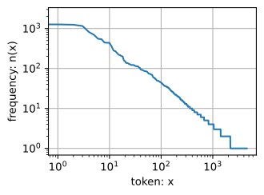
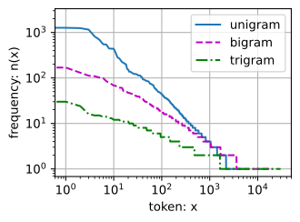

# Chuyển đổi Văn bản Thô thành Dữ liệu Chuỗi
<a id="sec_text-sequence"></a>

Trong suốt cuốn sách này,
chúng ta sẽ thường xuyên làm việc với dữ liệu văn bản
được biểu diễn dưới dạng các chuỗi
của các từ, ký tự, hoặc các mảnh từ.
Để bắt đầu, chúng ta sẽ cần một số công cụ cơ bản
để chuyển đổi văn bản thô
thành các chuỗi ở dạng phù hợp.
Các quy trình tiền xử lý điển hình
thực thi các bước sau:

1. Tải văn bản dưới dạng chuỗi vào bộ nhớ.
1. Tách các chuỗi thành các token (ví dụ: từ hoặc ký tự).
1. Xây dựng từ điển từ vựng để liên kết mỗi phần tử từ vựng với một chỉ số số học.
1. Chuyển đổi văn bản thành các chuỗi chỉ số số học.


```python
import collections
import re
from d2l import torch as d2l
import torch
import random
```




## Đọc Tập dữ liệu

Ở đây, chúng ta sẽ làm việc với
[The Time Machine](http://www.gutenberg.org/ebooks/35) của H. G. Wells,
một cuốn sách chứa hơn 30.000 từ.
Trong khi các ứng dụng thực tế thường sẽ
liên quan đến các tập dữ liệu lớn hơn đáng kể,
điều này đủ để minh họa
quy trình tiền xử lý.
Phương thức `_download` dưới đây
(**đọc văn bản thô vào một chuỗi**).

```python
class TimeMachine(d2l.DataModule): 
    """The Time Machine dataset."""
    def _download(self):
        fname = d2l.download(d2l.DATA_URL + 'timemachine.txt', self.root,
                             '090b5e7e70c295757f55df93cb0a180b9691891a')
        with open(fname) as f:
            return f.read()

data = TimeMachine()
raw_text = data._download()
raw_text[:60]
```




Để đơn giản, chúng ta bỏ qua dấu câu và chữ hoa khi tiền xử lý văn bản thô.

```python
@d2l.add_to_class(TimeMachine)  
def _preprocess(self, text):
    return re.sub('[^A-Za-z]+', ' ', text).lower()

text = data._preprocess(raw_text)
text[:60]
```

## Token hóa

*Token* là các đơn vị nguyên tử (không thể chia nhỏ hơn) của văn bản.
Mỗi bước thời gian tương ứng với 1 token,
nhưng chính xác cái gì cấu thành một token là một lựa chọn thiết kế.
Ví dụ, chúng ta có thể biểu diễn câu
"Baby needs a new pair of shoes"
như một chuỗi 7 từ,
trong đó tập hợp tất cả các từ bao gồm
một từ điển lớn (thường là hàng chục
hoặc hàng trăm nghìn từ).
Hoặc chúng ta có thể biểu diễn cùng câu đó
như một chuỗi dài hơn nhiều gồm 30 ký tự,
sử dụng một từ điển nhỏ hơn nhiều
(chỉ có 256 ký tự ASCII riêng biệt).
Dưới đây, chúng ta token hóa văn bản đã tiền xử lý
thành một chuỗi các ký tự.

```python
@d2l.add_to_class(TimeMachine)  
def _tokenize(self, text):
    return list(text)

tokens = data._tokenize(text)
','.join(tokens[:30])
```

## Từ vựng

Các token này vẫn là các chuỗi.
Tuy nhiên, các đầu vào của mô hình
cuối cùng phải bao gồm
các đầu vào số học.
[**Tiếp theo, chúng ta giới thiệu một lớp
để xây dựng *từ vựng*,
tức là các đối tượng liên kết
mỗi giá trị token riêng biệt
với một chỉ số duy nhất.**]
Đầu tiên, chúng ta xác định tập hợp các token duy nhất trong *kho ngữ liệu* huấn luyện.
Sau đó chúng ta gán một chỉ số số học cho mỗi token duy nhất.
Các phần tử từ vựng hiếm gặp thường bị loại bỏ để thuận tiện.
Bất cứ khi nào chúng ta gặp một token tại thời điểm huấn luyện hoặc kiểm tra
mà trước đây chưa được nhìn thấy hoặc bị loại khỏi từ vựng,
chúng ta biểu diễn nó bằng một token đặc biệt "&lt;unk&gt;",
biểu thị rằng đây là một giá trị *không xác định*.

```python
class Vocab:  
    """Vocabulary for text."""
    def __init__(self, tokens=[], min_freq=0, reserved_tokens=[]):
        # Flatten a 2D list if needed
        if tokens and isinstance(tokens[0], list):
            tokens = [token for line in tokens for token in line]
        # Count token frequencies
        counter = collections.Counter(tokens)
        self.token_freqs = sorted(counter.items(), key=lambda x: x[1],
                                  reverse=True)
        # The list of unique tokens
        self.idx_to_token = list(sorted(set(['<unk>'] + reserved_tokens + [
            token for token, freq in self.token_freqs if freq >= min_freq])))
        self.token_to_idx = {token: idx
                             for idx, token in enumerate(self.idx_to_token)}

    def __len__(self):
        return len(self.idx_to_token)

    def __getitem__(self, tokens):
        if not isinstance(tokens, (list, tuple)):
            return self.token_to_idx.get(tokens, self.unk)
        return [self.__getitem__(token) for token in tokens]

    def to_tokens(self, indices):
        if hasattr(indices, '__len__') and len(indices) > 1:
            return [self.idx_to_token[int(index)] for index in indices]
        return self.idx_to_token[indices]

    @property
    def unk(self):  # Index for the unknown token
        return self.token_to_idx['<unk>']
```

Bây giờ chúng ta [**xây dựng một từ vựng**] cho tập dữ liệu của mình,
chuyển đổi chuỗi các chuỗi
thành một danh sách các chỉ số số học.
Lưu ý rằng chúng ta chưa mất bất kỳ thông tin nào
và có thể dễ dàng chuyển đổi tập dữ liệu
về biểu diễn gốc (chuỗi) của nó.

```python
vocab = Vocab(tokens)
indices = vocab[tokens[:10]]
print('indices:', indices)
print('words:', vocab.to_tokens(indices))
```

## Kết hợp Tất cả Lại

Sử dụng các lớp và phương thức trên,
chúng ta [**đóng gói mọi thứ vào phương thức
`build` sau đây của lớp `TimeMachine`**],
trả về `corpus`, danh sách các chỉ số token, và `vocab`,
từ vựng của kho ngữ liệu *The Time Machine*.
Các sửa đổi chúng ta đã thực hiện ở đây là:
(i) chúng ta token hóa văn bản thành ký tự, không phải từ,
để đơn giản hóa việc huấn luyện trong các phần sau;
(ii) `corpus` là một danh sách duy nhất, không phải danh sách các danh sách token,
vì mỗi dòng văn bản trong tập dữ liệu *The Time Machine*
không nhất thiết là một câu hoặc đoạn văn.

```python
@d2l.add_to_class(TimeMachine)  
def build(self, raw_text, vocab=None):
    tokens = self._tokenize(self._preprocess(raw_text))
    if vocab is None: vocab = Vocab(tokens)
    corpus = [vocab[token] for token in tokens]
    return corpus, vocab

corpus, vocab = data.build(raw_text)
len(corpus), len(vocab)
```

## Thống kê Ngôn ngữ Khám phá
<a id="subsec_natural-lang-stat"></a>

Sử dụng kho ngữ liệu thực và lớp `Vocab` được định nghĩa trên các từ,
chúng ta có thể kiểm tra các thống kê cơ bản liên quan đến việc sử dụng từ trong kho ngữ liệu.
Dưới đây, chúng ta xây dựng một từ vựng từ các từ được sử dụng trong *The Time Machine*
và in mười từ xuất hiện thường xuyên nhất trong số chúng.

```python
words = text.split()
vocab = Vocab(words)
vocab.token_freqs[:10]
```

Lưu ý rằng (**mười từ thường xuyên nhất**)
không quá mô tả.
Bạn thậm chí có thể tưởng tượng
rằng chúng ta có thể thấy một danh sách rất tương tự
nếu chúng ta đã chọn bất kỳ cuốn sách nào một cách ngẫu nhiên.
Các mạo từ như "the" và "a",
đại từ như "i" và "my",
và giới từ như "of", "to", và "in"
xuất hiện thường xuyên vì chúng phục vụ các vai trò cú pháp phổ biến.
Những từ phổ biến nhưng không đặc biệt mô tả như vậy
thường được gọi là (***từ dừng***) và,
trong các thế hệ phân loại văn bản trước đây
dựa trên cái gọi là biểu diễn túi từ,
chúng thường được lọc ra.
Tuy nhiên, chúng mang ý nghĩa và
không cần thiết phải lọc chúng ra
khi làm việc với các mô hình nơ-ron hiện đại dựa trên RNN và
Transformer.
Nếu bạn nhìn xuống xa hơn trong danh sách,
bạn sẽ nhận thấy
rằng tần suất từ giảm nhanh chóng.
Từ thường xuyên thứ $10^{\textrm{th}}$
ít phổ biến hơn $1/5$ so với từ phổ biến nhất.
Tần suất từ có xu hướng tuân theo phân phối luật lũy thừa
(cụ thể là Zipfian) khi chúng ta đi xuống trong bảng xếp hạng.
Để có ý tưởng tốt hơn, chúng ta [**vẽ hình về tần suất từ**].

```python
freqs = [freq for token, freq in vocab.token_freqs]
d2l.plot(freqs, xlabel='token: x', ylabel='frequency: n(x)',
         xscale='log', yscale='log')
```

Sau khi xử lý một vài từ đầu tiên như ngoại lệ,
tất cả các từ còn lại xấp xỉ theo một đường thẳng trên đồ thị log-log.
Hiện tượng này được nắm bắt bởi *luật Zipf*,
nói rằng tần suất $n_i$
của từ thường xuyên thứ $i^\textrm{th}$ là:

$$n_i \propto \frac{1}{i^\alpha},$$

tương đương với

$$\log n_i = -\alpha \log i + c,$$

trong đó $\alpha$ là số mũ đặc trưng cho
phân phối và $c$ là một hằng số.
Điều này đã cho chúng ta dừng lại để suy nghĩ nếu chúng ta muốn
mô hình hóa các từ bằng thống kê đếm.
Dù sao, chúng ta sẽ ước tính quá mức tần suất của phần đuôi, còn được gọi là các từ hiếm gặp. Nhưng [**còn về các tổ hợp từ khác, chẳng hạn như hai từ liên tiếp (bigram), ba từ liên tiếp (trigram)**] và hơn nữa?
Hãy xem liệu tần suất bigram có hoạt động theo cách giống như tần suất từ đơn (unigram) hay không.

```python
bigram_tokens = ['--'.join(pair) for pair in zip(words[:-1], words[1:])]
bigram_vocab = Vocab(bigram_tokens)
bigram_vocab.token_freqs[:10]
```

Một điều đáng chú ý ở đây. Trong số mười cặp từ thường xuyên nhất, chín cặp được tạo thành từ cả hai từ dừng và chỉ có một cặp liên quan đến cuốn sách thực tế---"the time". Hơn nữa, hãy xem liệu tần suất trigram có hoạt động theo cách giống nhau không.

```python
trigram_tokens = ['--'.join(triple) for triple in zip(
    words[:-2], words[1:-1], words[2:])]
trigram_vocab = Vocab(trigram_tokens)
trigram_vocab.token_freqs[:10]
```

Bây giờ, hãy [**trực quan hóa tần suất token**] trong ba mô hình này: unigram, bigram, và trigram.

```python
bigram_freqs = [freq for token, freq in bigram_vocab.token_freqs]
trigram_freqs = [freq for token, freq in trigram_vocab.token_freqs]
d2l.plot([freqs, bigram_freqs, trigram_freqs], xlabel='token: x',
         ylabel='frequency: n(x)', xscale='log', yscale='log',
         legend=['unigram', 'bigram', 'trigram'])
```

Hình này khá thú vị.
Thứ nhất, ngoài các từ unigram, các chuỗi từ
cũng có vẻ tuân theo luật Zipf,
mặc dù với số mũ nhỏ hơn
$\alpha$ trong :eqref:`eq_zipf_law`,
tùy thuộc vào độ dài chuỗi.
Thứ hai, số lượng $n$-gram riêng biệt không quá lớn.
Điều này cho chúng ta hy vọng rằng có khá nhiều cấu trúc trong ngôn ngữ.
Thứ ba, nhiều $n$-gram xuất hiện rất hiếm.
Điều này khiến một số phương pháp không phù hợp để mô hình hóa ngôn ngữ
và thúc đẩy việc sử dụng các mô hình deep learning.
Chúng ta sẽ thảo luận về điều này trong phần tiếp theo.


## Tóm tắt

Văn bản là một trong những dạng dữ liệu chuỗi phổ biến nhất gặp phải trong deep learning.
Các lựa chọn phổ biến cho cái gì cấu thành một token là ký tự, từ, và mảnh từ.
Để tiền xử lý văn bản, chúng ta thường (i) tách văn bản thành các token; (ii) xây dựng từ vựng để ánh xạ các chuỗi token sang các chỉ số số học; và (iii) chuyển đổi dữ liệu văn bản thành các chỉ số token để các mô hình xử lý.
Trong thực tế, tần suất của các từ có xu hướng tuân theo luật Zipf. Điều này đúng không chỉ cho các từ riêng lẻ (unigram), mà còn cho $n$-gram.


## Bài tập

1. Trong thí nghiệm của phần này, token hóa văn bản thành các từ và thay đổi giá trị đối số `min_freq` của thể hiện `Vocab`. Mô tả định tính cách thay đổi `min_freq` ảnh hưởng đến kích thước của từ vựng kết quả.
1. Ước tính số mũ của phân phối Zipfian cho unigram, bigram, và trigram trong kho ngữ liệu này.
1. Tìm một số nguồn dữ liệu khác (tải xuống một tập dữ liệu machine learning chuẩn, chọn một cuốn sách thuộc phạm vi công cộng khác,
   cào một trang web, v.v.). Với mỗi nguồn, token hóa dữ liệu ở cả cấp độ từ và ký tự. Kích thước từ vựng so sánh như thế nào với kho ngữ liệu *The Time Machine* ở các giá trị `min_freq` tương đương. Ước tính số mũ của phân phối Zipfian tương ứng với phân phối unigram và bigram cho các kho ngữ liệu này. Chúng so sánh như thế nào với các giá trị bạn quan sát thấy cho kho ngữ liệu *The Time Machine*?


[Discussions](https://discuss.d2l.ai/t/118)
